## 요구사항을 LED 기반 제어 규칙으로 바꾸기

발표자료에서 정리한 요구사항은 최소 3층 이상의 엘리베이터, 현재 층을 나타내는 RED LED, 층 사이 이동을 나타내는 YELLOW LED, 층별 호출 버튼과 호출 상태를 나타내는 GREEN LED였습니다. 구현에서는 4층 구조를 선택했습니다.

<div class="media-stack"><figure class="feature-media">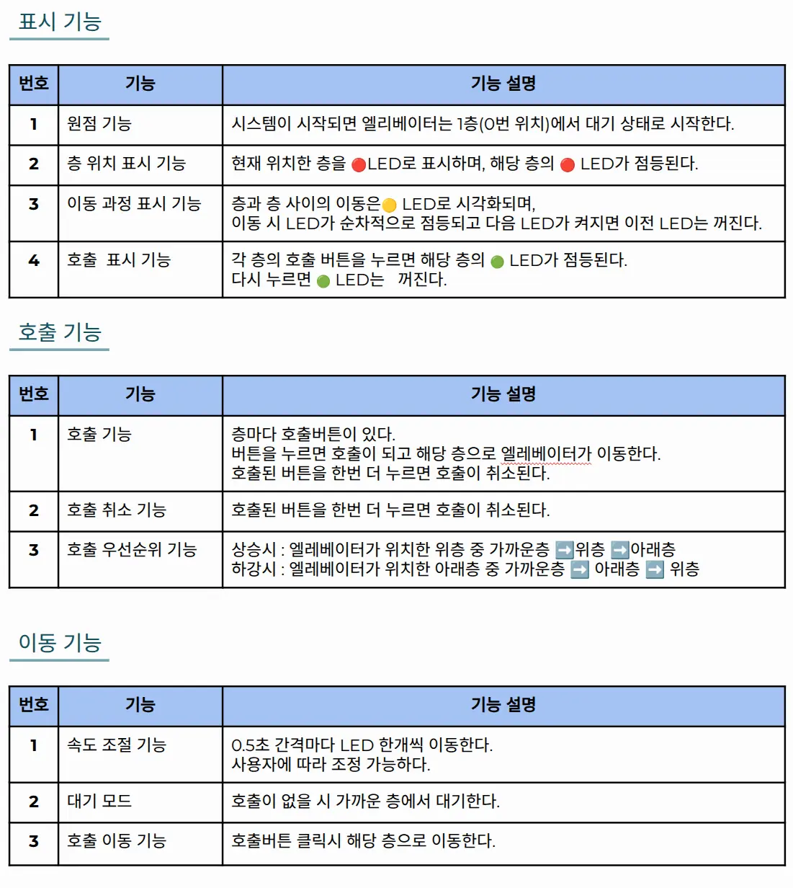<figcaption>발표자료에 정의한 사용자 요구사항과 표시·이동·호출 기능</figcaption></figure></div>

<div class="role-grid"><div class="info-card"><strong>현재 층</strong><span>RED LED 4개로 층 도착 위치 표시</span></div><div class="info-card"><strong>층간 이동</strong><span>YELLOW LED 6개로 이동 과정 표시</span></div><div class="info-card"><strong>호출 상태</strong><span>버튼 4개와 GREEN LED 4개로 등록·취소 표시</span></div></div>

실제 승강기 모터 대신 LED 한 칸을 위치 단위로 사용했습니다. 한 층은 `RED → YELLOW → YELLOW`의 세 위치로 구성되며, `nowFloor`를 0부터 9까지 이동시켜 층과 층 사이의 진행 과정까지 표현했습니다.

## 초안 — 호출 순서를 큐에 저장하기

초기에는 버튼을 누른 순서대로 층 번호를 큐에 저장하고, 먼저 들어온 호출부터 처리하려 했습니다.

<div class="media-grid pr-comparison"><figure class="feature-media">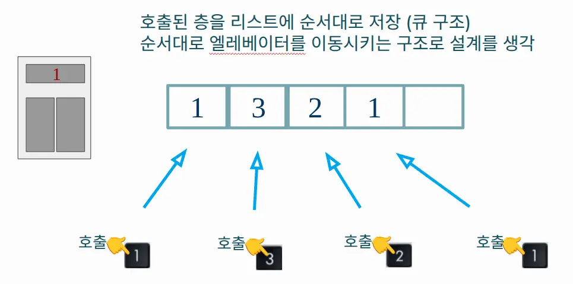<figcaption>초기 설계 — 호출 순서를 그대로 저장</figcaption></figure><figure class="feature-media">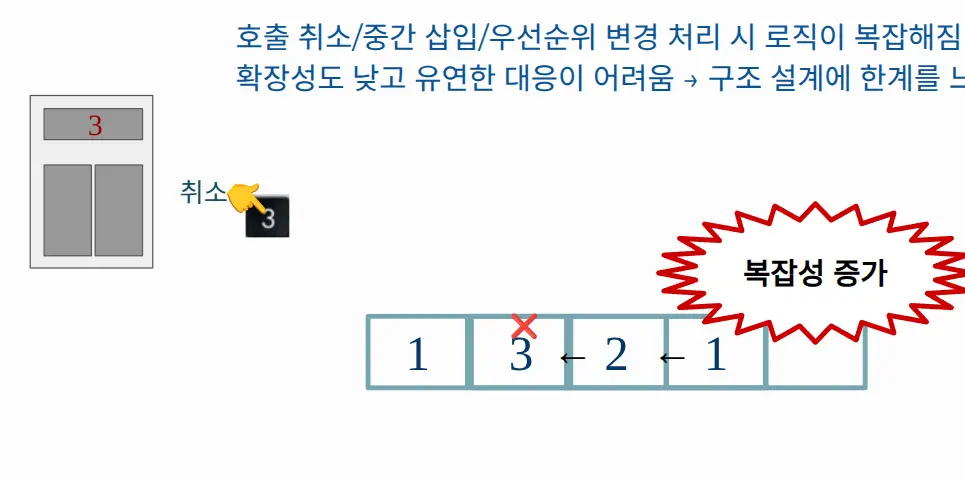<figcaption>발견한 문제 — 취소·중간 삽입·방향 변경 시 복잡도 증가</figcaption></figure></div>

단순 호출에는 적합했지만 다음 상황에서 큐를 계속 수정해야 했습니다.

- 이미 등록한 호출을 다시 눌러 취소하는 경우
- 1층에서 4층으로 이동하던 중 2층 호출이 추가되는 경우
- 현재 진행 방향의 가까운 요청을 먼저 처리해야 하는 경우
- 목적층 도착 후 반대 방향의 남은 호출을 이어서 처리하는 경우

호출 이벤트의 순서보다 **현재 남아 있는 호출과 진행 방향**이 다음 목적층을 결정해야 한다고 판단했습니다.

## 개선 — 호출 상태와 진행 방향으로 목적층 다시 계산하기

큐 대신 `floorList[4]`에 각 층의 호출 여부만 저장했습니다. 이동 방향은 `upMode`, 현재 LED 위치는 `nowFloor`, 선택된 목표는 `wantFloor`로 관리하고, 메인 루프가 실행될 때마다 남아 있는 호출에서 다음 목적층을 다시 계산합니다.

<div class="media-stack"><figure class="feature-media">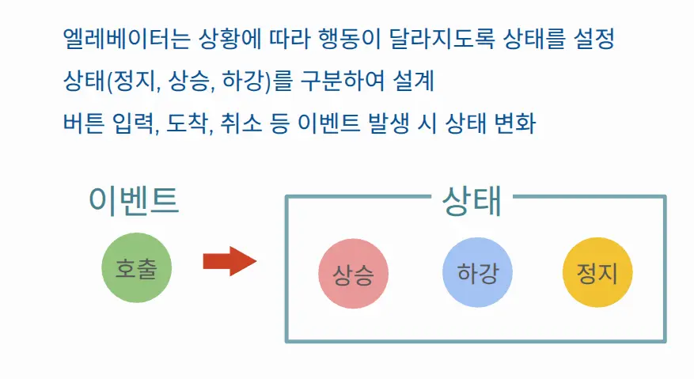<figcaption>발표자료의 개선안 — 호출 순서 저장에서 상태·방향 기반 탐색으로 전환</figcaption></figure></div>

<div class="media-stack"><figure class="feature-media">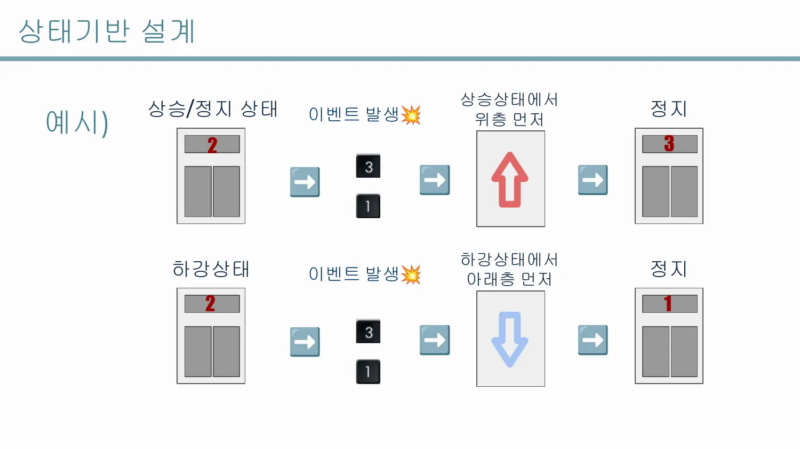<figcaption>진행 방향별 처리 예시 — 같은 호출 목록도 현재 방향에 따라 다음 목적층이 달라집니다.</figcaption></figure></div>

발표자료에서는 정지·상승·하강의 세 상태로 설명했지만, 실제 코드는 명시적인 FSM enum을 사용하지 않습니다. `upMode`가 마지막 이동 방향을 나타내고, `wantFloor == nowFloor`인 경우가 정지 동작에 해당합니다. 따라서 이 구현은 **명시적 3-State FSM**보다 **방향 상태를 이용한 스케줄링**으로 설명하는 것이 정확합니다.

<div class="media-stack"><figure class="feature-media">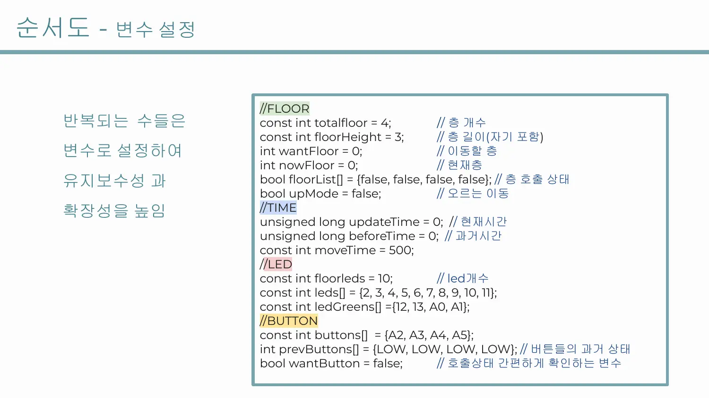<figcaption>상태 변수 — 현재 위치, 목적 위치, 진행 방향과 층별 호출 여부를 분리해 관리</figcaption></figure></div>

<div class="diagram" role="img" aria-label="방향 기반 호출 스케줄링 흐름"><div class="diagram-node owner">Button Edge<br>Call Toggle</div><div class="diagram-arrow">→</div><div class="diagram-node owner">floorList<br>Active Calls</div><div class="diagram-arrow">→</div><div class="diagram-node owner">Direction Scan<br>Target Floor</div><div class="diagram-arrow">→</div><div class="diagram-node owner">500 ms Tick<br>Move One LED</div></div>

## 버튼 상승 엣지로 호출 등록과 취소 구분하기

버튼을 누르고 있는 동안 호출 상태가 매 루프 반복해서 바뀌지 않도록 이전 값과 현재 값을 비교했습니다. `LOW → HIGH`가 발생한 순간에만 `floorSensing()`을 호출합니다.

<div class="media-grid pr-comparison"><figure class="feature-media">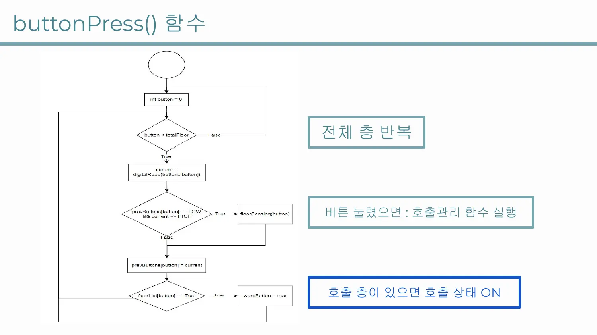<figcaption>buttonPress() — LOW → HIGH 상승 엣지만 감지</figcaption></figure><figure class="feature-media">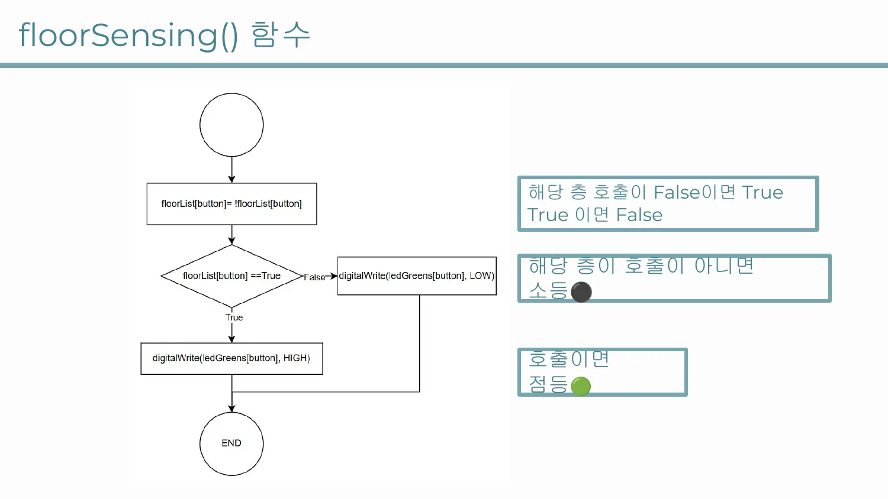<figcaption>floorSensing() — 호출 등록·취소와 GREEN LED를 함께 갱신</figcaption></figure></div>

```cpp
int current = digitalRead(buttons[button]);

if (prevButtons[button] == LOW && current == HIGH) {
    floorSensing(button);
}

prevButtons[button] = current;
```

`floorSensing()`은 해당 층의 `floorList`를 반전시키고 GREEN LED를 같은 상태로 갱신합니다. 첫 번째 클릭은 호출 등록, 같은 버튼의 다음 클릭은 호출 취소가 됩니다.

이 방식은 상승 엣지를 구분하지만 별도의 소프트웨어 Debounce 시간이나 하드웨어 필터는 없습니다. 메인 루프의 10 ms 지연만 존재하므로 실제 기계식 버튼에서는 바운스로 인한 중복 토글 가능성이 남아 있습니다.

## 진행 방향에서 가까운 호출부터 탐색하기

상승 중에는 `scanTop()`이 현재 위치보다 위에 있는 호출을 가까운 층부터 탐색합니다. 위쪽에 호출이 없으면 `scanBottom()`으로 반대 방향 요청을 찾습니다. 하강 중에는 아래쪽 호출을 먼저 탐색한 뒤 위쪽으로 전환합니다.

<div class="formula-block">상승: 가까운 위쪽 호출 → 아래쪽 호출 &nbsp;·&nbsp; 하강: 가까운 아래쪽 호출 → 위쪽 호출</div>

<div class="media-stack"><figure class="feature-media">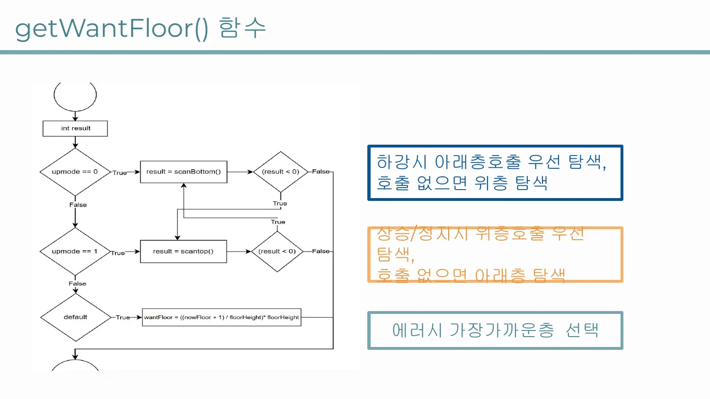<figcaption>getWantFloor() — 현재 방향의 호출을 먼저 찾고, 없을 때 반대 방향으로 전환</figcaption></figure></div>

<div class="media-grid pr-comparison"><figure class="feature-media">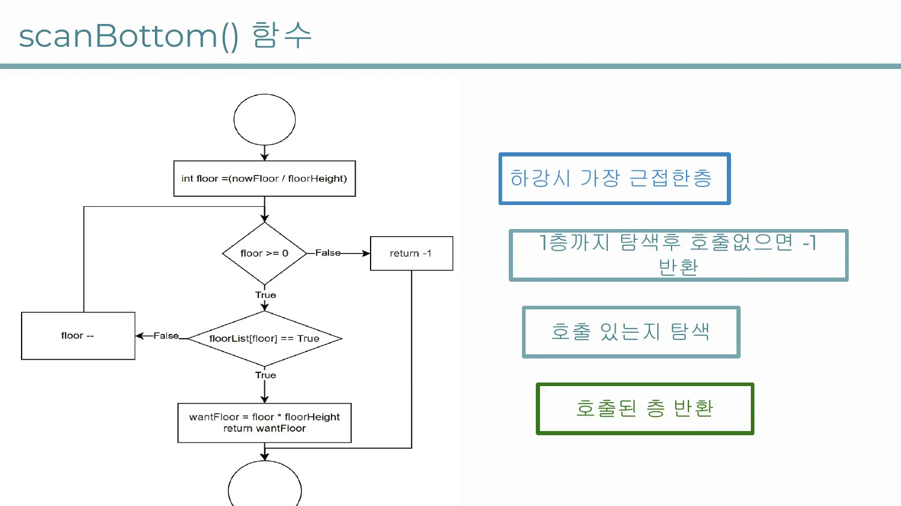<figcaption>scanBottom() — 현재 위치 아래의 가까운 호출 탐색</figcaption></figure><figure class="feature-media">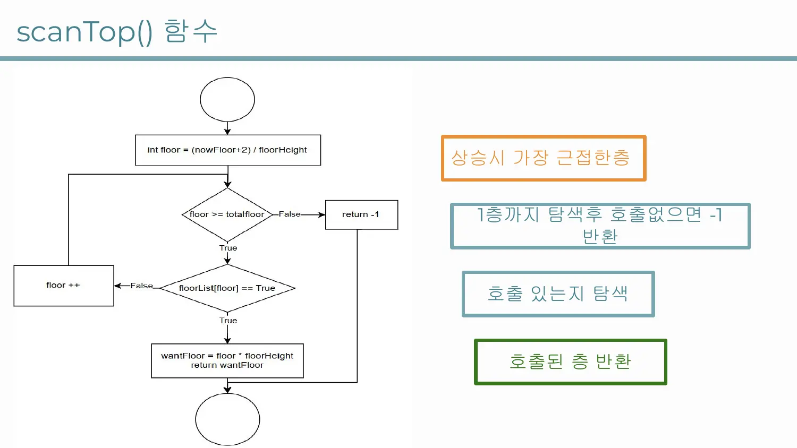<figcaption>scanTop() — 현재 위치 위의 가까운 호출 탐색</figcaption></figure></div>

호출이 하나도 없으면 현재 LED 위치를 가장 가까운 실제 층 위치로 반올림해 대기합니다. 이 방식은 실제 엘리베이터 군 제어 알고리즘이 아니라, 하나의 승강기가 진행 방향의 요청을 우선 처리하는 단순 스케줄러입니다.

## 500 ms 이동 주기 사이에도 호출 확인하기

이동은 `millis()`의 시간 차가 500 ms를 넘었을 때만 `moveElevator()`를 호출해 LED를 한 칸 갱신합니다. 긴 `delay(500)`으로 이동 전체를 막지 않기 때문에 각 이동 Tick 사이에서 버튼 상태와 새 호출을 다시 확인할 수 있습니다.

<div class="media-grid pr-comparison"><figure class="feature-media">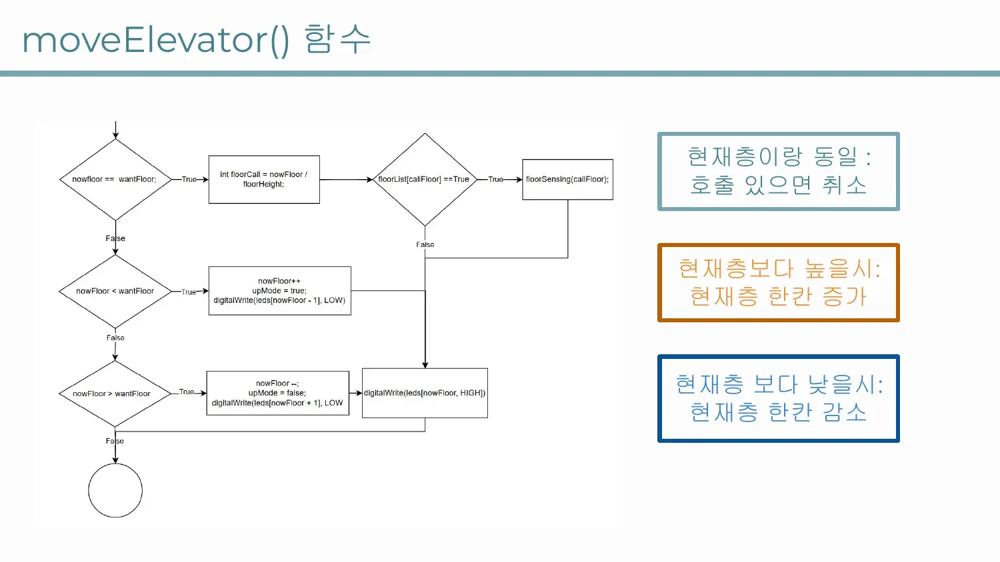<figcaption>moveElevator() — 목표 방향으로 LED 위치를 한 칸 갱신</figcaption></figure><figure class="feature-media">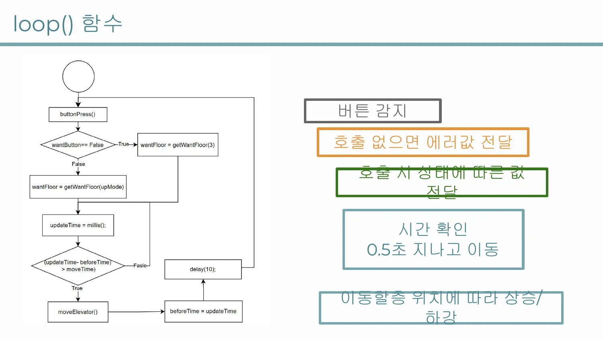<figcaption>loop() — 입력 확인은 계속 수행하고 이동만 500 ms 주기로 실행</figcaption></figure></div>

다만 메인 루프 마지막에 `delay(10)`이 남아 있으므로 완전히 Blocking 호출이 없는 구조는 아닙니다. 정확히는 긴 이동 대기를 제거하고 짧은 폴링 주기와 `millis()`를 결합한 **Cooperative Timing**입니다.

## 하드웨어 구성과 위치 표현

<div class="media-stack"><figure class="feature-media">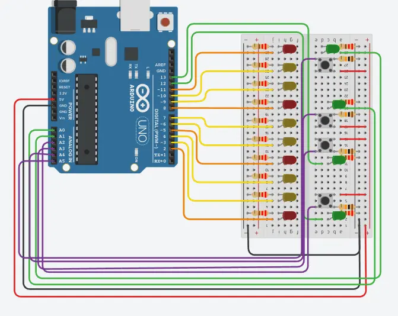<figcaption>Arduino Uno/Nano에 4개 버튼, 4개 RED, 6개 YELLOW, 4개 GREEN LED를 연결한 구성</figcaption></figure></div>

핀 번호는 `leds`, `ledGreens`, `buttons` 배열로 모았습니다. 층수를 확장하려면 핀 배열뿐 아니라 `totalfloor`, `floorHeight`, 호출 배열과 전체 위치 LED 수도 함께 변경해야 합니다. 속도는 `moveTime`을 변경해 조정할 수 있습니다.

## 입력·탐색·이동을 함수로 분리하기

<div class="media-stack"><figure class="feature-media">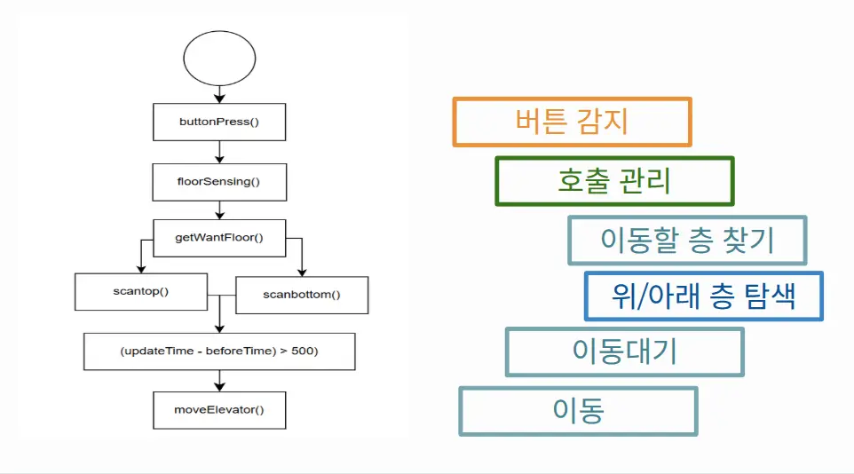<figcaption>발표자료의 전체 함수 흐름도</figcaption></figure></div>

<dl class="flow"><dt>buttonPress()</dt><dd>버튼 상승 엣지를 감지하고 호출 상태 변경을 요청합니다.</dd><dt>floorSensing()</dt><dd>호출 상태를 토글하고 해당 층의 GREEN LED를 갱신합니다.</dd><dt>scanTop() / scanBottom()</dt><dd>현재 위치와 방향을 기준으로 가까운 활성 호출을 찾습니다.</dd><dt>getWantFloor()</dt><dd>진행 방향 우선순위와 반대 방향 전환을 적용해 목표 위치를 선택합니다.</dd><dt>moveElevator()</dt><dd>현재 위치를 목표 방향으로 한 칸 이동시키고 LED 출력을 갱신합니다.</dd></dl>

## 발표자료에 정의한 8개 테스트 시나리오

발표자료에는 다음 테스트 시나리오와 기대 결과를 정의했습니다.

<div class="media-stack"><figure class="feature-media">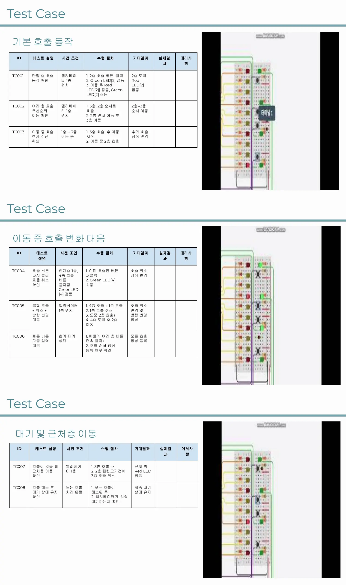<figcaption>TC01–08 — 발표자료에 작성한 입력 순서와 기대 동작</figcaption></figure></div>

<div class="evidence-grid"><div class="evidence-card"><span class="status-tag status-demo">TC01–03</span><strong>기본 호출과 이동 중 입력</strong><p>단일 층 호출, 3층·2층 순차 호출, 이동 중 2층 추가 호출</p></div><div class="evidence-card"><span class="status-tag status-demo">TC04–06</span><strong>취소와 빠른 다중 입력</strong><p>호출 재클릭 취소, 복합 호출·방향 변경, 빠른 연속 입력</p></div><div class="evidence-card"><span class="status-tag status-demo">TC07–08</span><strong>호출 해소 후 대기</strong><p>호출이 없을 때 가까운 층 복귀와 최종 위치 대기</p></div></div>

<p class="note">PPT의 테스트 표에는 기대 결과가 작성돼 있지만 실제 결과와 오류 사항 열은 비어 있습니다. 따라서 8개 시나리오를 모두 통과했다고 주장하지 않고, Tinkercad 데모로 호출 등록·이동·도착의 대표 흐름을 확인한 범위로 제한합니다.</p>

[발표 슬라이드 보기](https://docs.google.com/presentation/d/1m6TEW22ZXlsffNen36meO2qcAVfPnEL0svScLSEzju0/edit?usp=sharing) · [Tinkercad 시뮬레이션](https://www.tinkercad.com/things/1Y2Mx1cmY9a-elevatorled) · [전체 코드](https://github.com/jongbob1918/elevator-mcu/blob/main/src/elevator.ino)

## 검증 범위와 한계

이 프로젝트는 실제 승강기를 제어한 것이 아니라 버튼과 LED로 호출 스케줄링을 시뮬레이션한 원데이 프로토타입입니다.

- 실제 모터, 문 센서, 층 센서와 안전 인터락을 연결하지 않았습니다.
- 정지 상태를 별도 enum으로 모델링하지 않고 마지막 진행 방향을 `upMode`에 유지합니다.
- 기계식 버튼 Debounce와 입력 오류 처리가 없습니다.
- 8개 테스트의 자동 실행 코드와 결과 로그가 저장소에 없습니다.
- 호출이 없을 때 가까운 층으로 이동하는 정책은 실제 운영 요구사항에 따라 달라질 수 있습니다.

다음 단계에서는 `STOPPED`, `MOVING_UP`, `MOVING_DOWN`, `DOOR_OPEN`을 명시적인 상태로 분리하고, 입력 이벤트와 상태 전이를 독립적으로 테스트할 수 있습니다. 테스트 시나리오를 시뮬레이터 입력으로 자동화하면 기대 경로와 실제 LED 위치를 비교하는 회귀 테스트도 구성할 수 있습니다.
