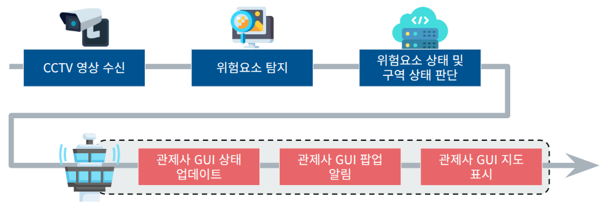
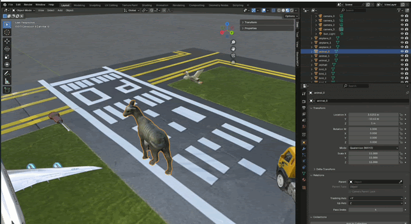
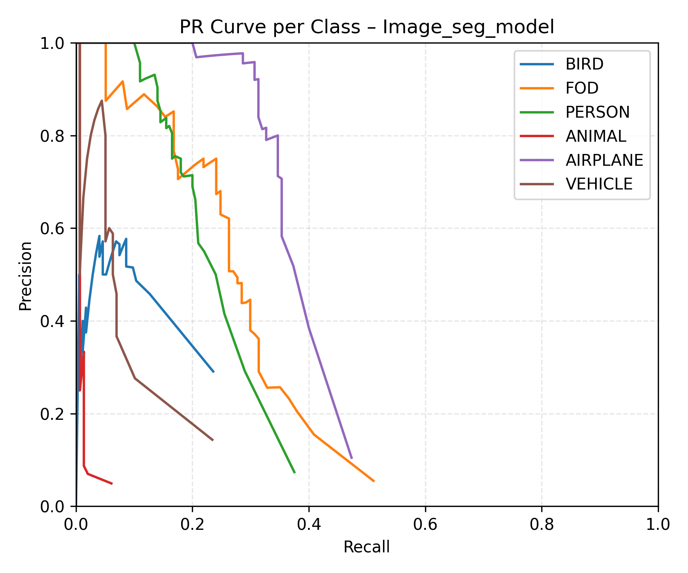
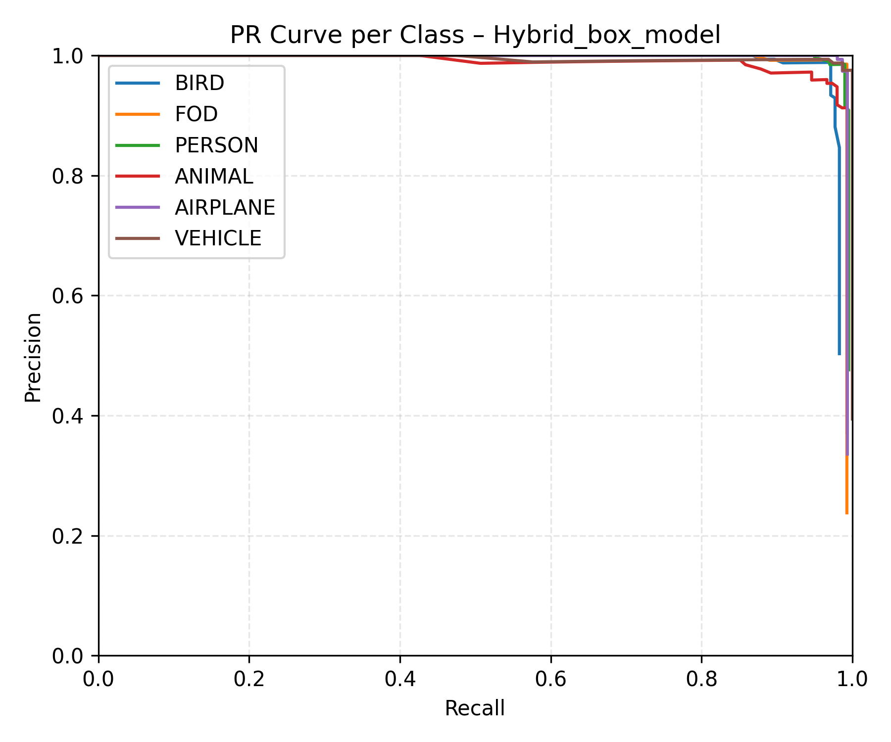
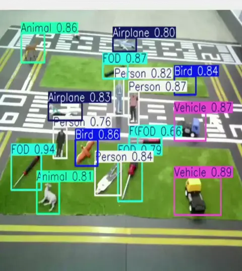
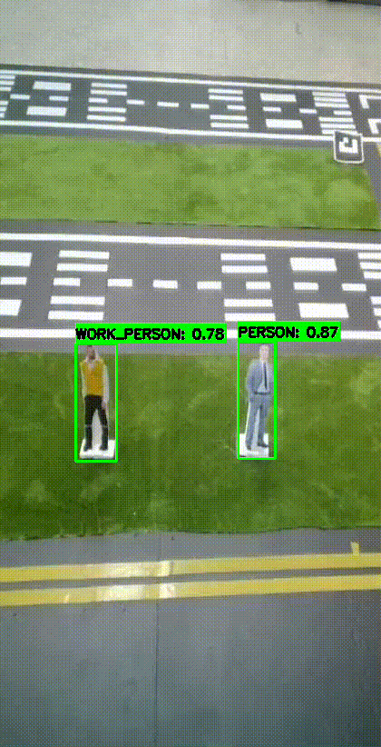
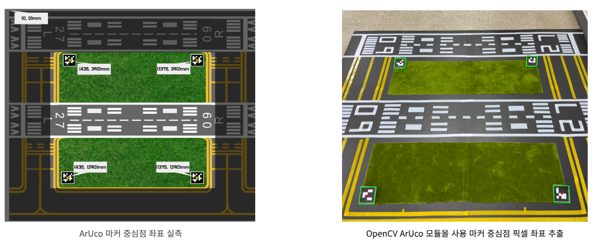
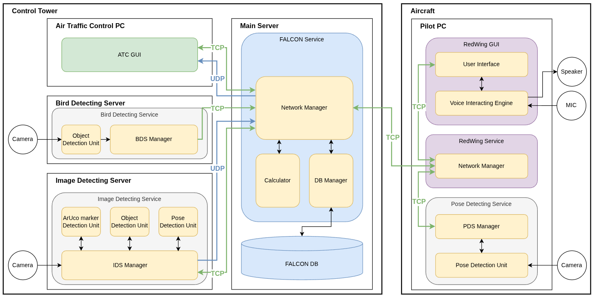

## CCTV 영상에서 관제 경보까지

카메라 프레임은 `탐지 → 추적 → 좌표변환 → 구역 판정 → 관제 표시` 순서로 처리됩니다. 단순히 Bounding Box를 보여주는 데서 끝내지 않고, 객체가 어느 구역에 있으며 같은 위험요소가 계속 이동 중인지 관제사가 판단할 수 있는 이벤트로 변환했습니다.

<figure class="feature-media"></figure>

## 지상 위험요소 탐지와 좌표변환 검증

4명으로 구성된 팀의 팀장으로 일정과 문서를 관리하고, CCTV 영상에서 조류·FOD·사람·차량 같은 지상 위험요소를 찾아 관제 정보로 만드는 탐지 시스템(Ground IDS)의 통합을 담당했습니다. 실사·합성 데이터를 이용한 모델 조사·학습·검증, YOLOv8과 ByteTrack을 연결한 탐지·추적 파이프라인, ArUco Marker 기반 좌표변환 시험을 수행했습니다. 합성 데이터 생성은 장진혁, 서버와 좌표변환 로직 설계는 박효진, 관제 GUI는 김지연과 협업했습니다.

## 합성·실사·Negative Sample을 함께 학습한 이유

공개 데이터로 학습한 초기 모델은 공항 모형의 고정 CCTV 시점에서 작은 객체를 놓치거나 배경의 ArUco Marker를 위험요소로 오인했습니다. 학습 이미지와 실제 배치 환경의 시점·조명·배경 차이가 컸기 때문입니다.

팀이 Unity와 Blender로 생성한 합성 데이터에 실제 공항 모형 촬영 이미지와 객체가 없는 Negative Sample을 결합해 Hybrid Dataset을 구성했습니다. YOLOv8n-box를 960×960 입력, 150 epoch로 재학습해 조류·FOD·사람·동물·항공기·차량 6개 클래스를 하나의 모델에서 탐지했습니다.

<dl class="flow"><dt>문제</dt><dd>공개 데이터만으로 학습한 모델은 고정 CCTV 시점의 작은 객체와 공항 모형 배경에 충분히 대응하지 못했습니다.</dd><dt>데이터</dt><dd>Unity·Blender 합성 이미지, 실제 모형 촬영 이미지, 객체가 없는 Negative Sample을 결합했습니다.</dd><dt>학습</dt><dd>YOLOv8n-box를 960×960 입력과 150 epoch 조건으로 여섯 클래스에 맞춰 재학습했습니다.</dd><dt>검증</dt><dd>분리된 평가 데이터의 정량 지표와 실제 공항 모형 영상의 다중 객체 탐지 결과를 함께 확인했습니다.</dd></dl>

<figure class="feature-media"></figure>

## 정량 지표와 실제 영상으로 모델 검증

공개 데이터로 학습한 기존 Segmentation 모델과 실사·합성·Negative Sample을 결합한 Hybrid Detection 모델의 PR Curve를 나란히 비교했습니다. 기존 모델은 여러 클래스의 Recall이 낮은 구간에서 Precision이 빠르게 하락했지만, Hybrid 모델은 여섯 클래스 모두 우측 상단에 가까운 곡선을 유지했습니다.

<figure class="feature-media"><figcaption>Before · Public Dataset Segmentation Model</figcaption></figure><figure class="feature-media"><figcaption>After · Hybrid Dataset YOLOv8n-box</figcaption></figure>

0.9902mAP@0.5

0.9005mAP@0.5:0.95

0.9928 / 0.9672Precision / Recall

최종 Ground Model v0.3는 위 지표를 기록했고, 실제 공항 모형 영상에서도 여러 클래스가 동시에 등장하는 상황을 확인했습니다. 기존 모델의 집계 지표와 동일 평가 데이터 사용 여부는 저장소에 남아 있지 않아 숫자 개선율은 계산하지 않고 PR Curve의 형태만 비교 근거로 사용했습니다.

## 6개 클래스 탐지와 객체 추적

프레임마다 새 객체로 처리하지 않도록 YOLOv8의 추론 결과를 ByteTrack에 연결하고 `persist` 옵션으로 Track ID를 유지했습니다. 지상 위험요소 탐지 시스템은 모델의 기본 클래스에 후처리를 더해 관제 판단에 필요한 상태를 구분합니다.

<dl class="flow"><dt>객체 추적</dt><dd>ByteTrack의 ID를 FALCON 객체 ID로 변환해 프레임이 바뀌어도 같은 위험요소의 이동을 이어서 추적합니다.</dd><dt>작업자 구분</dt><dd>사람 Bounding Box 상단 60%의 HSV 영역에서 형광색 픽셀 비율을 계산해 일반인과 형광 조끼 작업자를 구분합니다.</dd><dt>작업 차량</dt><dd>차량 영역의 노란색과 검은색 비율을 함께 검사해 일반 차량과 작업 차량을 나눕니다.</dd><dt>쓰러짐 상태</dt><dd>사람 Bounding Box의 종횡비와 지속 시간을 이용해 구조 단계가 필요한 상황을 별도 이벤트로 만듭니다.</dd></dl>

<figure class="feature-media"></figure><figure class="feature-media"></figure>

## ArUco Marker로 실제 위치 계산

Bounding Box만으로는 객체가 영상 안 어디에 보이는지만 알 수 있어 관제 지도에 정확히 표시할 수 없습니다. 카메라 화면에서 ID 0–3의 ArUco Marker 중심점을 찾고, 실측한 네 기준점과 대응시켜 Homography 행렬을 계산했습니다.

λ [xmap, ymap, 1]ᵀ = H [upixel, vpixel, 1]ᵀ

<figure class="feature-media"></figure>

검출 객체의 Bounding Box 중심점을 `perspectiveTransform`으로 mm 단위의 맵 좌표로 변환했습니다. 네 기준 Marker가 모두 보일 때만 보정 결과를 생성하고, 변환된 위치를 활주로·유도로·잔디 구역과 비교해 객체가 어느 구역에 있는지 판단하도록 구성했습니다.

## 탐지 결과를 관제 서버에 전달하기

탐지 시스템은 보정용 Map Mode와 위험요소 탐지용 Object Mode를 분리합니다. 추론 프로세스가 만든 객체 ID·클래스·좌표·신뢰도는 JSON 이벤트로 변환되어 TCP Queue를 통해 Main Server에 전달되고, 서버 명령으로 두 모드를 전환할 수 있습니다.

서버 연결이 끊기면 통신 스레드가 5초 간격으로 재연결하며, 줄바꿈을 메시지 경계로 사용해 여러 JSON 명령이 한 번에 수신돼도 순서대로 복원합니다. 이 구조를 통해 영상 추론 루프와 네트워크 지연을 분리하고 관제 GUI가 탐지 화면, 지도 마커와 경보 이력을 갱신할 수 있게 했습니다.

<figure class="feature-media"></figure>

## 검증 결과와 한계

MODEL<strong>Hybrid Dataset 평가</strong>
여섯 클래스 Ground Model v0.3가 mAP@0.5:0.95 0.9005를 기록했고 클래스별 PR Curve를 저장했습니다.

DEMO<strong>실제 모형 영상 탐지</strong>
공항 모형 영상에서 조류·FOD·사람·동물·항공기·차량을 동시에 검출하고 Track ID를 유지했습니다.

SYSTEM<strong>관제 시스템 연동</strong>
좌표변환 결과와 객체 이벤트를 JSON으로 전송해 관제 GUI의 지도 마커와 경보 갱신에 연결했습니다.

<strong>검증 범위</strong> 모델 지표는 Hybrid Dataset의 분리된 평가 데이터 기준이며 실제 운영 공항에서 측정한 결과가 아닙니다. 좌표변환은 네 개의 ArUco Marker가 모두 보이는 평면 공항 모형에서 검증했으며, 실제 공항 기준 좌표 오차와 전체 시스템 지연 시간은 별도로 측정하지 못했습니다.

