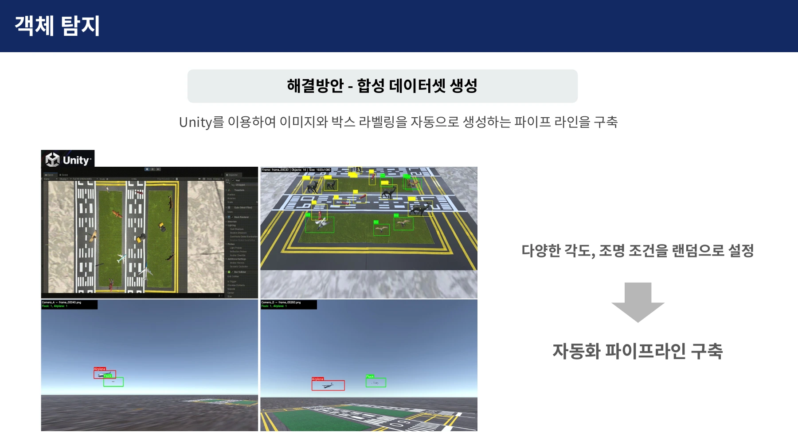
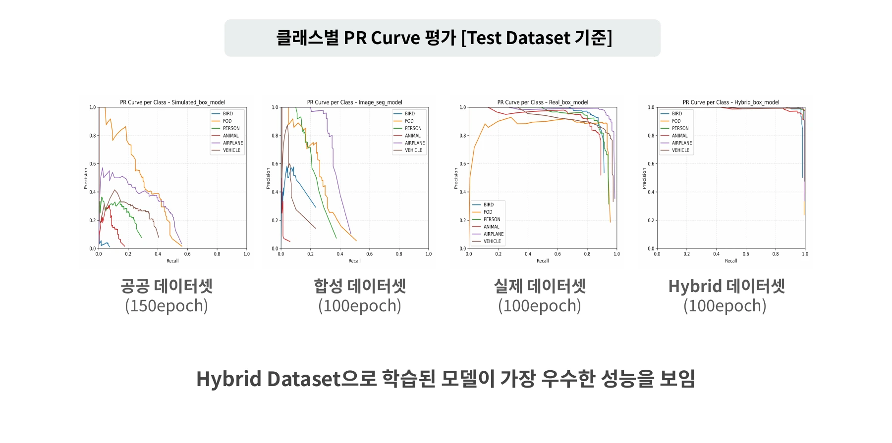

## 카메라 영상에서 관제 경보까지

공항 모형에 카메라를 설치하고, 영상에서 찾은 위험요소를 관제사와 조종사에게 전달하도록 구성했습니다. 지상·조류 탐지 서버가 분석 결과를 메인 서버로 보내면, 관제 화면(Hawkeye)은 위치와 경보를 표시하고 조종사 서비스(RedWing)는 위험정보를 음성으로 안내합니다.

<figure class="feature-media"></figure>

4명으로 구성된 팀에서 팀장을 맡아 일정과 문서를 관리하고, 지상 객체 탐지 서버 구축과 탐지 모델 조사·학습을 담당했습니다. 합성 데이터 생성과 모델 제작은 팀원과 협업했으며, 메인 서버와 관제 화면, 조종사 서비스는 각 담당 팀원이 구현했습니다.

## 초기 모델이 모형에서 객체를 놓친 이유

지상 탐지 대상은 조류, 이물질, 야생동물, 사람, 차량, 항공기 6종으로 정했습니다. 처음에는 공개 이미지 약 15,000장으로 모델을 학습했지만, 공항 모형을 촬영한 영상에서는 작은 객체를 잘 찾지 못했습니다.

실제 공항 사진과 테스트에 사용한 모형은 객체의 크기와 형태, 배경이 달랐습니다. 이 차이를 줄이기 위해 모형 환경을 반영한 학습 데이터를 만들었습니다.

## 합성 이미지와 실제 촬영 이미지를 함께 학습

팀에서 모형을 3D로 스캔하고 Polycam과 Blender로 가상 공항 환경을 구성했습니다. 여기에 Unity로 촬영 각도와 조명을 바꾸며 이미지와 객체 위치 표시를 함께 생성하는 과정을 만들었습니다. Unity 환경과 자동 라벨링은 해당 팀원이 구현했습니다.

<figure class="feature-media"></figure>

이렇게 만든 합성 이미지 3,000장에 실제 촬영 이미지 1,000장을 섞어 학습 데이터를 구성했습니다. 객체의 위치와 종류를 찾는 경량 모델 YOLOv8n으로 전체 학습 데이터를 100회 반복 학습했습니다.

## 테스트 데이터로 탐지 결과 비교

공항 모형과 객체를 촬영한 테스트 데이터로 공개 이미지, 합성 이미지, 실제 촬영 이미지, 혼합 이미지로 학습한 모델을 비교했습니다. 공개 이미지 모델은 150회, 나머지 모델은 각각 100회 학습했습니다. 이 비교에서 합성·실제 이미지를 섞은 모델이 가장 좋은 탐지 결과를 보였습니다.

아래는 정확하게 찾은 비율인 정밀도와 놓치지 않고 찾은 비율인 재현율의 관계를 나타낸 곡선(Precision–Recall Curve)입니다. 혼합 데이터 모델은 여섯 종류의 객체에서 두 지표를 높게 유지했습니다.

<figure class="feature-media"></figure>

혼합 데이터 모델의 평균 정밀도(mean Average Precision, mAP)는 탐지 영역과 정답 영역이 50% 이상 겹치는 기준에서 **0.930**, 겹침 기준을 50~95%로 높여 평균한 지표에서 **0.7207**을 기록했습니다. 이 결과를 바탕으로 혼합 데이터로 학습한 모델을 지상 탐지에 사용했습니다.

## 탐지한 객체를 지도에 표시

영상 속 객체를 관제 지도에 표시하려면 픽셀 위치를 공항 모형의 좌표로 바꿔야 했습니다. 저는 위치 기준으로 쓰는 사각 마커(ArUco)를 이용한 좌표변환을 조사하고 테스트했으며, 변환 로직은 백엔드 담당 팀원이 설계했습니다.

마커 중심의 실제 위치를 측정하고 영상에서 같은 마커의 픽셀 위치를 찾았습니다. 두 좌표의 대응 관계로 평면 좌표변환 행렬(Homography)을 구해, 탐지한 객체의 중심점을 지도 좌표로 옮겼습니다. 변환한 위치를 기준으로 활주로·유도로·잔디 중 어느 구역에 있는지 판단했습니다.

<figure class="feature-media"></figure>

객체가 움직일 때는 추적 알고리즘 ByteTrack으로 프레임 사이의 같은 객체를 연결했습니다. 사람의 형광 조끼와 차량 색상도 분석해 작업자와 작업 차량을 구분했습니다. 객체의 식별번호·종류·위치를 서버로 전달하면 관제 화면의 지도 마커와 팝업 경보가 갱신됩니다.

<figure class="feature-media"></figure>

## 모형 환경에서 통합 시연

공항 모형에 배치한 객체를 탐지하고, 형광 조끼를 입은 작업자를 구분하는 동작을 확인했습니다. 탐지한 위치를 관제 화면에 표시하고 조종사 음성 경보로 전달하는 흐름까지 연결했습니다.

<figure class="feature-media"></figure><figure class="feature-media"></figure>

<figure class="feature-media">
<iframe src="https://www.youtube.com/embed/-si0u8I1h2A" title="FALCON 위험정보를 조종사 음성 경보로 전달하는 통합 시연" loading="lazy" allow="accelerometer; autoplay; clipboard-write; encrypted-media; gyroscope; picture-in-picture; web-share" allowfullscreen></iframe>
</figure>

이번 구현에서는 모형 환경에 맞춘 데이터가 탐지 성능에 큰 영향을 준다는 점을 확인했습니다. 다른 환경에서는 탐지 성능이 떨어졌고, 작업자 구분도 조끼 색상에 의존했습니다. 후속 개선 과제로 촬영 환경과 탐지 대상의 다양화, 색상 외 특징을 이용한 인원 구분을 정리했습니다.
