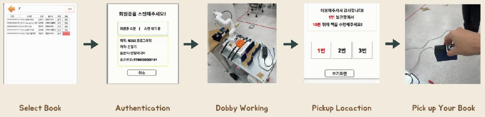
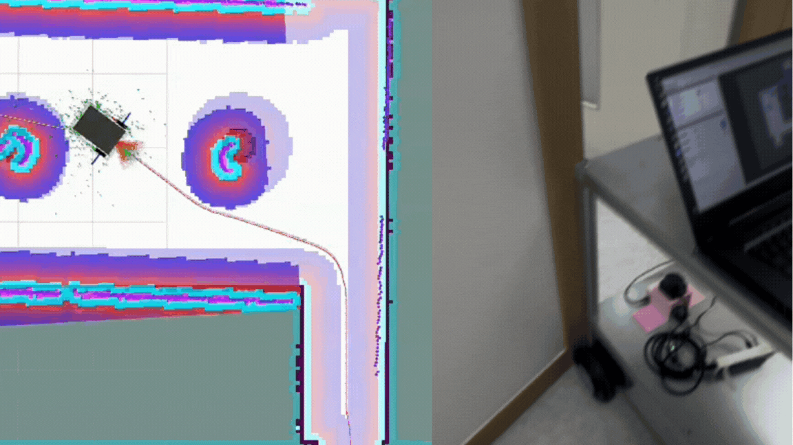
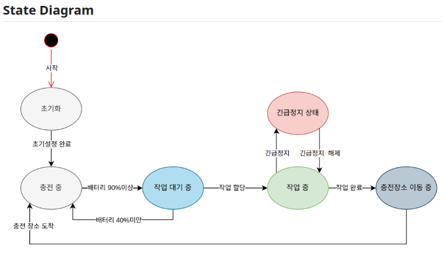
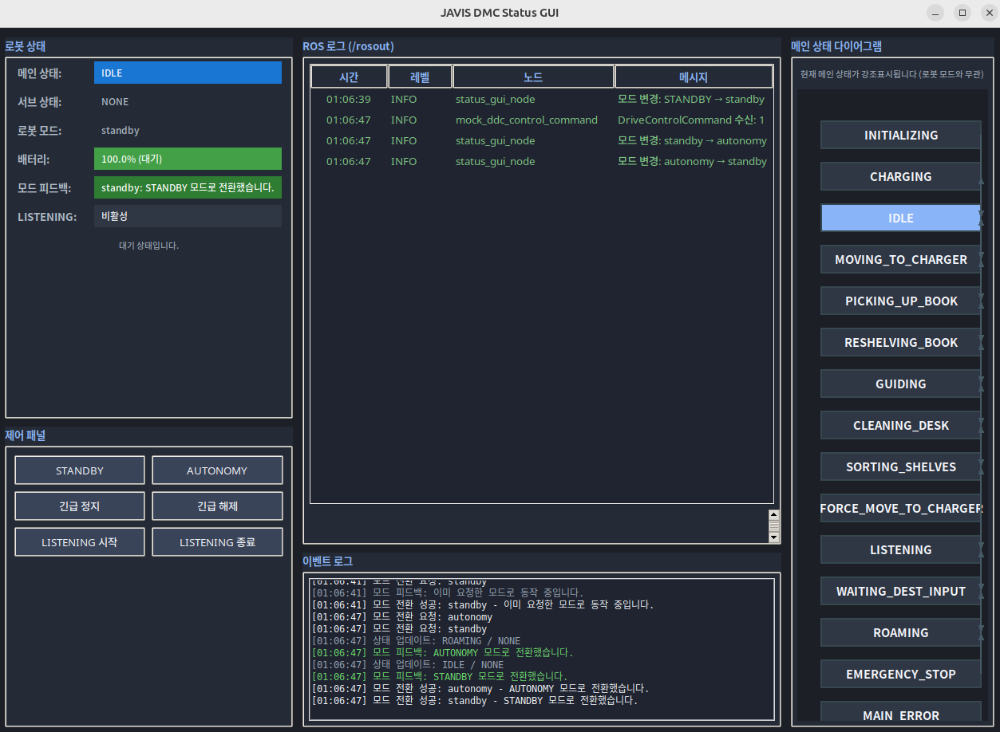
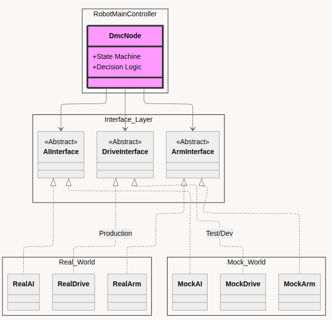
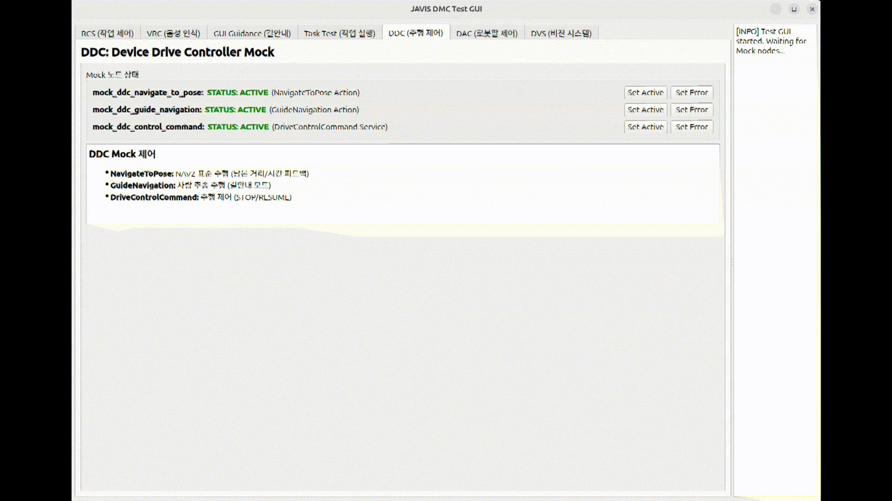

## 도서 요청에서 픽업까지

사용자가 도서를 요청하면 중앙 시스템이 로봇의 상태와 배터리를 확인해 작업을 할당합니다. JAVIS는 목표 책장으로 이동하고, 카메라로 도서를 인식한 뒤 로봇팔로 픽업합니다.

<figure class="feature-media"><figcaption>도서 선택부터 사용자 인증, 로봇 작업과 도서 수령까지의 서비스 흐름</figcaption></figure>

## 좁은 서가에서도 안정적으로 이동하기

JAVIS는 2D LiDAR로 작성한 지도에서 위치를 추정하고, Nav2를 사용해 목표 책장까지의 경로를 생성합니다. Global Planner가 전체 이동 경로를 만들고 Local Controller가 LiDAR로 감지한 장애물과 Costmap을 반영해 로봇의 속도와 회전 방향을 결정합니다.

초기 구성에서는 장애물의 Inflation 영역을 크게 설정하면 좁은 통로가 막힌 것으로 판단했고, 작게 설정하면 벽과 가까운 경로가 생성됐습니다. 회전이나 Recovery 과정에서 주변 장애물과 접촉하는 문제도 반복됐습니다.

<figure class="feature-media"><figcaption>초기 구성 — 협소 공간에서 발생한 경로 정체와 장애물 접촉</figcaption></figure><figure class="feature-media"><figcaption>개선 후 — Costmap을 반영해 서가 사이를 통과하는 주행</figcaption></figure>

<dl class="flow"><dt>경로 계획</dt><dd>점 모델 중심의 NavFn 대신 로봇의 직사각형 형상, 회전 반경과 후진 경로를 고려하는 Smac Planner Hybrid를 적용했습니다.</dd><dt>장애물 인식</dt><dd>실제 로봇보다 넓게 설정돼 근접 장애물을 제거하던 LiDAR 필터 범위를 다시 설정하고 Costmap Inflation 가중치를 조정했습니다.</dd><dt>경로 추종</dt><dd>복잡한 공간에서 유효한 회피 궤적을 찾기 어려웠던 DWB 대신 샘플링 기반 예측 제어를 사용하는 MPPI Controller를 적용했습니다.</dd></dl>

## 로봇의 상태와 임무 흐름 관리하기

주행, 비전과 로봇팔 모듈은 서로 독립적으로 동작합니다. ROS 2 기반 메인 컨트롤러는 Task Executor와 State Machine을 사용해 각 모듈의 실행 순서를 관리하고, 완료·실패 응답에 따라 다음 동작을 결정합니다.

중앙 시스템 작업 요청

→

Task Executor 임무 실행

→

DMC 상태 · 예외

→

공통 Interface

→

Drive · Arm · AI

메인 컨트롤러는 초기화, 충전, 작업 대기, 작업 수행과 충전소 이동 상태를 관리합니다. 배터리 조건이나 긴급 정지 요청이 발생하면 현재 작업에서 별도의 상태로 전환하며, 전용 GUI에서 메인 상태와 세부 임무, 배터리 및 ROS 로그를 함께 확인할 수 있습니다.

<figure class="feature-media"><figcaption>배터리와 작업 조건을 반영한 메인 State Machine</figcaption></figure><figure class="feature-media"><figcaption>메인 상태, 세부 임무와 이벤트 로그를 확인하는 상태 GUI</figcaption></figure>

## 실제 장비 없이 제어 흐름 검증하기

AI, 주행과 로봇팔 모듈이 모두 준비될 때까지 기다리지 않고 통합 개발을 진행할 수 있도록 공통 인터페이스를 정의했습니다. 실제 모듈과 Mock 모듈이 같은 명령과 응답 구조를 사용하므로 메인 컨트롤러를 변경하지 않고 실행 대상을 교체할 수 있습니다.

<figure class="feature-media"><figcaption>AI·주행·로봇팔의 실제 구현과 Mock 구현을 분리한 구조</figcaption></figure><figure class="feature-media"><figcaption>Mock의 정상·실패 응답을 변경하며 상태 전이를 확인하는 테스트 GUI</figcaption></figure>

Mock의 응답을 통해 정상 완료뿐 아니라 실행 실패와 작업 취소 상황을 재현했습니다. 이를 통해 실제 장비를 연결하기 전에 State Machine의 전이, 예외 처리와 하위 모듈 호출 순서를 반복적으로 확인했습니다.

## JAVIS를 구성하는 장비와 모듈

JAVIS는 이동 베이스, 2D LiDAR, 카메라, 로봇팔과 온보드 제어 모듈로 구성됩니다. 2D LiDAR와 Nav2는 지도 작성, 위치 추정과 장애물 회피를 담당하고, 카메라와 AI 모듈은 목표 도서를 인식합니다. 이동이 완료되면 로봇팔이 인식 결과를 바탕으로 픽업 작업을 수행합니다.

## 구현 결과 확인하기

CODE<strong>Interface와 Mock 테스트</strong>
하위 모듈의 정상·실패 응답과 상태 전이를 단위 테스트로 확인합니다.

CODE<strong>배터리 예외 테스트</strong>
충전·소모·Critical Callback과 경계값 처리 코드를 확인할 수 있습니다.

DEMO<strong>협소 공간 주행</strong>
경로 생성부터 통로 진입과 회전까지의 동작을 시연 영상으로 확인합니다.

## 코드에서 확인하기

[DMC 구현과 테스트 보기 ↗](https://github.com/jongbob1918/JAVIS/tree/main/javis_ros2/src/javis_dmc)

저장소에는 DMC Launch, Interface/Mock 단위 테스트와 검증 체크리스트가 있습니다.
