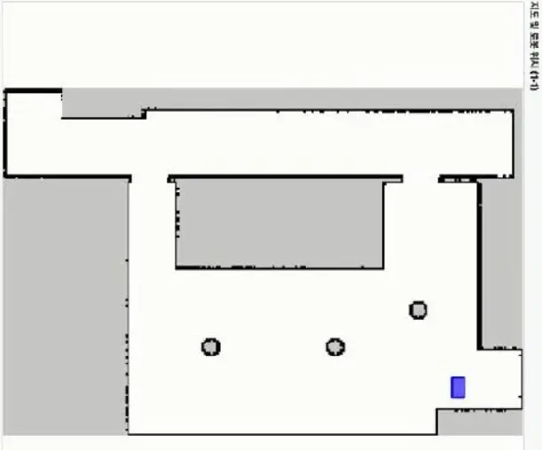

## 도서 픽업 서비스

사용자가 도서를 요청하면 중앙 시스템이 로봇의 상태와 배터리를 확인해 작업을 할당합니다. JAVIS는 목표 책장으로 이동하고, 카메라로 도서를 인식한 뒤 로봇팔로 픽업합니다.

<figure class="feature-media"></figure>

## 픽업·반납 자율주행

JAVIS가 도서를 픽업하고 반납하려면 폭이 좁은 서가 사이를 지나 지정된 책장 앞까지 이동해야 했습니다. Cartographer와 2D LiDAR로 도서관의 점유격자 지도를 생성한 뒤, 편집 도구로 불필요한 영역과 벽면을 정리했습니다.

<figure class="feature-media"><figcaption>Cartographer로 생성한 도서관의 2D 점유격자 지도</figcaption></figure>

초기에는 Nav2의 DWB Controller로 경로를 추종했습니다. 넓은 구간에서는 이동할 수 있었지만, 좁은 복도와 전방이 막힌 구간에서는 회전 궤적을 찾지 못하고 정지하는 문제가 반복됐습니다. Costmap의 Inflation 영역을 넓히면 서가 사이를 통과할 수 없는 공간으로 판단했고, 반대로 좁히면 로봇이 벽에 지나치게 가까워졌습니다.

<figure class="feature-media"><figcaption>DWB 적용 후 좁은 구간에서 회전에 실패한 초기 주행</figcaption></figure>

이 문제를 해결하기 위해 로봇의 직사각형 형상과 회전 반경, 후진 경로를 고려하는 Smac Planner Hybrid로 전역 경로 계획기를 변경했습니다. LiDAR 필터와 Inflation 값을 실제 로봇 크기에 맞게 조정하고, 여러 후보 궤적을 비교해 움직임을 선택하는 MPPI Controller를 적용했습니다.

<figure class="feature-media"><figcaption>Smac Planner Hybrid와 MPPI 적용 후 좁은 서가를 통과하는 주행</figcaption></figure>

변경 후 실제 도서관 테스트에서 좁은 서가와 회전 여유가 적은 구간을 지나 픽업·반납 위치까지 이동하는 흐름을 확인했습니다.

## 로봇 상태 및 임무 제어

로봇의 초기화, 충전, 작업 대기, 작업 수행과 충전소 이동을 상위 State로 구분했습니다. 각 임무 단계에서는 하위 모듈의 완료·실패·취소 응답을 확인해 다음 상태를 결정하고, 배터리 조건이나 긴급 정지 요청이 발생하면 현재 임무에서 복구 또는 안전 상태로 전환하도록 구성했습니다.

<figure class="feature-media"></figure>

## 로봇 상태 모니터링

실물 로봇 통합 테스트 중 현재 State, 세부 임무, 배터리와 ROS 로그를 한 화면에서 확인하는 모니터링 GUI를 개발했습니다. 임무가 멈춘 단계와 모듈별 완료·실패 응답을 추적해 State Machine의 전이, 예외 처리와 통합 로직을 검증하는 데 사용했습니다.

<figure class="feature-media"></figure>

## 상태 전이 및 예외 처리 테스트

AI, 주행과 로봇팔 모듈이 모두 준비될 때까지 기다리지 않고 통합 개발을 진행할 수 있도록 공통 인터페이스를 정의했습니다. 실제 모듈과 Mock 모듈이 같은 명령과 응답 구조를 사용하므로 메인 컨트롤러를 변경하지 않고 실행 대상을 교체할 수 있습니다.

<figure class="feature-media"></figure><figure class="feature-media"></figure>

Mock의 응답을 통해 정상 완료뿐 아니라 실행 실패와 작업 취소 상황을 재현했습니다. 이를 통해 실제 장비를 연결하기 전에 State Machine의 전이, 예외 처리와 하위 모듈 호출 순서를 반복적으로 확인했습니다.
