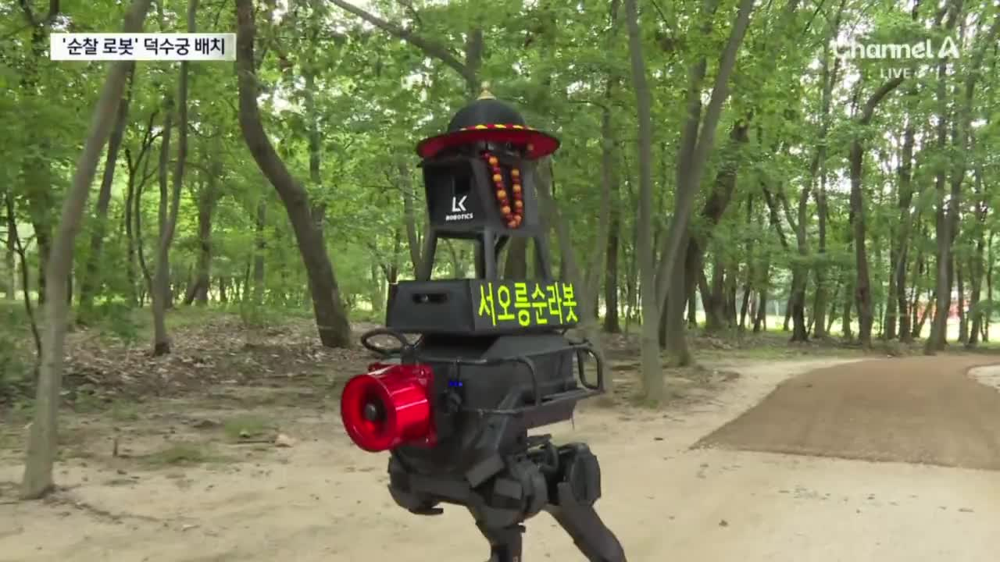

## 서오릉의 흙길과 경사로

서오릉 순찰 경로는 대부분 흙길이며, 경사와 요철이 많습니다. 비가 오면 흙이 유실돼 길의 형태와 단차도 달라집니다. 고정된 높이를 기준으로 장애물을 판별하는 기존 방식으로는 경사진 지면과 실제 장애물을 구분하기 어려웠습니다.

## 지면과 장애물을 구분하는 주행

레이저로 주변의 3차원 형상을 측정하는 센서(3D LiDAR, Light Detection and Ranging)의 데이터를 이용해 지면을 분리하는 Ground Segmentation 알고리즘을 적용했습니다. 기존 2D 장애물 처리에서 지형을 고려하는 방식으로 바꾸고, 경사로의 지면과 단차·장애물을 구분한 결과를 내비게이션에 반영했습니다.

지도 작성과 동시에 위치를 추정하는 SLAM(Simultaneous Localization and Mapping), 지도에서 현재 위치를 찾는 Localization 기능에도 예외 처리를 추가하고 현장에 맞게 설정을 조정했습니다.

## 출발 가속과 좁은 구간의 속도 명령 개선

바퀴형 이족 로봇의 강화학습 기반 주행 제어에서는 같은 속도 명령을 주어도 출발 시 급격한 가속이 나타났습니다. 당시 사용한 자율주행 소프트웨어 Nav2(Navigation2)의 Humble 버전 MPPI(Model Predictive Path Integral) 제어기에서 가속을 제한하는 방식을 검토했습니다. MPPI는 여러 후보 주행 궤적을 평가해 속도 명령을 만드는 제어기입니다.

먼저 지수 이동 평균 필터(EMA, Exponential Moving Average)를 적용해 속도 명령의 급격한 변화를 완화했습니다. 하지만 장애물 비용이 반영된 지도에서 통과 공간이 좁아지는 조건에서는 MPPI가 과도한 속도 명령을 출력하는 문제가 남았습니다.

Humble의 MPPI 구현을 분석한 뒤 Kilted 버전의 MPPI를 포팅해 가속과 좁은 구간의 과도한 속도 출력을 개선했습니다. Kilted 구현의 가속 제약은 [공식 소스 코드](https://api.nav2.org/nav2-kilted/html/motion__models_8hpp_source.html)에서 확인할 수 있습니다.

## 사람 접근 시 정지와 안내 방송

사람이 접근하면 회피 동작을 빈번하게 수행하던 방식에서, 설정한 안전 범위 안에 사람이 감지되면 정지하고 안내 방송을 하는 방식으로 변경했습니다. 사람이 함께 이용하는 순찰 공간에 맞춰 임무 수행 중의 예외 처리를 추가했습니다.

## 도킹과 언도킹

순찰로봇이 도킹 위치에 진입하는 도킹 기능과, 도킹 위치에서 이탈하는 언도킹 기능을 개발했습니다.

## 2 km 경로에서 반복 주행

서오릉의 2 km 순찰 경로에서 수차례 주행하며 현장에 맞게 알고리즘을 조정했습니다.

<figure class="feature-media"><figcaption>서오릉 현장의 로봇 주행 모습 · 채널A 뉴스 · 2026.09.04</figcaption></figure>
