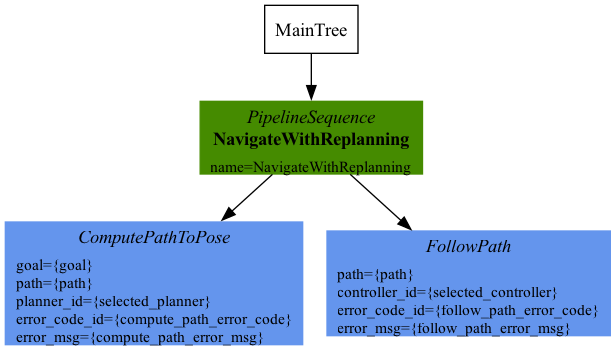

## Problem Statement

기존 시스템은 로봇 소프트웨어 프레임워크인 ROS(Robot Operating System) 1 Noetic과 자율주행 패키지 move_base를 사용했습니다. 로봇의 동작은 상태 머신(State Machine)으로 관리했습니다.

기존 ROS 1의 유지보수 지원이 종료되고, move_base 기반 구성에서 사용할 수 있는 알고리즘과 시스템 구조에도 서비스 확장의 한계가 있었습니다. 이에 ROS 2 Humble로 전환하고 자율주행과 의사결정 구조를 재설계했습니다.

## ROS 2 포팅

기존 코드 전체를 옮기기보다 새 시스템에 필요한 부분을 선별했습니다. 3차원 레이저 센서인 3D LiDAR(Light Detection and Ranging)를 이용한 지도 작성·동시 위치 추정 알고리즘(SLAM, Simultaneous Localization and Mapping)과 사전 지도 기반 위치 추정(Localization) 등을 ROS 2 Humble로 포팅했습니다.

경로 계획과 주행 제어는 Nav2(Navigation2)를 중심으로 구성했습니다.

상태 머신 기반 의사결정 구조를 변경해, 조건 확인과 행동 실행을 트리로 구성하는 행동 트리(Behavior Tree)를 도입했습니다.

<figure class="feature-media"></figure>

의사결정과 개별 기능을 분리하고, 시스템을 다음 네 모듈로 나눴습니다.

| 모듈 | 역할 |
| --- | --- |
| 지도 작성·위치 추정 | 3D LiDAR 기반 SLAM과 사전 지도에서의 현재 위치 추정 |
| 주행 | Nav2 기반 경로 계획과 주행 제어 |
| 관제 통신 | 관제 시스템과 로봇 사이의 통신 |
| 의사결정 | 행동 트리 기반 조건 판단과 행동 실행 흐름 관리 |

이 구조를 바탕으로 여러 로봇에서 각 모듈을 재사용할 수 있도록 설계했습니다.
