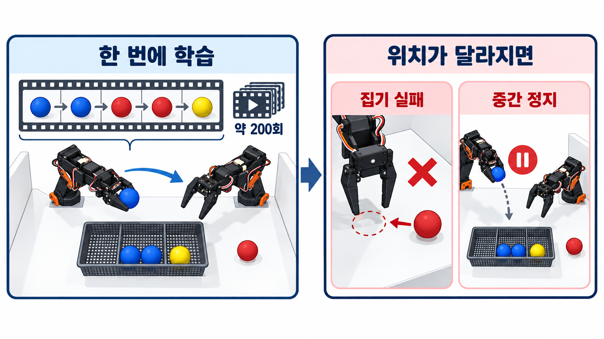
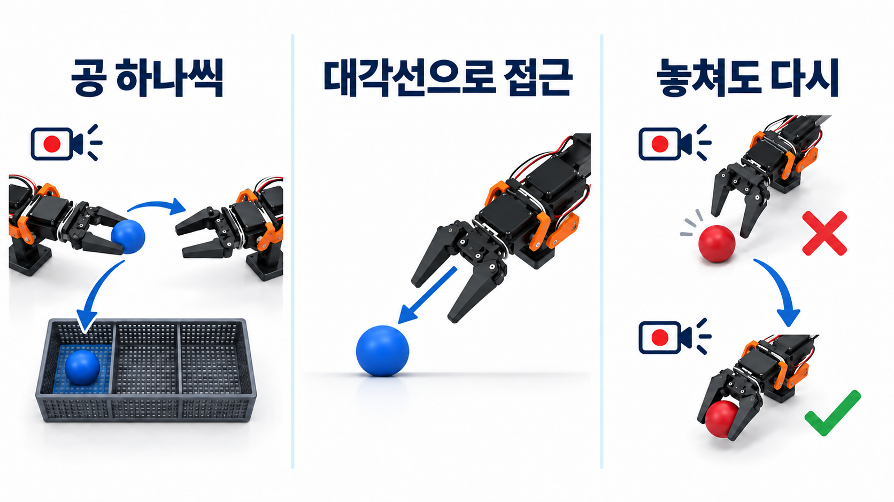

## 도전 과제: 두 팔이 공을 건네 색상별로 분류하기

<strong>Pick & Place</strong>한쪽 팔로 바닥의 공 집기

<strong>Transfer</strong>반대쪽 팔의 그리퍼로 전달

<strong>Classification</strong>색상별 수납함에 넣기

<figure class="feature-media hackathon-wide-media"></figure>

## 모델 선택

제한된 시간 안에 구현과 테스트를 마치기 위해 LeRobot에서 지원하는 ACT를 사용했습니다. ACT는 카메라 영상과 관절 상태를 바탕으로 여러 동작을 한 번에 예측해 집기·전달·분류 같은 연속 동작을 제어합니다.

<figure class="feature-media hackathon-act-media"></figure>

사람이 리더 로봇팔을 움직이며 카메라 영상, 관절 상태와 동작을 에피소드로 기록했습니다.

<figure class="feature-media hackathon-wide-media"></figure>

## 1차 시도: 다섯 개의 공을 한 번에 학습시키기

공의 위치를 임의로 정해 고정한 뒤, **파랑 → 파랑 → 빨강 → 빨강 → 노랑** 순서로 다섯 공을 집어 전달하고 분류하는 전체 시퀀스를 한 번에 기록했습니다. 이 과정을 약 200회 반복해 학습 데이터를 수집했습니다.

테스트에서는 공을 떨어뜨리면 다시 집지 못하고 멈췄고, 공이 학습 때 고정한 위치에서 벗어나면 제대로 집지 못했습니다. 수직으로 접근하는 과정에서는 공에 닿기 전에 집게를 먼저 닫는 현상도 발생했습니다.

<figure class="feature-media hackathon-act-media"></figure>

## 2차 시도: 공 하나씩 학습하고 실패 복구도 기록하기

시연을 **공 하나를 집어 전달하고, 같은 색 수납함에 넣는 동작**으로 나눴습니다. 긴 순서를 한꺼번에 익히기보다 짧은 동작을 반복해서 학습하도록 바꿨습니다.

공에 수직으로 내려가는 대신 대각선으로 접근해 집는 동작을 기록했습니다. 일부러 공을 놓친 뒤 다시 집는 동작을 넣어, **실패한 상태에서 작업을 이어가는 과정**도 학습 데이터에 포함했습니다.

<figure class="feature-media hackathon-act-media"></figure>

## 심사 결과

공 5개를 각각 200회씩 시연해 약 1,000개의 학습 데이터를 수집했습니다. 오전 9시 마감에 맞춰 15,000 step까지 학습한 모델로 심사를 진행했습니다.

공 3개는 집기·전달·색상별 분류까지 연속으로 성공했습니다. 네 번째 공을 처리하던 중 오른팔이 수납함을 넘어뜨려 시연을 중단해 완주하지 못했고, 아쉽게 수상하지는 못했습니다.

<figure class="feature-media hackathon-wide-media"></figure>

## 회고

ACT로 양팔 동작을 학습했지만, 수납함이 넘어지는 등 상황이 달라졌을 때 작업을 이어가는 데 한계가 있었습니다. 동작 학습과 별개로 작업 진행 상태를 확인하고 다음 행동을 정하는 구조가 필요했습니다.

다시 설계한다면 ACT는 팔 동작을 맡고, 상위 상태 머신은 공의 색상·처리 개수·실패 여부를 관리하도록 나누겠습니다. 이번 경험을 통해 작업을 짧게 나누고 실패 후 복구 동작까지 데이터에 담는 것이 중요하다는 점을 배웠습니다.

## 함께한 팀

<figure class="feature-media hackathon-team-media"></figure>
