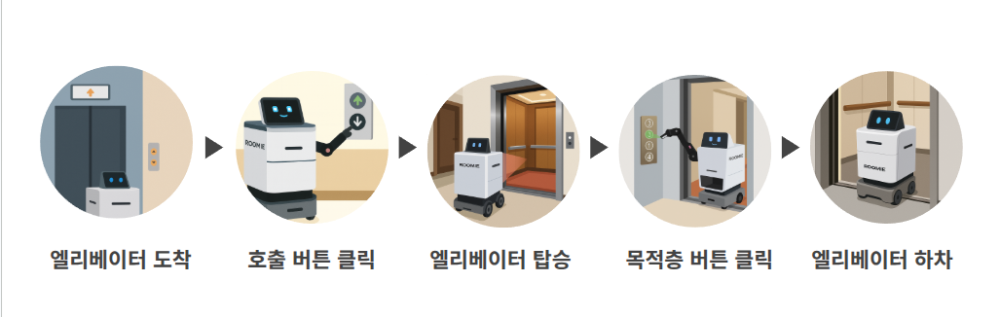
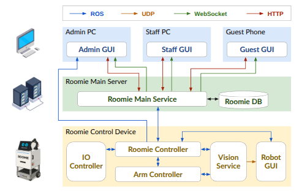
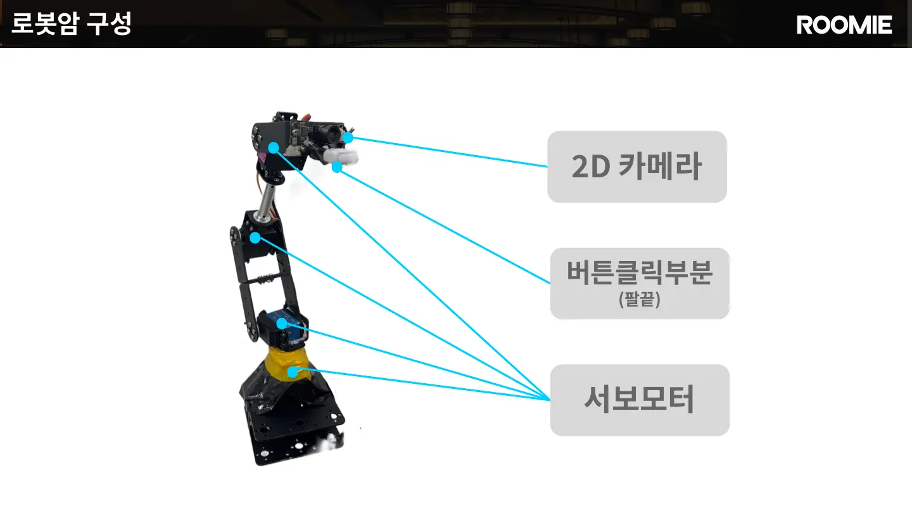
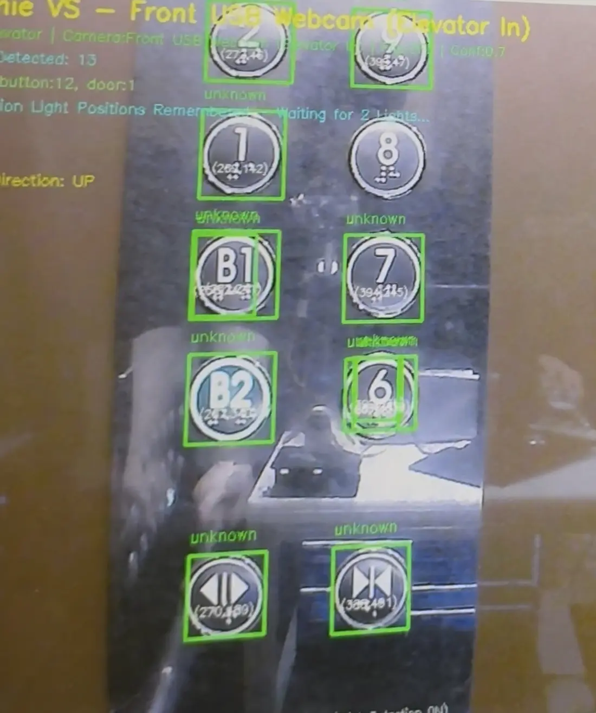
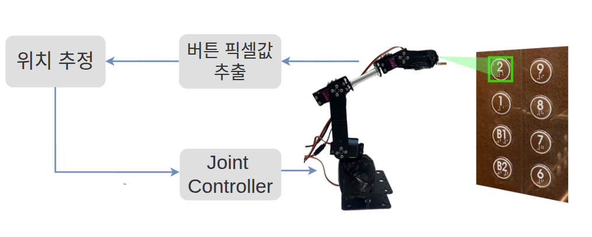
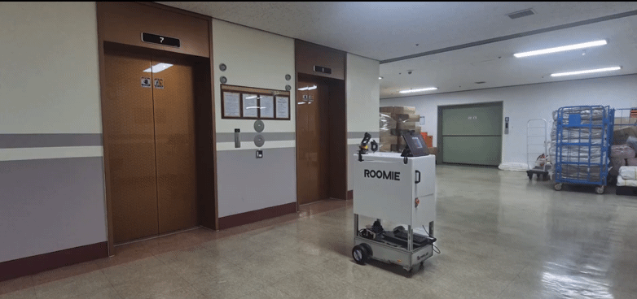
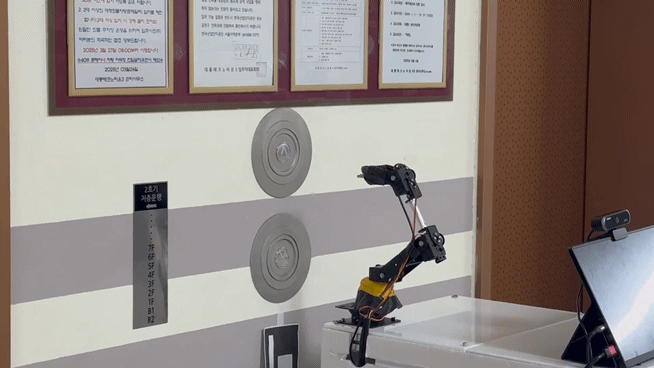

## 엘리베이터를 스스로 이용하는 서비스 흐름

ROOMIE는 엘리베이터 앞까지 자율주행한 뒤 외부 호출 버튼을 누르고 문 열림을 확인합니다. 탑승 후에는 내부 목적층 버튼을 조작하고, 층수 표시기의 OCR 결과로 도착을 판단한 다음 하차해 기존 배송·안내 임무를 계속합니다.

<figure class="feature-media"></figure>

## 시스템 설계

투숙객은 Guest GUI에서 룸서비스를 주문하거나 목적지를 선택하고, 직원은 Staff GUI에서 주문을 확인한 뒤 픽업을 요청합니다. 요청은 Roomie Main Service를 거쳐 로봇에 할당되며, ROS 2 기반 Roomie Controller가 주행·비전·로봇팔·적재함 제어 모듈의 실행을 연결합니다.

<figure class="feature-media"></figure>

## 인식 결과를 물리 동작으로 연결한 Arm Controller

4명으로 구성된 팀에서 Vision Service가 버튼을 검출한 이후부터 로봇팔이 조작 명령을 마치고 ROS 2 Action 결과를 반환할 때까지의 Arm Controller를 담당했습니다.

Vision Service 버튼 검출

→

3D 위치 추정 좌표계 변환

→

관측 자세 4-DOF IK

→

ESP32 제어 ACK · 예외 처리

→

Action Result Success · Abort

담당 범위에는 버튼 중심과 크기를 이용한 거리 추정, Forward Kinematics와 Hand–Eye Calibration을 이용한 좌표계 변환, 4축 역기구학, 관측 자세 기반 동작 계획, ESP32 모터 제어와 오류 처리가 포함됩니다. GUI와 팀 전체 기능을 나열하기보다 저비용 로봇팔의 불확실성을 실제 동작으로 연결한 과정에 집중했습니다.

## 약 5만 원대 로봇팔과 2D 카메라라는 제약

사용한 교육용 4축 로봇팔은 본체 기준 약 5만 원대였으며, Depth Camera 대신 일반 2D 카메라를 장착했습니다. 제한된 예산 안에서 빠르게 프로토타입을 제작할 수 있었지만 다음 문제가 발생했습니다.

<figure class="feature-media"></figure>

PERCEPTION<strong>2D 깊이 한계</strong>
버튼까지의 거리를 직접 측정할 수 없었습니다.

MECHANISM<strong>백래시·프레임 변형</strong>
같은 명령각에서도 팔끝 위치가 달라졌습니다.

ACTUATION<strong>토크 부족</strong>
팔을 펼치면 버튼 반력을 이기기 어려웠습니다.

FEEDBACK<strong>센서 피드백 부재</strong>
실제 관절각과 버튼 접촉력을 측정할 수 없었습니다.

## 2D 검출 결과를 로봇 기준 3차원 목표로 바꾸기

Vision Service는 엘리베이터 버튼의 검출 박스와 중심 위치를 제공합니다. 기본 실행 경로인 `normal` 모드에서는 실험 대상 버튼의 대표 지름을 35 mm로 설정하고, 화면상 버튼 크기와 카메라 내부 파라미터를 이용해 깊이를 근사했습니다.

<figure class="feature-media portrait-evidence"><figcaption>실제 2D 카메라 입력에서 검출한 엘리베이터 버튼. 검출 박스의 중심과 크기가 Arm Controller의 위치 추정 입력이 됩니다.</figcaption></figure>

Z ≈ fxD / Wpx &nbsp;·&nbsp; X = (u-cx)Z/fx &nbsp;·&nbsp; Y = (v-cy)Z/fy

버튼의 실제 지름 `D`, 영상에서의 버튼 너비 `Wpx`와 초점거리 `fx`로 깊이 `Z`를 근사하고, 버튼 중심 픽셀 `(u, v)`를 카메라 기준 `(X, Y, Z)`로 변환합니다. 이 방식은 Depth Camera 없이 동작하지만 검출 박스 크기와 촬영 각도에 민감하다는 한계가 있습니다.

네 기준점이 제공되는 경우에는 `solvePnPRansac`으로 카메라 기준 Pose를 구하는 `corner` 경로도 구현했습니다. 다만 공개 저장소의 기본 설정은 중심과 크기를 이용하는 `normal` 모드이며, PnP를 기본 시연 결과로 설명하지 않습니다.

Tbase→button = Tbase→tool · Ttool→camera · Tcamera→button

현재 명령 관절각의 Forward Kinematics, Hand–Eye Calibration과 OpenCV–로봇 좌표축 보정을 적용해 카메라 기준 버튼 위치를 로봇 베이스 기준 목표로 변환했습니다.

<figure class="feature-media"><figcaption>버튼의 영상 좌표를 카메라·Tool·Base 좌표계를 거쳐 로봇팔의 목표로 변환하는 구조</figcaption></figure>

## 4축 IK로 계산한 목표를 실제 로봇과 RViz에서 확인하기

변환된 목표 위치는 `ikpy` 기반 4관절 역기구학으로 계산했습니다. 현재 관절각을 초기값으로 사용하고, 계산 결과를 Forward Kinematics로 다시 검산해 수치 잔차가 1 mm를 넘거나 관절 제한을 벗어나면 이동을 실패 처리했습니다.

<figure class="feature-media evidence-video"><video controls playsinline preload="metadata" poster="../assets/images/roomie-ik-target-control-poster.jpg"><source src="../assets/videos/roomie-ik-target-control.mp4" type="video/mp4">브라우저가 MP4 영상을 지원하지 않습니다.</video><figcaption>IK 목표 제어 실험. 실제 로봇팔의 이동과 RViz 관절 모델을 함께 확인했습니다.</figcaption></figure>

여기서 1 mm는 IK 수치해의 허용 잔차이며 실제 로봇팔 끝단의 절대 정확도가 아닙니다. 실제 위치에는 백래시, 프레임 변형과 명령각–실제각 차이가 추가됩니다.

## 관측 자세를 거쳐 버튼을 한 번에 누르기

초기 구현에서는 로봇팔이 어떤 자세에 있는지와 관계없이 버튼을 검출하고 목표를 계산했습니다. 하지만 기준 자세에서 벗어난 상태에서는 관절 하중과 백래시 방향이 달라지고, 명령각 기반 FK와 실제 끝단 위치의 차이도 커졌습니다. 같은 버튼을 바라보더라도 시작 자세에 따라 도달 위치의 재현성이 현저히 떨어졌습니다.

이를 개선하기 위해 `ClickButton` 요청을 받으면 버튼을 바로 누르지 않고 사전에 정의한 관측 자세로 먼저 이동했습니다. 이 자세에서 버튼 위치를 한 번 계산한 뒤 준비 위치로 이동하고, 버튼을 누른 다음 후퇴하도록 순서를 고정했습니다.

ClickButton 요청

→

OBSERVE_POSE 기준 자세 통일

→

버튼 위치 1회 계산

→

Standby · Press Retreat

<figure class="feature-media evidence-video"><video controls playsinline preload="metadata" poster="../assets/images/roomie-button-click-poster.jpg"><source src="../assets/videos/roomie-button-click.mp4" type="video/mp4">브라우저가 MP4 영상을 지원하지 않습니다.</video><figcaption>개발 환경에서 관측 자세로 이동해 버튼 위치를 확인하는 과정</figcaption></figure>

<figure class="feature-media"><figcaption>ROOMIE가 관측 자세를 거쳐 엘리베이터 버튼으로 접근하는 과정</figcaption></figure>

## 버튼 누르기 동작과 물리적 한계

버튼 위치를 계산한 뒤 버튼 앞 80 mm 준비 위치로 이동하고, 버튼 방향으로 100 mm 전진한 다음 같은 준비 위치로 후퇴합니다.

<figure class="feature-media"><figcaption>ROOMIE 본체에 통합한 로봇팔의 엘리베이터 외부 호출 버튼 조작</figcaption></figure>

버튼 위치까지 이동해 접촉하더라도 실제 버튼을 활성화하려면 버튼 반력을 이길 힘이 필요했습니다. 그러나 팔을 펼친 상태에서는 서보모터의 유효 토크가 감소했고, 버튼을 누르는 순간 저가형 프레임과 관절 연결부가 밀리거나 휘었습니다. 위치 정렬이 성공해도 실제 버튼이 눌리지 않는 경우가 발생한 이유입니다.

## 실제 버튼 활성화 성공률 3/10

개발 당시 10회의 버튼 조작 테스트에서 실제 버튼이 활성화된 경우는 3회였습니다.

10회버튼 조작 시도

3회실제 버튼 활성화

30%최종 클릭 성공률

이 수치는 로봇팔이 목표 위치로 이동한 비율이나 IK 정확도가 아니라, 버튼이 실제로 눌려 입력이 활성화된 비율입니다. 당시 실험에서는 위치 정렬 실패와 접촉 후 힘 부족을 별도 수치로 기록하지 않았기 때문에 두 원인의 비율까지 주장하지 않습니다.

실패를 분석하면서 다음 두 문제를 분리했습니다.

<dl class="flow"><dt>위치 문제</dt><dd>2D 깊이 근사, 시작 자세, 백래시와 프레임 변형으로 End-effector가 버튼 중심에서 벗어났습니다.</dd><dt>힘의 문제</dt><dd>버튼에 접촉해도 모터 토크와 프레임 강성이 부족해 버튼 반력을 이기지 못했습니다.</dd></dl>

## 정지 진동을 완화하고 제어 주기를 분리하기

초기 등속 제어에서는 목표 각도에 도달할 때 팔끝이 떨리거나 동작이 끊기는 현상이 나타났습니다. ESP32에서 오차함수 기반 Gaussian 누적 프로파일로 시작각과 목표각을 보간하고, 마지막 스텝에서는 목표각을 직접 기록했습니다. 이는 실제 시연에서 관찰한 급격한 움직임을 완화하기 위한 변경이며, 진동 감소량을 정량 측정한 결과로 설명하지 않습니다.

<dl class="flow"><dt>Motion Task</dt><dd>FreeRTOS 태스크를 한 코어에 고정하고 6 ms 주기로 네 개 서보의 목표각을 갱신합니다.</dd><dt>Communication Task</dt><dd>별도 코어에서 시리얼 입력을 처리해 명령 수신이 모션 제어 주기를 막지 않게 했습니다.</dd><dt>완료 확인</dt><dd>460800 baud로 명령을 전송하고 ESP32의 완료 ACK를 받은 경우에만 다음 동작으로 전환합니다.</dd><dt>예외 처리</dt><dd>Vision 응답, IK, Serial timeout과 중복 요청을 각각 ROS 2 Action 실패로 반환합니다.</dd></dl>

## 전체 시연

<figure class="feature-media">
<iframe src="https://www.youtube.com/embed/qIbQOql0ST0" title="ROOMIE 전체 시연 영상" loading="lazy" allow="accelerometer; autoplay; clipboard-write; encrypted-media; gyroscope; picture-in-picture; web-share" allowfullscreen></iframe>
</figure>

## 남은 한계

버튼 위치까지 팔을 이동시키는 것과 실제 버튼을 누르는 것은 다른 문제였습니다. 2D 카메라의 거리 근사 오차와 로봇팔의 백래시가 위치 정확도를 낮췄고, 팔을 펼쳤을 때 부족해지는 토크와 프레임 변형 때문에 버튼에 닿아도 입력되지 않는 경우가 있었습니다. 관절 Encoder와 Force Sensor가 없어 어느 단계에서 실패했는지를 수치로 나눠 확인하지 못한 점도 한계로 남았습니다.
