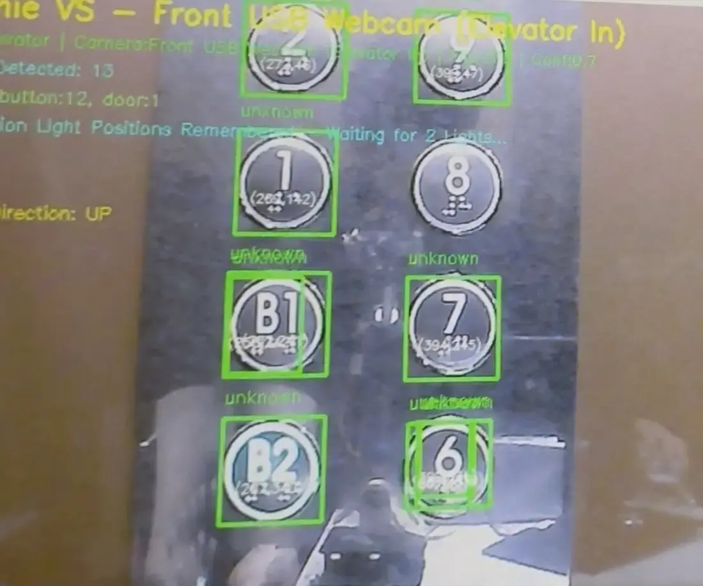
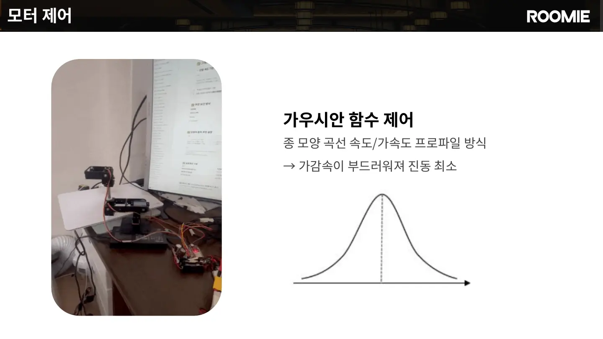

## 엘리베이터를 스스로 이용하는 서비스 흐름

ROOMIE는 엘리베이터 앞까지 자율주행한 뒤 외부 호출 버튼을 누르고 문 열림을 확인합니다. 탑승 후에는 내부 목적층 버튼을 조작하고, 층수 표시기의 OCR 결과로 도착을 판단한 다음 하차해 기존 배송·안내 임무를 계속합니다.

<figure class="feature-media"></figure>

## 시스템 설계

투숙객은 Guest GUI에서 룸서비스를 주문하거나 목적지를 선택하고, 직원은 Staff GUI에서 주문을 확인한 뒤 픽업을 요청합니다. 요청은 Roomie Main Service를 거쳐 로봇에 할당되며, ROS 2 기반 Roomie Controller가 주행·비전·로봇팔·적재함 제어 모듈의 실행을 연결합니다.

<figure class="feature-media"></figure>

## Arm Controller 하드웨어 구성

본체 기준 약 5만 원대의 교육용 4축 로봇팔을 사용했습니다. 팔끝에는 일반 2D 카메라와 버튼 접촉부를 장착하고, 네 개의 서보모터를 ESP32에서 제어하도록 구성했습니다.

<figure class="feature-media"></figure>

## 2D 카메라로 버튼 목표 좌표 계산

Vision Service가 검출한 버튼의 중심 픽셀 `(u, v)`와 Bounding Box 너비 `Wpx`를 입력으로 사용했습니다. 버튼의 실제 지름은 `D = 35 mm`로 설정하고, 카메라 내부 파라미터 `(fx, fy, cx, cy)`를 이용해 카메라에서 버튼까지의 거리와 방향을 계산했습니다.

<figure class="feature-media portrait-evidence"><figcaption>버튼 중심과 Bounding Box 크기를 위치 추정 입력으로 사용</figcaption></figure>

Z ≈ fxD / Wpx &nbsp;·&nbsp; X = (u-cx)Z/fx &nbsp;·&nbsp; Y = (v-cy)Z/fy

핀홀 카메라 모델에서 버튼의 실제 지름과 영상 속 크기의 비율로 깊이 `Z`를 근사합니다. 이후 중심 픽셀을 역투영해 카메라 좌표계의 버튼 위치 `p_camera = (X, Y, Z)`를 구했습니다.

pbase = Tbase←tool(q) · Ttool←camera · pcamera

현재 관절각 `q`의 Forward Kinematics로 `Tbase←tool`을 계산하고, Hand–Eye Calibration으로 구한 고정 변환 `Ttool←camera`를 적용했습니다. 그 결과 카메라 기준 버튼 위치를 로봇 베이스 기준 목표 `p_base`로 변환해 4축 역기구학의 입력으로 사용했습니다.

<figure class="feature-media"><figcaption>버튼의 영상 좌표를 카메라·Tool·Base 좌표계를 거쳐 로봇팔의 목표로 변환하는 구조</figcaption></figure>

## 4축 IK 목표 검증

변환된 목표 위치는 `ikpy` 기반 4관절 역기구학으로 계산했습니다. 현재 관절각을 초기값으로 사용하고, 계산 결과를 Forward Kinematics로 다시 검산해 수치 잔차가 1 mm를 넘거나 관절 제한을 벗어나면 이동을 실패 처리했습니다.

<figure class="feature-media evidence-video"><video controls playsinline preload="metadata" poster="../assets/images/roomie-ik-target-control-poster.jpg"><source src="../assets/videos/roomie-ik-target-control.mp4" type="video/mp4">브라우저가 MP4 영상을 지원하지 않습니다.</video><figcaption>IK 목표 제어 실험. 실제 로봇팔의 이동과 RViz 관절 모델을 함께 확인했습니다.</figcaption></figure>

여기서 1 mm는 IK 수치해의 허용 잔차이며 실제 로봇팔 끝단의 절대 정확도를 의미하지는 않습니다.

## 관측 자세에서 버튼 누르기

초기에는 임의의 자세에서 버튼 위치를 계산해 시작 자세에 따라 팔끝의 도달 위치가 달라졌습니다. 이후 `ClickButton` 요청을 받으면 먼저 정해진 관측 자세로 이동하고, 같은 조건에서 버튼 위치를 계산하도록 순서를 고정했습니다.

로봇팔 링크의 전체 길이는 약 33.5 cm이므로 팔만으로 확보할 수 있는 작업 범위가 제한적이었습니다. ROOMIE 본체가 버튼 가까이 정밀하게 접근한 뒤, 로봇팔이 관측 자세에서 클릭 동작을 실행하도록 구성했습니다.

본체 정밀 접근

→

OBSERVE_POSE

→

버튼 위치 계산

→

Standby 80 mm

→

Press 100 mm

→

Retreat

<figure class="feature-media evidence-video"><video controls playsinline preload="metadata" poster="../assets/images/roomie-button-click-poster.jpg"><source src="../assets/videos/roomie-button-click.mp4" type="video/mp4">브라우저가 MP4 영상을 지원하지 않습니다.</video><figcaption>개발 환경에서 관측 자세와 버튼 접근 동작을 확인한 실험</figcaption></figure>

<figure class="feature-media"></figure><figure class="feature-media"></figure>

## Gaussian 프로파일 기반 모션 제어

등속 제어에서 발생한 팔끝 지터를 줄이기 위해 Gaussian 프로파일로 가감속을 부드럽게 만들었습니다. ESP32는 네 개 서보의 목표각을 6 ms 주기로 갱신하고, 동작이 끝나면 완료 ACK를 반환합니다.

<figure class="feature-media"></figure>

## 전체 시연

<figure class="feature-media">
<iframe src="https://www.youtube.com/embed/qIbQOql0ST0" title="ROOMIE 전체 시연 영상" loading="lazy" allow="accelerometer; autoplay; clipboard-write; encrypted-media; gyroscope; picture-in-picture; web-share" allowfullscreen></iframe>
</figure>

## 최종 결과

10회버튼 조작 시도

3회버튼 눌림 성공

30%최종 성공률

## 한계

실패한 7회에는 위치 정렬 오차와 누름 힘 부족이 함께 포함돼 있으며, 원인별 횟수는 따로 기록하지 못했습니다.

PERCEPTION<strong>2D 깊이 추정</strong>
버튼 크기로 거리를 근사했지만 검출 크기와 촬영 각도에 민감했습니다.

MECHANISM<strong>백래시·프레임 변형</strong>
관측 자세를 통일해도 실제 팔끝 위치에는 오차가 남았습니다.

ACTUATION<strong>부족한 누름 힘</strong>
버튼에 도달해도 토크와 프레임 강성 부족으로 입력되지 않았습니다.

FEEDBACK<strong>센서 피드백 부재</strong>
Encoder와 Force Sensor가 없어 실패 원인을 직접 측정하지 못했습니다.

