## AI, ML, DL의 차이

### 인공지능(Artificial Intelligence)

인공지능은 컴퓨터가 사람처럼 인식하고 판단하도록 만드는 기술을 아우르는 넓은 개념입니다.

사람이 규칙을 직접 정하는 방식부터, 데이터를 통해 학습하는 머신러닝과 딥러닝까지 포함합니다.

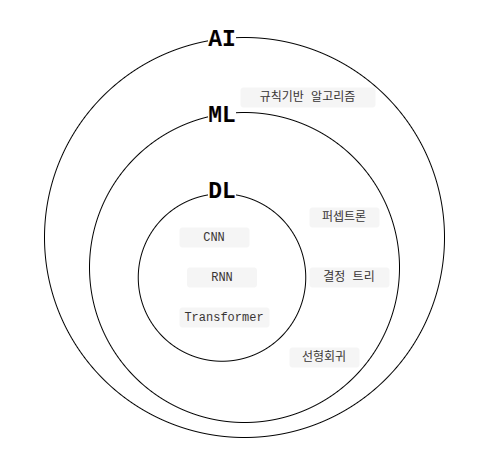

### 머신러닝(Machine Learning)

**머신러닝**은 사람이 모든 판단 규칙을 직접 정하는 대신, 데이터에서 판단에 필요한 패턴을 학습하는 방법입니다.

규칙 기반 알고리즘으로 강아지와 고양이를 구분하려면 사람이 직접 구별 규칙을 만들어야 합니다.
하지만 같은 동물도 생김새와 자세가 달라 모든 경우에 맞는 규칙을 작성하기는 어렵습니다.

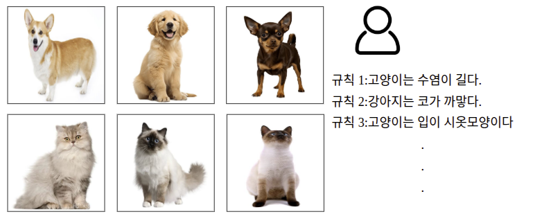

머신러닝에서는 데이터를 이용해 모델이 패턴을 학습하도록 합니다.

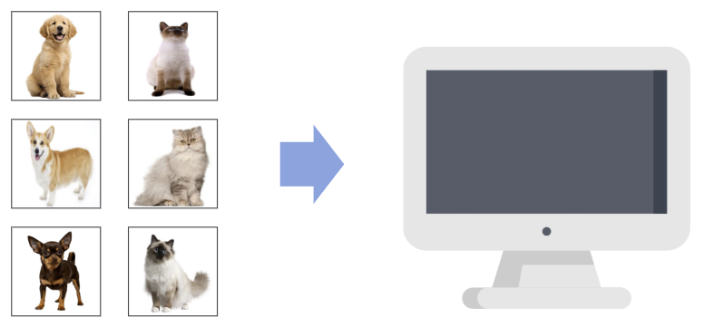

다양한 상황의 사진을 구분하려면 학습 데이터도 그 상황을 충분히 담고 있어야 합니다.

예를 들어, 누워 있거나 뒤돌아 있는 모습, 흐릿하거나 노이즈가 있는 사진을 포함하면 다양한 입력에 대응하는 데 도움이 됩니다.

다만 데이터가 많고 다양하다는 이유만으로 높은 성능이 보장되지는 않습니다.

이렇게 데이터로 모델을 조정하는 과정을 **훈련**이라고 합니다. 훈련 후에는 **학습에 사용하지 않은 사진**으로 강아지와 고양이를 얼마나 잘 구분하는지 평가합니다.

### 딥러닝(Deep Learning)

**딥러닝**은 머신러닝의 한 분야입니다. **깊은 인공 신경망(Deep Neural Network)** 을 이용해 데이터의 특징과 판단 기준을 학습합니다.

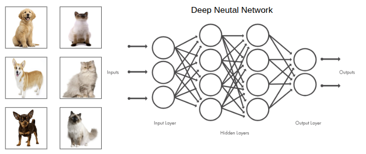

#### 인공 신경망이란?
여러 인공 신경을 층으로 연결한 수학적 모델입니다.

인공 신경은 뇌의 신경세포와 그 연결 방식에서 영감을 얻어 만들었습니다.

인공 신경망에는 데이터 입력을 받는 입력층, 특징을 추출하고 계산하는 은닉층, 결과를 출력하는 출력층이 있습니다.
은닉층이 하나인 모델은 얕은 신경망, 은닉층을 여러 겹 쌓은 모델은 깊은 신경망이라고 부릅니다. 얕은 신경망도 데이터에서 특징을 학습할 수 있지만, 깊은 신경망은 여러 층을 거치며 단순한 특징을 복잡한 특징으로 단계적으로 조합합니다.

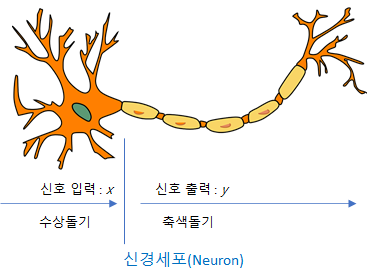
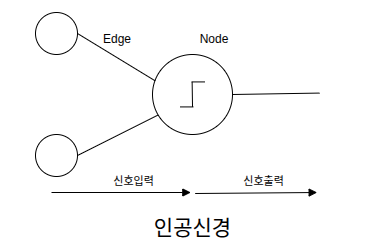

#### 딥러닝이 기존 머신러닝과 다른 점

딥러닝은 머신러닝과 별개의 기술이 아니라, 깊은 인공 신경망을 사용하는 머신러닝의 한 분야입니다. 

두 방식은 데이터에서 **특징**을 다루는 과정에서 차이가 드러납니다. 특징은 주어진 작업에 필요한 정보입니다.

기존 머신러닝에서는 사람이 어떤 특징을 추출할지 설계하고, 모델은 추출된 특징을 바탕으로 판단 기준을 학습하는 경우가 많았습니다.

인공 신경망은 학습 과정에서 특징을 직접 학습할 수 있습니다. 

특히 **딥러닝은 여러 층을 통해 단순한 특징을 복잡한 특징으로 단계적으로 조합하고, 판단 기준까지 하나의 학습 과정에서 함께 학습합니다.**

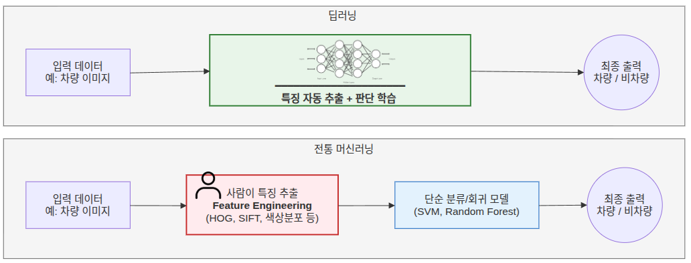

## 2. 머신러닝의 학습 방식

학습 방식에는 크게 네 가지로 지도학습, 비지도학습, 자기지도학습, 강화학습이 있습니다.

### 2.1 지도학습(supervised learning)

**지도학습**은 입력 데이터에 정답을 붙이고, 예측과 정답의 차이를 줄이도록 학습하는 방식입니다.

입력 데이터에 정답을 붙이는 작업을 **데이터 레이블링**(Data Labeling)이라고 합니다.
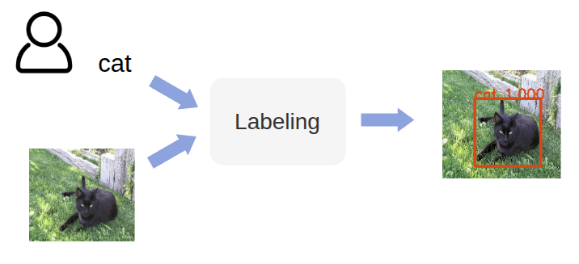

### 지도학습의 종류
#### 분류와 위치 추정
사진에 무엇이 있는지만 알면 되는지, 어디에 몇 개 있는지도 알아야 하는지에 따라 작업이 달라집니다.

- **분류(classification):** 이미지가 무엇을 나타내는지 클래스를 예측합니다.

- **객체 위치 추정(localization):** 대상 객체의 위치를 예측합니다. 보통 경계 상자로 표시합니다.

- **객체 탐지(object detection):** 한 이미지에 있는 여러 객체의 종류와 위치를 함께 예측합니다.
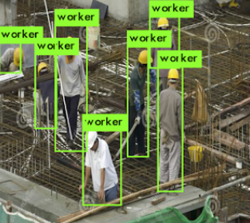

#### 분할

경계 상자만으로는 물체의 정확한 모양을 표현하기 어렵습니다. **분할**은 픽셀 단위로 영역을 구분합니다.

- **의미 분할(semantic segmentation):** 모든 픽셀에 대해 어떤 클래스에 속하는지 판단합니다.

- **인스턴스 분할(instance segmentation):** 같은 클래스라도 개별 객체를 구분합니다. 사람 두 명이 있으면 각각 다른 영역으로 표시합니다.

구현 예시: 객체 탐지 → 각 객체 영역의 픽셀 분할
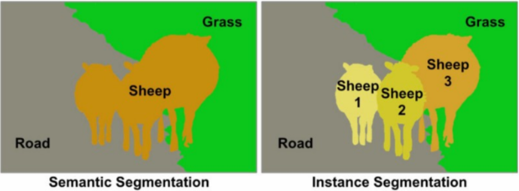

#### 자세 추정과 얼굴 랜드마크 탐지

- **자세 추정(Pose Estimation):** 어깨·팔꿈치·무릎 등 주요 신체 부위의 좌표를 예측합니다.

  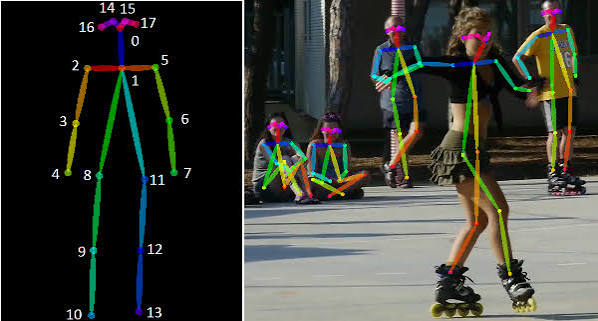

- **얼굴 랜드마크 탐지:** 눈·코·입 등 얼굴의 주요 특징점 좌표를 예측합니다.

  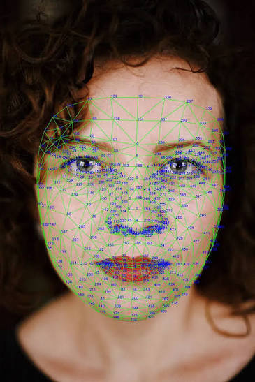

사람이 직접 정답(레이블)을 붙이는 데에는 많은 시간과 비용이 듭니다.

### 2.2 자기지도학습(self-supervised learning)

지도학습의 한계를 개선하기 위해 나온 학습 방식입니다.
별도로 사람이 만든 레이블 없이, 데이터 자체에서 학습에 필요한 정답이나 목표를 자동으로 만들어 학습하는 방식입니다.

넓은 의미에서는 비지도학습의 한 종류로 볼 수 있지만, 데이터로부터 입력과 정답에 해당하는 학습 신호를 만든 뒤 지도학습과 유사한 방식으로 모델을 학습한다는 특징이 있어 별도로 구분하기도 합니다.

이때 대표적으로 사용하는 방법이 **사전학습(Pre-training)과 미세조정(Fine-tuning)​**입니다.

먼저 레이블이 없는 대량의 데이터를 이용해 가짜 목표를 만들고 모델을 사전학습한 뒤, 실제로 하려는 작업의 레이블이 있는 소량의 데이터를 이용해 모델을 미세조정합니다.

이를 통해 적은 양의 레이블 데이터만으로도 특정 작업에 적합한 모델을 만들 수 있습니다.

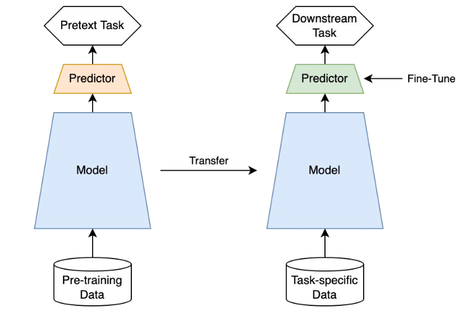

| 단계                | 학습 내용                                                                                                              | 사용하는 데이터           |
| ----------------- | ------------------------------------------------------------------------------------------------------------------ | ------------------ |
| 사전학습(Pretraining) | 가짜 연습 문제(Pretext Task)를 풀며 특징 학습 Predictor : 가짜 연습 문제(Pretext Task)를 풀기 위한 **임시 채점기**                           | 레이블이 없는 대량의 데이터    |
| 미세조정(Fine-tuning) | 실제로 풀려는 다운스트림 작업(Downstream Task)에 맞게 모델 조정  Predictor : 우리가 진짜 풀고 싶은 실전 문제(Downstream Task)를 위한 **실전용 최종 출력기** | 해당 작업의 레이블이 있는 데이터 |

사전학습 방식은 대표적으로 두 가지로 나뉩니다.

#### 자가예측 방식 (Self-Prediction)

하나의 data sample 내에서 한 파트를 통해서 다른 파트를 예측하는 task를 말합니다.

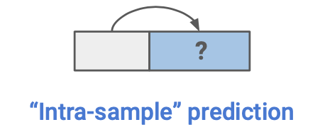

##### 이미지에서 예시

- **Context Prediction · 위치 관계 예측**
	이미지에 정답 레이블이 없어도 어디에서 잘라낸 조각인지는 알 수 있습니다.
	 이 위치 정보를 학습 목표로 사용하는 방법이 **Context Prediction**입니다. 
	 작은 이미지 영역인 패치 사이의 상대 위치를 예측합니다.
	
	순서

	1. 이미지에서 기준 패치를 무작위로 선택합니다.
	2. 기준 패치 주변에서 같은 크기의 패치를 선택합니다.
	3. 두 패치를 입력하고, 주변 패치가 기준 패치의 어느 방향에 있었는지 예측합니다.

<figure>
  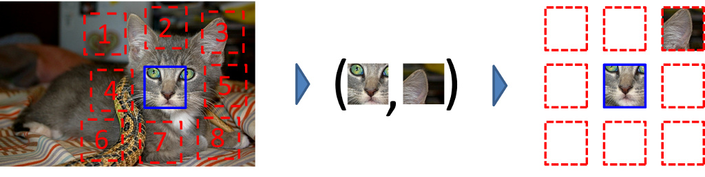
  <figcaption>출처: Doersch · Gupta · Efros, <a href="https://graphics.cs.cmu.edu/projects/deepContext/">ICCV 2015 프로젝트 페이지</a>.</figcaption>
</figure>

패치의 위치는 추출 과정에서 알 수 있으므로 별도 레이블링 없이 여러 학습 쌍을 만들 수 있습니다. 이미지의 픽셀과 물체의 부분이 일정한 구조를 가진다는 점을 활용합니다. [원 논문](https://arxiv.org/abs/1505.05192)

##### 자연어에서 예시

- **GPT:** 앞선 토큰을 보고 다음 토큰을 예측합니다  (Next Token Prediction).
- **BERT:** 문장의 일부를 가리고 해당 토큰을 예측합니다 (Masked Token Prediction).
- 원래 BERT는 두 문장 구간이 연속된 것인지 예측하는 작업(Next Sentence Prediction)도 사용했습니다.

두 방식 모두 원문으로부터 학습 목표를 만듭니다. [BERT 공식 설명](https://github.com/google-research/bert#what-is-bert)

#### 대조학습 방식 (Contrastive Learning)

이미지 사이의 관계를 예측하는 task를 말합니다.

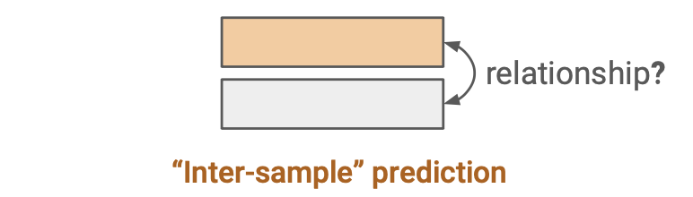

##### 이미지에서 예시: SimCLR

1. 하나의 이미지에 서로 다른 변형을 적용합니다. 예: 일부 자르기, 밝기·색상 조절.
2. 변형된 이미지를 모델에 넣어 각각 숫자 벡터로 표현합니다.
3. 같은 원본의 벡터는 가까워지고, 다른 원본의 벡터는 멀어지도록 모델을 조정합니다.

<figure>
  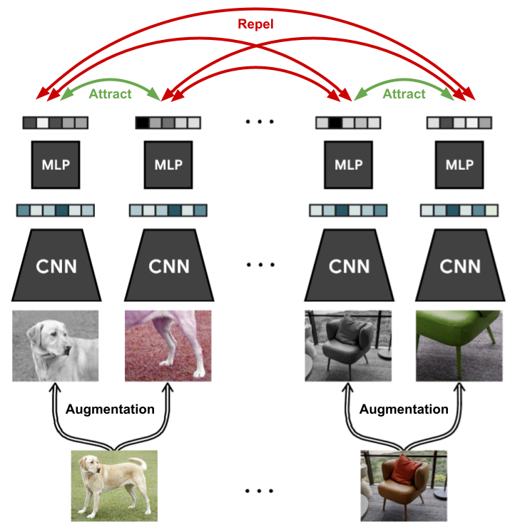
  <figcaption>출처: Chen et al., <a href="https://simclr.github.io/">SimCLR 공식 프로젝트 페이지</a>.</figcaption>
</figure>

두 변형의 표현이 가까워지도록 모델을 조정하면서, 변형 전후에도 유지되는 핵심 특징을 학습합니다. [SimCLR 원 논문](https://arxiv.org/abs/2002.05709)

### 2.3 비지도학습

**레이블이 없는 데이터에서 패턴이나 구조를 찾는 방식입니다.**

대표 예시: 군집화, 차원 축소

#### 군집화

정답 분류가 없는 데이터에서 비슷한 특징이 있는 데이터끼리 묶는 방식입니다.

주요 활용
	데이터에서 이상치 탐지
	 이미지 분할
	 취향이 비슷한 유저 그룹을 찾아 맞춤형 콘텐츠 추천

주요 알고리즘
- **K-means:** 군집 수 K를 정하고, 가까운 중심에 데이터를 배정한 뒤 중심을 갱신하는 과정을 반복합니다.
- **DBSCAN:** 데이터가 밀집한 영역을 그룹으로 묶는 밀도 기반 방법입니다. k means와 달리 비정형 군집모양도 가능합니다.

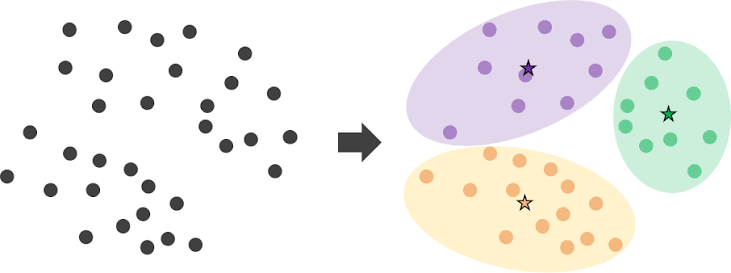

#### 차원 축소

데이터의 특징이 많으면 계산량이 늘고, 분포를 눈으로 확인하기도 어렵습니다. **차원 축소**는 중요한 특징을 가능한 한 유지하면서 특징 수를 줄이는 방법입니다.

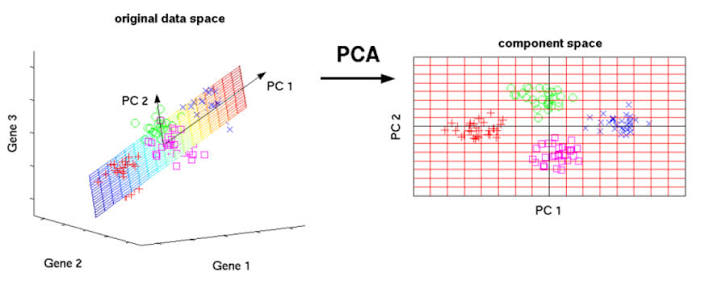

활용 예시: 고차원 데이터 시각화, 계산량 감소

- **PCA(Principal Component Analysis):** 데이터의 분산을 최대로 보존하는 축으로 투영해 차원을 축소하는 기법입니다.
	- 분산이 사라지면 데이터들이 다 똑같아 보여서 구별하지 못하기 때문입니다.

- **SVD(Singular Value Decomposition):** 복잡한 직사각형 숫자 표(행렬)를 3개의 단순한 부품 표로 쪼개는 기술입니다. 일부 성분을 남기는 근사나 PCA 계산에 활용할 수 있습니다.

[군집화·차원 축소 참고 문서](https://scikit-learn.org/stable/unsupervised_learning.html)

### 2.4 강화학습

**강화학습(Reinforcement Learning)** 은 에이전트가 환경에서 행동을 시도하고 보상을 받으며, 앞으로 더 큰 보상을 얻는 선택을 배우는 방식입니다.

**딥 강화학습(Deep Reinforcement Learning)** 은 이 과정에 깊은 신경망을 사용하는 방식입니다. 예를 들어 Q-learning은 위치와 행동별 예상 누적 보상인 Q값을 배우고, **심층 Q 신경망(Deep Q-Network, DQN)** 은 신경망으로 그 Q값을 예측합니다.

출처: [https://davinci-ai.tistory.com/31](https://davinci-ai.tistory.com/31) [DAVINCI - AI:티스토리]

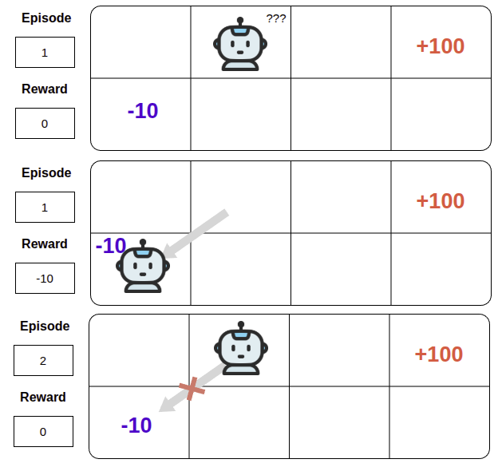

#### 강화학습에 나오는 용어 정리

- **에이전트(Agent):** 행동을 선택하고 그 결과로 학습하는 주체. 예: 로봇, 게임 캐릭터
- **행동(Action):** 에이전트가 선택해 실행하는 일. 예: 위쪽으로 한 칸 이동
- **보상(Reward):** 이번 행동의 결과로 실제 받은 점수
- **환경(Environment):** 에이전트가 행동하고 그 결과와 보상을 받는 공간
- **상태(State):** 에이전트가 행동을 선택할 때 참고하는 현재 상황. 예: 현재 위치
- **행동 가치(Q값):** 현재 위치에서 특정 행동을 했을 때 앞으로 받을 총점의 예상값
- **큐러닝(Q-learning):** 이번 행동으로 받은 보상과 이동한 위치에서 가장 높은 Q값을 이용해 예상 점수를 고치는 학습 방법
- **정책(Policy):** 현재 위치에서 어느 방향으로 갈지 정하는 규칙. 예: Q값이 가장 높은 방향 선택

예를 들어 오른쪽으로 한 칸 이동하며 `−1`을 받아도, 그 길이 맛집으로 이어진다면 오른쪽의 Q값은 양수일 수 있습니다. `−1`은 이번 보상이고, Q값은 그 뒤에 받을 보상까지 고려한 예상 점수입니다.

#### 맛집을 찾으며 배우는 에이전트

맛집까지 가는 길을 배우는 프로그램을 생각해 봅시다. 이 프로그램이 **에이전트**이고, 지도와 점수 규칙이 **환경**입니다. 현재 위치는 **상태**, 위·아래·왼쪽·오른쪽 중 하나를 고르는 일은 **행동**입니다. 이동한 결과로 받는 점수가 **보상**입니다. 예를 들어 맛집에 도착하면 `+100`, 공사 구간에 들어가면 `−20`, 한 칸 이동할 때마다 `−1`을 받도록 정할 수 있습니다.

학습 초반에는 어느 길이 좋은지 모르기 때문에 여러 방향으로 움직이며 시행착오를 겪습니다.

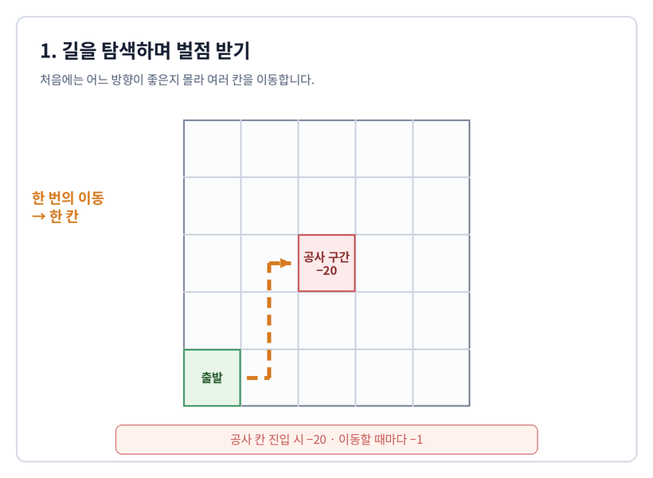

에이전트는 위치와 방향마다 앞으로 받을 총점의 예상치인 **Q값**을 기록합니다. 이 값을 고치는 방법 중 하나가 **Q-learning**입니다.

> 새 Q값 = 기존 Q값 + 학습률 × (이번 이동의 보상 + 할인율 × 다음 위치에서 가장 높은 Q값 − 기존 Q값)

즉, 이번에 받은 보상과 다음 위치에서 기대할 보상을 보고 기존 점수를 조금 고칩니다. 공사 구간으로 이동한 방향의 Q값은 낮추고, 맛집에 도착하는 데 도움이 된 방향의 Q값은 높입니다. 이렇게 배운 Q값을 보고 방향을 고르는 규칙이 **정책**입니다.

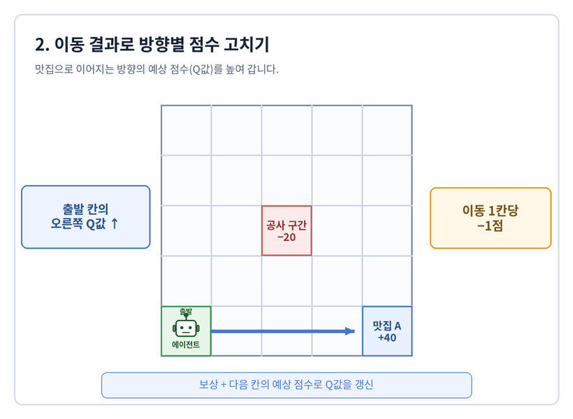

하지만 현재 Q값이 가장 높은 방향만 계속 선택하면, 다른 위치에 있는 더 좋은 맛집을 발견하지 못할 수 있습니다.

이를 해결하려면 이미 알고 있는 행동을 선택하는 **활용(Exploitation)** 과 새로운 행동을 시도하는 **탐색(Exploration)** 사이의 균형이 필요합니다.

이때 사용할 수 있는 정책인 **엡실론 그리디(ε-greedy)** 는 `ε`의 확률로 무작위 방향을 선택하고, `1−ε`의 확률로 Q값이 가장 높은 방향을 선택합니다. `ε`는 사람이 정하는 하이퍼파라미터이며, 학습 초반에는 크게 두고 학습이 진행될수록 줄이기도 합니다.

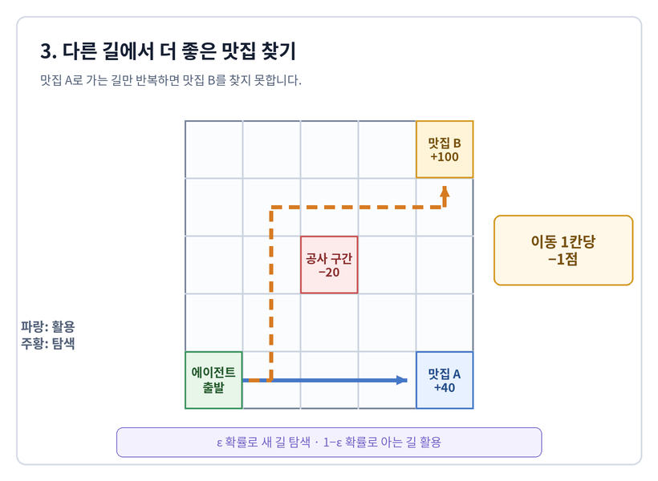

맛집을 발견한 다음에는 더 짧은 경로도 학습해야 합니다. 한 칸 이동할 때마다 작은 벌점 `−1`을 주면 이동 횟수가 많은 경로의 누적 보상이 작아집니다. 여기에 **할인율(Discount Factor)** `γ`를 적용하면 나중에 받을 보상일수록 현재 선택에 더 작게 반영됩니다.

$$
G_t=r_{t+1}+\gamma r_{t+2}+\gamma^2r_{t+3}+\cdots
$$

맛집의 보상은 이전 위치의 행동으로 거슬러 올라가며 전달됩니다. 같은 `+100`을 받더라도 적은 단계로 도착한 경로는 이동 벌점과 할인 효과를 덜 받기 때문에 누적 보상이 더 큽니다. 에이전트는 이 누적 보상을 비교하며 더 짧은 경로를 선택하게 됩니다.

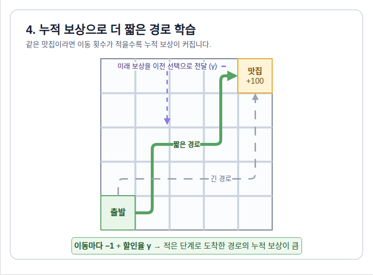

| 하이퍼파라미터 | 역할 |
| --- | --- |
| 학습률 | 새 경험에 따라 Q값을 얼마나 바꿀지 정하는 정도 |
| 탐색률 `ε` | 무작위 행동을 시도할 확률 |
| 할인율 `γ` | 미래에 받을 보상을 현재 선택에 반영하는 정도 |

## 참고 자료

- [NeurIPS 2021 · Self-Supervised Learning: Self-Prediction and Contrastive Learning](https://nips.cc/media/neurips-2021/Slides/21895.pdf).

- 혁펜하임, 『이지 딥러닝』, 챕터 1.
- Doersch et al., [Context Prediction](https://arxiv.org/abs/1505.05192), 2015.
- Chen et al., [SimCLR](https://arxiv.org/abs/2002.05709), 2020.
- [BERT 공식 설명](https://github.com/google-research/bert#what-is-bert).
- [scikit-learn 비지도학습 문서](https://scikit-learn.org/stable/unsupervised_learning.html).
- [Spinning Up 강화학습 기본 개념](https://spinningup.openai.com/en/latest/spinningup/rl_intro.html).
