## 1. 인공 신경

인공 신경망은 생물학적 신경 구조에서 영감을 받은 수학적 모델입니다.

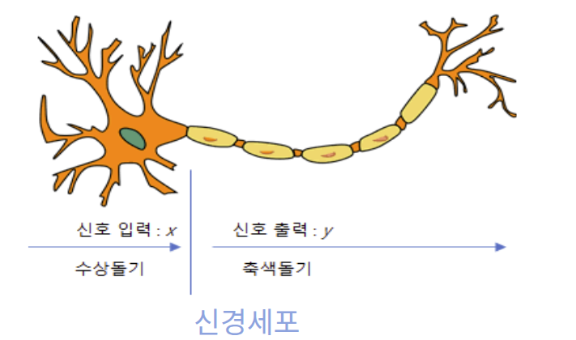

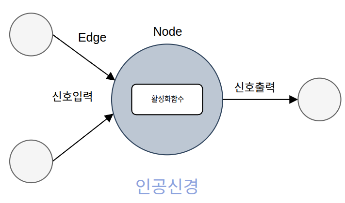

| 생물학적 구조 | 역할             | 인공 신경                    |
| ------- | -------------- | ------------------------ |
| 수상돌기    | 다른 신경의 신호를 받음  | 연결을 통해 입력을 받음            |
| 세포체     | 받은 신호를 통합      | 총합을 계산하고 활성화 함수를 통과시킴      |
| 축삭      | 신호를 다음 신경으로 전달 | 활성화 함수의 출력값을 다음 층의 신경에 전달 |

우리 뇌의 뉴런도 자극이 일정 기준(역치)을 넘어야만 다음 뉴런으로 신호를 쏘듯이 인공 신경망에서도 입력값의 가중합에 바이어스를 더하고 활성화 함수에 통과시켜 다음 층으로 보냅니다.

초기에 사용한 기본적인 활성화 함수는 단위 계단 함수(Unit Step Function)입니다. 여기서는 총합이 0보다 작거나 같으면 0을, 0보다 크면 1을 출력하도록 정의합니다. 그래프가 계단 모양을 띠어 붙은 이름입니다.

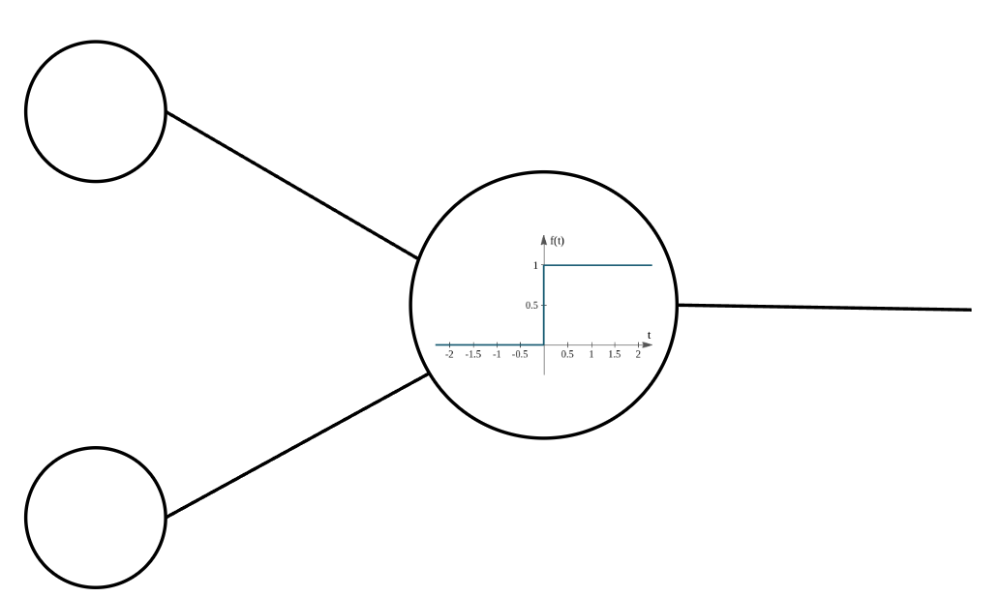

### 가중치(Weight)와 바이어스(Bias)란?

예를 들어, 온도가 100도 이상이거나 연기가 나면 경보를 울리는 장치를 만든다고 해 보겠습니다. 온도는 0 이상의 정수로, 연기는 없으면 0, 있으면 1로 입력합니다.

두 개의 입력 노드가 있습니다.

- 위쪽 입력 노드: 온도
- 아래쪽 입력 노드: 연기 유무

1. 온도계가 99도이면서 연기가 안 나는 상황

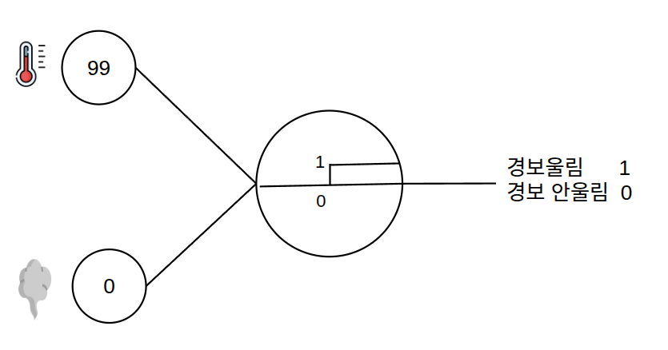

온도 99 + 연기 0 = 99이므로 경보가 울립니다. 온도가 100도 미만이고 연기도 없는데 반응하므로, 기준을 조절하기 위해 **바이어스(Bias)**를 사용합니다.

**바이어스**는 입력의 가중합에 더해지는 값으로, 신경의 반응 기준을 조절하는 파라미터입니다.

바이어스를 −99로 설정하면 다음과 같습니다.

- (99, 0)일 때: `99 + 0 - 99 = 0`, 경보가 울리지 않습니다.
- (99, 1)일 때: `99 + 1 - 99 = 1`, 경보가 울립니다.
- (100, 0)일 때: `100 + 0 - 99 = 1`, 경보가 울립니다.

하지만 (0, 1)일 때는 `0 + 1 - 99 = -98`이므로 경보가 울려야 하는데 울리지 않습니다.

각 입력값이 동일한 중요도로 취급되기 때문에 이런 현상이 발생합니다.

이 문제를 해결하기 위해 입력마다 중요도를 조절하는 **가중치(Weight)**를 사용합니다. 가중치는 각 입력값에 곱해져 총합에 반영됩니다.

예를 들어 온도의 가중치는 1, 연기의 가중치는 100으로 설정합니다. 연기의 가중치가 100이어야 온도가 0이어도 연기에 반응합니다. (99라면 `0 × 1 + 1 × 99 - 99 = 0`이라 울리지 않습니다.)

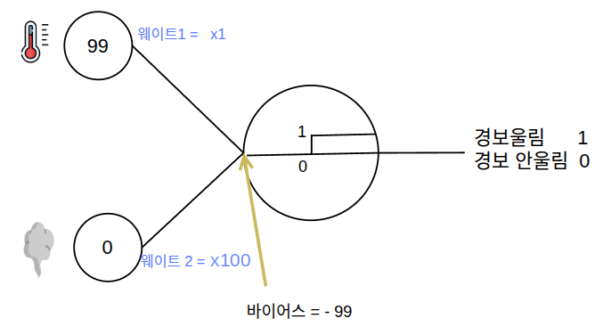

- (99, 1)일 때: `99 × 1 + 1 × 100 - 99 = 100`, 경보가 울립니다.
- (0, 1)일 때: `0 × 1 + 1 × 100 - 99 = 1`, 경보가 울립니다.

딥러닝 모델에는 사람이 하나씩 조정하기 어려울 만큼 많은 가중치와 바이어스가 있습니다.

데이터를 입력하고 예측 결과의 오차를 계산한 뒤, 그 오차를 줄이는 방향으로 가중치와 바이어스를 자동으로 조정하는 과정이 **학습**입니다.

### 신경망의 핵심 요소

| 구성                | 역할                  |
| ----------------- | ------------------- |
| 입력층(Input Layer)  | 조회수·영상 길이 같은 입력을 받음 |
| 은닉층(Hidden Layer) | 입력을 조합하고 변환         |
| 출력층(Output Layer) | 예측 수익 같은 최종 결과를 출력  |

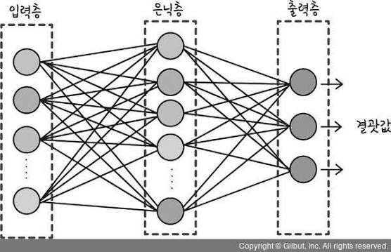

- **완전연결층**(Fully Connected Layer, FC): 이전 층의 모든 노드와 연결된 층입니다.
- **다층 퍼셉트론**(Multi-Layer Perceptron, MLP): 하나 이상의 은닉층을 가지며, 완전연결층과 비선형 활성화 함수로 구성한 신경망입니다. 왜 비선형이어야 하는지는 [3장](/notes/deep-learning/linear-nonlinear-activations/)에서 다룹니다.
- 심층 신경망: 은닉층을 여러 겹 쌓은 신경망입니다.

신경망은 작은 계산들을 연결한 **하나의 함수**입니다. 입력에 가중치를 곱하고, 바이어스를 더하고, 활성화 함수를 통과시키는 계산이 층마다 이어집니다.

## 2. 손실 함수

### 조회수로 수익 예측하기

조회수만으로 영상 수익을 예측한다고 해 보겠습니다. 먼저 기존 영상 네 편의 조회수와 실제 수익을 살펴보겠습니다.

| 영상  | 조회수(만 회) | 실제 수익(만 원) |
| --- | -------: | ---------: |
| A   |        1 |          2 |
| B   |        2 |          4 |
| C   |        3 |          5 |
| D   |        4 |          7 |

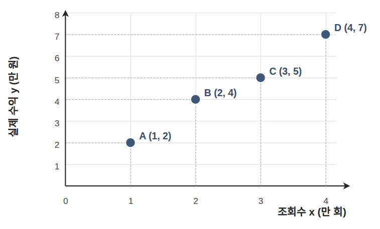

처음 보는 영상의 수익을 예측하려면, 조회수와 수익이 어떤 관계인지 알아야 합니다.
이처럼 연속된 숫자를 예측하는 문제를 **회귀**라고 합니다.

**선형 회귀**는 두 값의 관계를 직선으로 나타내는 방법입니다.
딥러닝 자체는 아니지만, 앞에서 배운 가중치와 바이어스가 예측을 어떻게 바꾸는지 살펴보기 좋은 간단한 예입니다.

### 가중치와 바이어스로 예측선 조절하기

그래프에 점들을 찍고 그 사이를 지나는 직선을 그으면, 그 직선으로 새로운 영상의 수익을 예측할 수 있습니다. 조회수가 들어오면 선형 회귀 함수가 예상 수익을 내놓습니다.

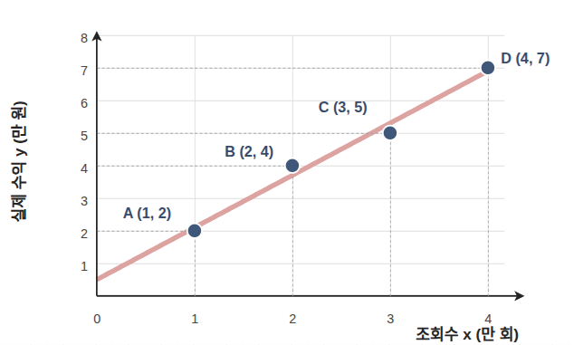

직선의 식은 $y = ax + b$이고, 이 그래프에서는 $y = 1.5x + 0.5$입니다.
여기서 $a$=1.5가 가중치(기울기), $b$=0.5가 바이어스(절편)입니다.
이 둘을 바꾸면 예측선의 기울기와 위치가 달라집니다. 앞으로 $a$, $b$처럼 학습으로 조정하는 값을 **파라미터**라고 부르겠습니다.

그러면 어떤 직선이 데이터를 가장 잘 예측하는지 어떻게 판단할까요?

기존 영상마다 직선이 예측한 수익과 실제 수익을 비교하면 됩니다.
두 값의 차이를 **오차**라고 합니다.

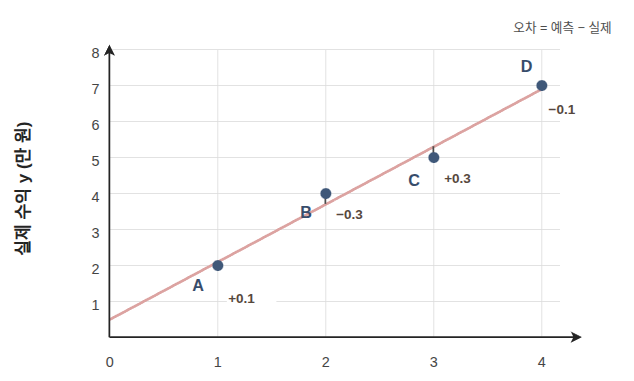

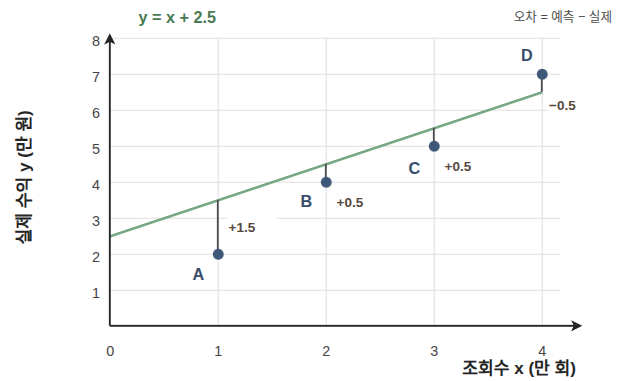

오차 하나만 보면 직선이 전체 데이터를 잘 설명하는지 알기 어렵습니다.

그래서 모든 영상의 오차를 하나의 점수로 모읍니다.

예측이 얼마나 빗나갔는지 나타내는 이 점수를 **손실**이라고 하고, 손실을 계산하는 규칙을 **손실 함수**라고 합니다.
데이터 개수가 달라도 비교하려면 합계보다 평균이 낫습니다. 그런데 오차를 그대로 평균 내면 문제가 생깁니다.

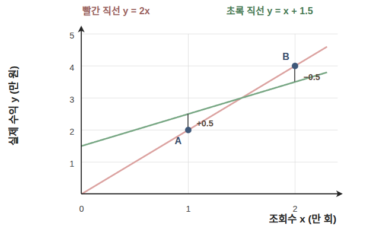

앞의 A와 B 두 영상만 놓고 두 직선을 비교해 보겠습니다.
빨간 직선은 두 데이터를 모두 지나가지만
초록 직선은 두 데이터의 중간을 지나갑니다.
두 데이터의 오차를 더하면 다음과 같습니다.

- 초록 직선: `0.5 + (−0.5) = 0`
- 빨간 직선: `0 + 0 = 0`

둘 다 0이 됩니다.

이 문제를 막으려면 오차를 0 이상의 값으로 바꿔 평균을 내면 됩니다.
대표적인 방법이 절댓값을 쓰는 방법과 제곱을 쓰는 방법입니다.

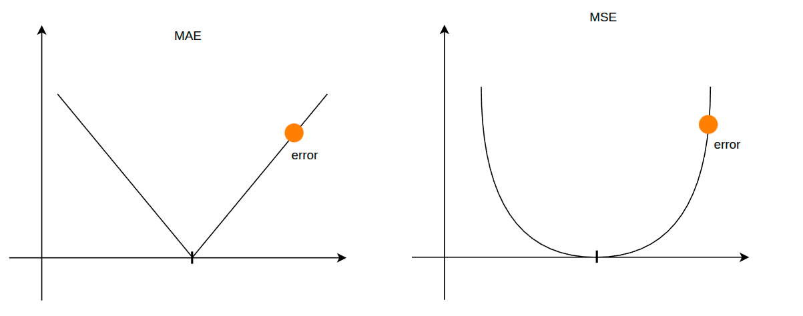

| 손실 함수                              | 계산 방법        | 특징                     |
| ---------------------------------- | ------------ | ---------------------- |
| 평균 절대 오차(Mean Absolute Error, MAE) | 오차의 절댓값을 평균  | 오차 크기에 비례해 손실이 증가        |
| 평균 제곱 오차(Mean Squared Error, MSE)  | 오차를 제곱한 뒤 평균 | 오차가 커질수록 손실이 더 가파르게 증가 |

이상치가 많아 큰 오차에 휘둘리고 싶지 않다면 MAE, 큰 오차를 특히 피하고 싶다면 MSE처럼 목적에 맞게 선택합니다. 왜 회귀에서 제곱 오차를 많이 쓰는지는 [5장](/notes/deep-learning/easy-deep-learning-ch04/)에서 확률의 관점으로 설명합니다.

손실이 가장 작아지는 파라미터를 찾는 일이 학습입니다. 파라미터가 두 개라면 사람이 바꿔 볼 수 있지만, 수천 개나 수억 개라면 어렵습니다. 이를 자동으로 해 주는 알고리즘이 경사하강법입니다.

## 3. 경사하강법(Gradient Descent)

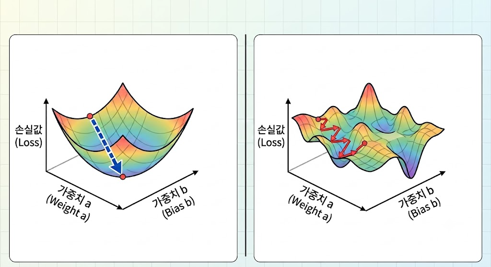

**기울기**(그래디언트, Gradient)는 파라미터를 살짝 바꿨을 때 손실이 얼마나 변하는지를 나타냅니다. 다른 파라미터는 고정하고 하나만 바꿀 때의 변화율이므로 편미분($\partial$)으로 구합니다.
경사하강법은 기울기의 반대 방향(내리막길)으로 파라미터를 조금씩 이동시킵니다.

왼쪽의 단순 선형 회귀 그래프를 보면 **“그냥 한 번에 최소점을 구하면 되지 않을까?”**라고 생각할 수 있습니다. 
제곱 오차를 사용하는 선형 회귀는 해를 직접 계산할 수 있지만, 볼록한 함수라고 해서 모두 그렇게 풀 수 있는 것은 아닙니다.
실제 딥러닝에서는 활성화 함수(3장에서 다룹니다)와 다층 구조 때문에 손실 지형이 오른쪽 그래프처럼 아주 울퉁불퉁해집니다.

**실제 신경망의 손실 지형은 차원이 높아 전체를 그려 보기 어렵습니다.**
그래서 전체를 한 번에 풀지 않고, 현재 위치의 기울기로 내려갈 방향만 찾아 조금씩 이동합니다. 마치 안개 낀 산에서 발밑의 경사로 골짜기를 찾아가는 것과 같습니다.

### 작동 방식

1. 파라미터 $a$와 $b$를 임의의 값으로 초기화합니다. (왜 임의의 값인지는 4장에서 다룹니다.)
2. 예측값과 실제값의 차이로 손실을 계산합니다.
3. 기울기를 계산해 손실이 가파르게 내려가는 방향을 찾습니다.
4. 그 방향으로 파라미터를 조정합니다.
5. 손실 변화가 충분히 작아지거나 정한 반복 횟수에 도달할 때까지 2~4를 반복합니다.

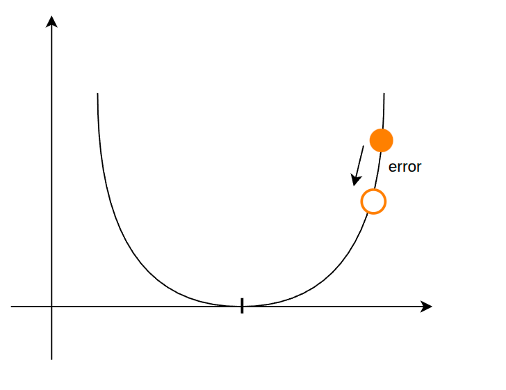

$$
\text{새로운 파라미터} \leftarrow \text{현재 파라미터} - \left( \text{학습률} \times \text{손실의 기울기} \right)
$$

**학습률**은 기울기에 곱해 한 번에 이동하는 보폭을 정하는 계수입니다. 

수학 기호로 표현하면 다음과 같습니다.

$$
w_{\text{new}} \leftarrow w_{\text{old}} - \eta \cdot \frac{\partial \text{Loss}}{\partial w}
$$

- $w$: 갱신할 파라미터(가중치 또는 바이어스)
- $w_{\text{old}}$, $w_{\text{new}}$: 갱신 전과 갱신 후의 값. $\leftarrow$는 새 값으로 바꾼다는 뜻입니다.
- $\eta$(에타): 학습률
- $\dfrac{\partial \text{Loss}}{\partial w}$: $w$를 살짝 바꿨을 때 손실이 변하는 비율(기울기)
- $\partial$ : 편미분 기호

기울기를 빼는 이유는 내리막 방향으로 가기 위해서입니다. 
기울기가 양수이면 $w$를 줄이고, 음수이면 $w$를 늘려 손실을 줄입니다.

파라미터 $a, b$는 한꺼번에 다음과 같이 갱신합니다.

$$
\begin{bmatrix} a \\ b \end{bmatrix}_{\text{new}} \leftarrow \begin{bmatrix} a \\ b \end{bmatrix}_{\text{old}} - \eta \cdot \begin{bmatrix} \frac{\partial \text{Loss}}{\partial a} \\ \frac{\partial \text{Loss}}{\partial b} \end{bmatrix}
$$

### 기울기(그래디언트) 구하기와 연쇄 법칙

목표는 $\dfrac{\partial \text{Loss}}{\partial a}$, 즉 $a$를 살짝 바꿨을 때 손실이 변하는 비율을 구하는 것입니다. 다음 순서로 따라가 보겠습니다.

$$
\text{입력 } x \xrightarrow{\text{파라미터 } a, b} \text{예측값 } \hat{y} \xrightarrow{\text{정답 } y \text{와 비교}} \text{손실(Loss)}
$$

$a$로 $\hat{y}$을 만들고, $\hat{y}$으로 손실을 계산합니다. 
가중치 a -> f(a)(예측값을 구하는 함수) -> 예측값y^ -> 손실함수g(y^) -> 손실Loss
즉 L = g(f(a)) 입니다.  
 -  함수 f(), g()는 별뜻없는 가독성상 의미 
함수 안에 함수가 들어있는걸 **합성함수**라고 합니다. 구하려는 기울기는 이 합성함수를 $a$로 미분한 값입니다.

합성함수의 미분을 한번에 계산할려고 하면 계산량이 많아집니다 그래서 쪼개서 각 미분을 하고 그다음 미분값들을 곱하는 방식을 사용합니다. 계산랴이 훨씬 간단해집니다. 이를 연쇄 법칙(Chain Rule)라고도 합니다 
$$
\frac{\partial \text{Loss}}{\partial a} = \frac{\partial \text{Loss}}{\partial \hat{y}} \times \frac{\partial \hat{y}}{\partial a}
$$

앞의 항은 예측값이 손실에 미치는 영향, 뒤의 항은 파라미터가 예측값에 미치는 영향입니다.
위는 라이프니츠 기호라고 하며 라이프니츠라는 사람이 쓴 수식이고 아래는 라그랑주라는 수학자가 쓰는 수식입니다 표현방법만 다르지 수식은 같습니다. 

$$
\{f(g(x))\}' = f'(g(x)) \cdot g'(x)
$$

직접 계산해보겠습니다. 
데이터 하나에서 $\hat{y}=ax+b$, $\text{Loss}=(\hat{y}-y)^2$이라고 하겠습니다.

| 단계 | 미분 |
| --- | --- |
| 예측값 → 손실 | $\dfrac{\partial \text{Loss}}{\partial \hat{y}}=2(\hat{y}-y)$ |
| 파라미터 → 예측값 | $\dfrac{\partial \hat{y}}{\partial a}=x$ |
| 곱하기 | $\dfrac{\partial \text{Loss}}{\partial a}=2(\hat{y}-y)\,x$ |

층이 깊어져도 같은 방법을 씁니다.

합성이 길어질 뿐이므로 손실에서 출발해 **거꾸로** 한 단계씩 곱해 나가면 됩니다. 
신경망에서 이 방식으로 기울기를 구하는 알고리즘을 **역전파**라고 합니다.

이렇게 구한 기울기로 각 파라미터를 어느 방향으로 얼마나 수정해야 할지 알 수 있습니다.

### 한 번에 얼마나 움직일까

학습률이 지나치게 크면 최적점에 수렴하지 못하고 반대편으로 건너뛰는 과정에서 손실값이 점점 더 커져 결국 학습이 **발산(Divergence)**하게 됩니다.

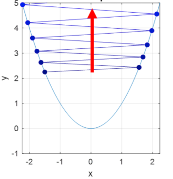

학습률이 너무 작으면 한 번에 이동하는 거리가 짧아 학습이 매우 느려집니다. 특히 기울기가 작은 구간에서는 학습이 정체될 수 있습니다.

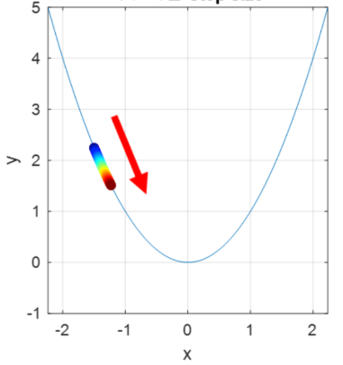

적절한 학습률 크기를 찾는 일이 중요합니다.

### 경사하강법의 한계

지금 예시에서는 영상이 네 편뿐이라 손실을 금방 계산할 수 있습니다.
하지만 영상이 수백만 편이라면, 한 번 움직일 때마다 모든 영상의 예측과 오차를 계산해야 합니다.
모든 데이터의 오차를 사용하는 경사하강법은 한 번 갱신하는 데 계산량이 큽니다.

신경망에서는 손실이 낮은 지점이 여러 개일 수 있습니다.

그중 주변보다 낮지만 가장 낮은 곳은 아닌 지점을 **지역 최솟값**(Local Minimum)이라고 합니다.
지역 최솟값에서는 기울기가 0이므로, 현재 기울기만 사용하는 경사하강법은 그 지점에서 멈춥니다.

학습의 시작점과 갱신 경로를 바꾸는 가중치 초기화와 확률적 경사하강법(SGD)을 살펴보겠습니다.

## 4. 가중치 초기화

가중치는 층을 거치며 신호의 크기가 왜곡되지 않도록 적절한 크기로 초기화하는 것이 중요합니다. 여기서 신호의 크기는 값이 퍼진 정도인 **분산**으로 나타내며, 층을 지날 때 분산이 너무 커지거나 작아지지 않도록 가중치의 분산을 맞춥니다.

- **0으로 초기화하는 경우:**

    모든 노드가 똑같은 계산을 하고 똑같은 수정(기울기)을 받게 됩니다. 결국 **노드가 100개 있든 1,000개 있든, 전부 똑같은 일만 반복하는 복사-붙여넣기 상태**가 되어 노드를 여러 개 둔 의미가 완전히 사라집니다. (서로 다른 특징을 나눠서 학습하지 못합니다.)

- **너무 작은 값으로 하는 경우:**

    역전파 과정에서 작은 값들이 계속 곱해지면서, 앞쪽 노드로 갈수록 기울기가 거의 0이 되어 **앞쪽 층의 학습이 정체될 수 있습니다.**

- **너무 큰 값으로 하는 경우:**

    활성화 함수에 따라 값이나 기울기가 지나치게 커지거나, 포화 구간에서 기울기가 작아질 수 있습니다. 계산 범위를 넘으면 `inf`나 `NaN`이 발생해 학습이 불안정해질 수 있습니다.

대표적인 초기화는 평균이 0인 정규분포 또는 균등분포에서 가중치를 무작위로 뽑습니다. 아래는 자주 사용하는 기본 분산입니다.

| 초기화             | 가중치 분산                                 | 주로 연결되는 활성화 함수  |
| --------------- | -------------------------------------- | --------------- |
| LeCun           | $1/n_{\mathrm{in}}$                    | SELU 등          |
| Xavier · Glorot | $2/(n_{\mathrm{in}}+n_{\mathrm{out}})$ | sigmoid, tanh 등 |
| He · Kaiming    | $2/n_{\mathrm{in}}$                    | ReLU            |

- $n_{\mathrm{in}}$: 한 노드로 들어오는 입력 수. 많아질수록 합산되는 신호도 많아지므로 가중치의 분산을 줄입니다.
- $n_{\mathrm{out}}$: 다음 층의 출력 수. 역전파에서 합쳐지는 기울기의 크기와 관련됩니다.

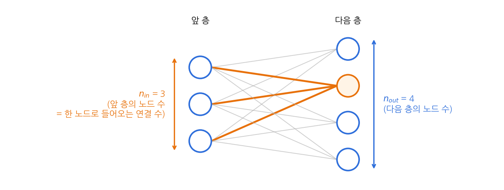

같은 분산이면 정규분포와 균등분포 모두 쓸 수 있습니다. 균등분포는 $-a$에서 $a$ 사이에서 고르게 뽑고 분산이 $a^2/3$이므로, 분산이 $\sigma^2$이면 $a=\sqrt{3}\,\sigma$입니다. 그래프의 점선은 정규분포에서는 표준편차(분산의 제곱근), 균등분포에서는 양 끝 값입니다.

**LeCun**

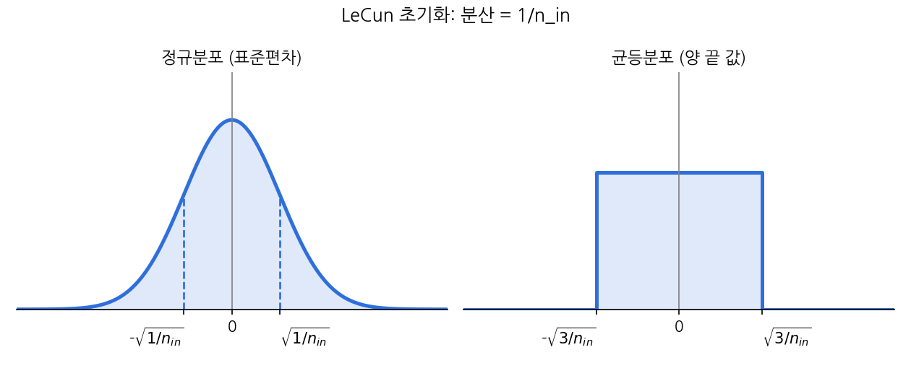

**Xavier**

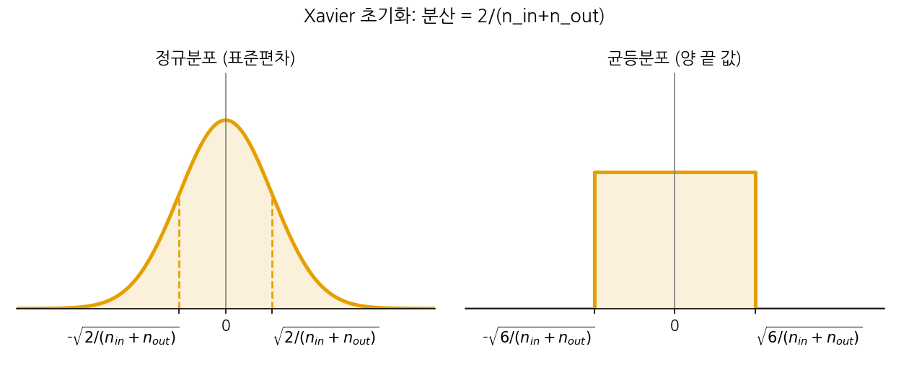

**He**

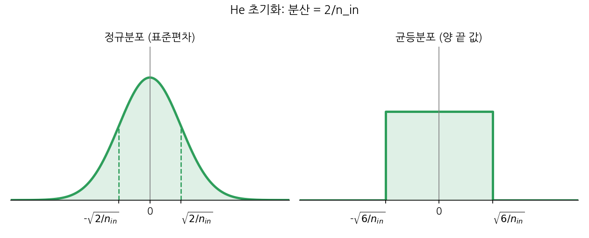

연결 수가 많을수록 합산되는 신호가 커지므로 **연결 개수에 맞춰 가중치의 분산을 조절**합니다. 또 가중치를 무작위로 두어야 같은 층의 노드들이 서로 다른 특징을 배울 수 있습니다.
바이어스는 보통 0으로 초기화하며, 구성에 따라 작은 양수를 쓰기도 합니다. [초기화 참고](https://docs.pytorch.org/docs/stable/nn.init.html)

## 5. 확률적 경사하강법

**확률적 경사하강법**(Stochastic Gradient Descent, SGD)은 입력 데이터 하나로 손실과 기울기를 계산합니다. 데이터를 무작위로 하나씩 뽑아 쓰기 때문에 '확률적'이라는 이름이 붙었습니다.

작동 방식

1. 학습 데이터의 순서를 무작위로 섞습니다.
2. 데이터 하나의 손실과 기울기를 계산해 파라미터를 갱신합니다.
3. 다음 데이터로 넘어가며 모든 데이터를 사용할 때까지 2를 반복합니다.
4. 다음 에포크에서 데이터를 다시 섞고 반복합니다.

전체 데이터를 한 번 순회한 단위를 **에포크**(Epoch)라고 합니다.

이렇게 데이터 하나씩 사용하면 데이터마다 기울기가 달라 갱신 방향이 흔들립니다.

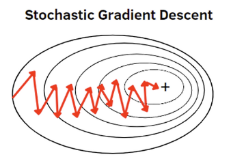

[출처] ml-explained.com

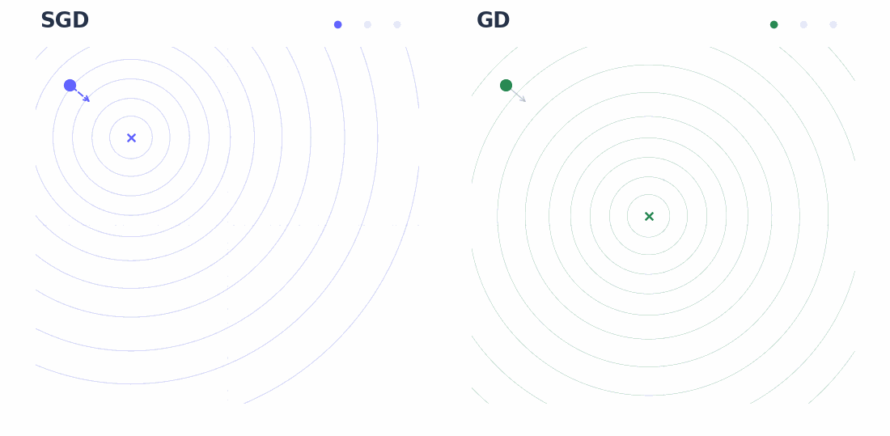
**장점**

- **지역 최솟값 탈출 가능성:** 이 요동 덕분에 얕은 지역 최솟값이나 안장점(Saddle Point)에 갇히더라도 튕겨 나와 더 좋은 최적점으로 갈 가능성이 생깁니다.

- **빠른 초기 수렴 속도(대용량 데이터 환경):** 전체 데이터의 오차를 모두 합산해야 한 번 전진하는 방식과 달리, SGD는 데이터 1건마다 즉시 전진하므로 데이터가 방대할 때 최적점 근처까지 도달하는 시간이 짧아질 수 있습니다.

## 6. 미니배치 경사하강법

SGD는 노이즈나 이상치(Outlier)가 포함된 샘플이 들어오면 기울기의 분산(Variance)이 커져 학습 경로가 불안정해집니다. 또한 1개씩 순차 연산하면 GPU의 병렬 처리 장점을 거의 활용하지 못합니다.

이를 해결하기 위해 여러 개의 데이터를 묶어 연산하는 방식이 **미니배치 경사하강법**입니다.
묶음 단위로 연산하면 기울기의 분산을 줄여 안정적인 수렴을 유도하고 GPU 텐서 연산 코어를 효율적으로 활용할 수 있습니다.

| 방식 | 갱신 한 번에 사용하는 영상 수 | 특징 |
| --- | --- | --- |
| SGD | 1개 | 자주 갱신하지만 방향의 변동이 큼 |
| 미니배치 | 일부 | 변동을 줄이고 GPU 병렬 계산을 활용 |
| 전체 배치 GD | 전체 | 한 번의 갱신에 전체 데이터 계산 |

### (심화) 배치 크기와 학습률 웜업

처음 읽을 때는 건너뛰어도 다음 내용을 이해하는 데 문제가 없습니다.

배치 크기를 $k$배 키우면 한 에포크 동안 가중치를 갱신하는 횟수가 약 $\frac{1}{k}$로 줄어듭니다. 작은 배치로 $k$번 움직인 거리와 비슷하게 맞추려고 **한 번의 보폭(학습률)도 $k$배 키우는 규칙**을 선형 스케일링 규칙(Linear Scaling Rule)이라고 합니다. 다만 모든 배치 크기에서 성립하는 법칙은 아닙니다.

학습 초기에는 가중치가 불안정해서 학습률을 처음부터 $k$배로 올리면 발산할 수 있습니다. 그래서 초기 몇 에포크 동안 학습률을 서서히 올리는 **학습률 웜업**(Learning Rate Warmup)을 함께 씁니다.

선형 웜업에서는 정해 둔 기간(예: 1,000스텝)의 진행률을 목표 학습률 $K$에 곱합니다.

$$
\text{현재 보폭} = K \times \left( \frac{\text{현재 스텝}}{\text{목표 웜업 스텝}} \right)
$$

- **0스텝:** $K \times \frac{0}{1000} = \mathbf{0}$ (조심스럽게 출발)
- **100스텝:** $K \times \frac{100}{1000} = \mathbf{0.1 \times K}$
- **500스텝:** $K \times \frac{500}{1000} = \mathbf{0.5 \times K}$
- **1,000스텝:** $K \times \frac{1000}{1000} = \mathbf{1.0 \times K}$ (원래 정했던 보폭 $K$ 도달)

## 7. 모멘텀(Momentum)

SGD와 미니배치는 지금 계산한 기울기만 보고 움직입니다. 그래서 좁은 골짜기에서는 좌우로 흔들리며 학습이 느려질 수 있습니다.

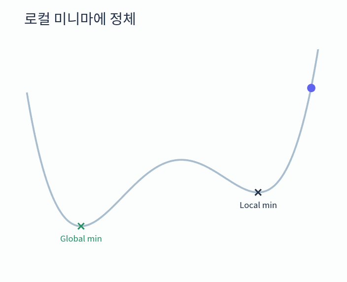

기울기가 거의 0인 평평한 곳에서는 이동도 매우 작아지고, 기울기가 정확히 0인 안장점에서는 갱신이 멈출 수 있습니다.

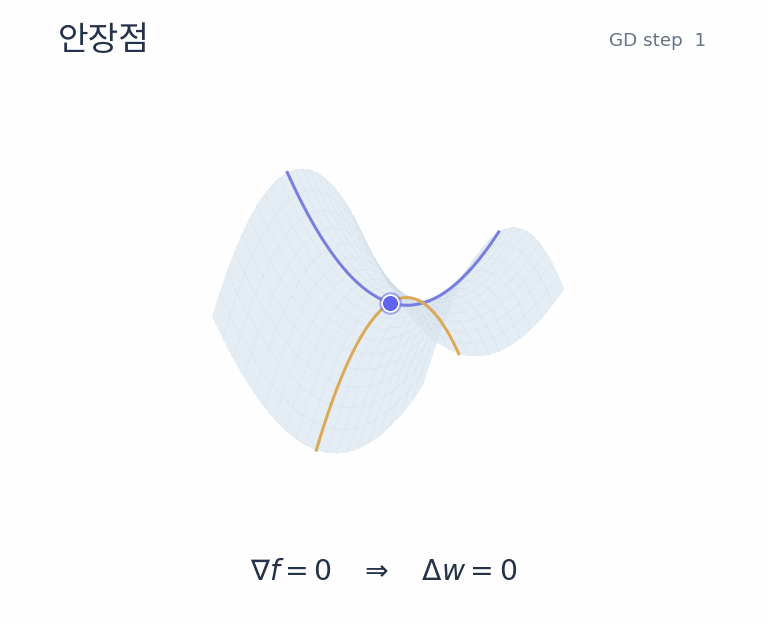

이를 해결하기 위해 과거의 기울기를 누적해 관성(속도)을 부여하는 방식이 **모멘텀**입니다.

누적에는 **지수 이동 평균**(Exponential Moving Average, EMA)을 씁니다. 최근 값에 더 큰 비중을 두고, 오래된 값의 비중은 점점 줄이는 평균입니다.
여러 배치에서 같은 방향의 기울기가 반복되면 그 방향으로 속도가 붙고, 반대 방향으로 번갈아 흔들리는 성분은 부호가 상쇄되어 진동이 줄어듭니다.

$$
\text{속도(관성)} = \gamma \times (\text{이전 속도}) + \eta \times (\text{현재 기울기})
$$

$$
\text{새로운 가중치} = \text{현재 가중치} - \text{속도(관성)}
$$

- $\gamma$ (보통 0.9): 이전 속도를 얼마나 유지할지 결정하는 모멘텀 계수
- $\eta$: 학습률

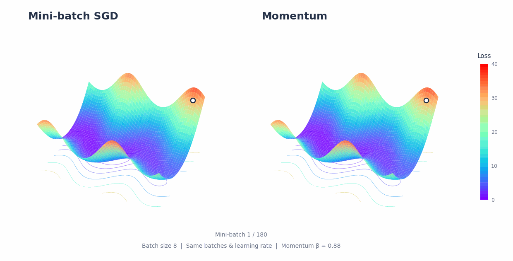

## 8. RMSprop(Root Mean Square Propagation)

### 단일 학습률의 한계: 파라미터마다 다른 경사도

모든 파라미터에 동일한 고정 학습률($\eta$)을 쓰면, 손실 함수의 지형에 따라 심각한 불균형이 일어납니다.

- **기울기가 큰 방향:** 갱신 폭이 커서 최솟값을 지나치거나 진동할 수 있습니다.
- **기울기가 작은 방향:** 갱신 폭이 작아 학습이 느려질 수 있습니다.

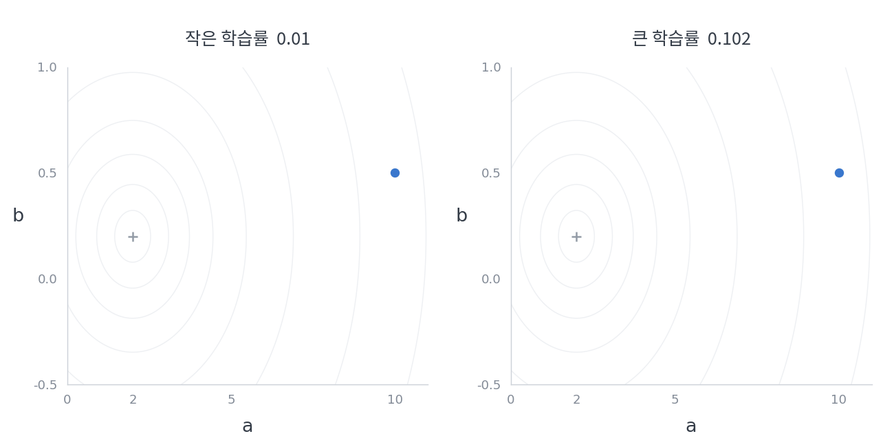

이를 해결하기 위해 등장한 방식이 RMSprop입니다. 최근 기울기가 컸던 파라미터는 보폭을 줄이고, 작았던 파라미터는 보폭을 키웁니다.

각 파라미터의 기울기 제곱을 앞서 본 지수 이동 평균으로 누적하고, 그 제곱근을 분모에 넣습니다.

지수 이동 평균을 쓰는 이유: 과거 기울기 제곱을 계속 더하기만 하면 누적값이 커져 유효 학습률이 지나치게 작아질 수 있기 때문입니다.

제곱: 기울기의 부호가 상쇄되지 않게 크기를 누적하고, 큰 기울기를 더 강하게 반영합니다.

제곱근: 누적값을 다시 기울기와 같은 단위로 맞춥니다.

**공식**
$$
\text{기울기 제곱 평균}_t = \text{과거 유지 비율} \times \text{기울기 제곱 평균}_{t-1} + (1 - \text{과거 유지 비율}) \times (\text{현재 기울기})^2
$$

$$
\text{새로운 가중치}_{t+1} = \text{현재 가중치}_t - \frac{\text{기본 학습률}}{\sqrt{\text{기울기 제곱 평균}_t + \text{안전값}}} \times \text{현재 기울기}
$$

안전값 **$\epsilon$** 은 0으로 나누는 오류를 막기 위해 더하는 작은 상수입니다. 여기서는 제곱근 안에 넣었으며, 구현에 따라 제곱근 밖에 더하기도 합니다.

## 9. Adam(Adaptive Moment Estimation)

Adam은 위 두 가지 알고리즘의 장점을 합한 최적화 알고리즘입니다.
딥러닝에서 널리 사용하는 방식입니다.

**1. 모멘텀처럼 기울기의 지수 이동 평균을 누적합니다.**

$$
m_t=\beta_1m_{t-1}+(1-\beta_1)g_t
$$

**2. RMSprop처럼 기울기 제곱의 지수 이동 평균을 누적합니다.**

$$
v_t=\beta_2v_{t-1}+(1-\beta_2)g_t^2
$$

$g_t$는 현재 기울기이며, $\beta_1,\beta_2$는 각각 과거 정보를 유지하는 비율입니다.

**3. 편향을 보정합니다. (심화: 처음 읽을 때는 건너뛰어도 됩니다)**

두 이동 평균은 0에서 시작하므로 초기에 0 쪽으로 치우칩니다. 아래는 $\beta_1=0.9$, $\beta_2=0.999$일 때 첫 단계의 계산입니다.

**$\hat{m}_1$ 보정:**

$$
\hat{m}_1 = \frac{m_1}{1 - \beta_1^1} = \frac{0.1 g_1}{1 - 0.9} = \frac{0.1 g_1}{0.1} = \mathbf{g_1}
$$

**$\hat{v}_1$ 보정:**

$$
\hat{v}_1 = \frac{v_1}{1 - \beta_2^1} = \frac{0.001 g_1^2}{1 - 0.999} = \frac{0.001 g_1^2}{0.001} = \mathbf{g_1^2}
$$

**4. 보정한 값으로 파라미터를 갱신합니다.**

$$
\theta_{t+1}=\theta_t-\eta\frac{\hat m_t}{\sqrt{\hat v_t}+\epsilon}
$$

[Adam 원 논문](https://arxiv.org/abs/1412.6980)

## 참고 자료

- 혁펜하임, 『이지 딥러닝』, 챕터 2.
- [Stanford CS231n · 신경망 구조](https://cs231n.github.io/neural-networks-1/), [학습과 최적화](https://cs231n.github.io/neural-networks-3/).
- [Glorot & Bengio, 가중치 초기화, 2010](https://proceedings.mlr.press/v9/glorot10a.html).
- [PyTorch · 초기화](https://docs.pytorch.org/docs/stable/nn.init.html).
- [Hinton · RMSprop 강의 자료](https://www.cs.toronto.edu/~tijmen/csc321/slides/lecture_slides_lec6.pdf).
- [Kingma & Ba, Adam, 2014](https://arxiv.org/abs/1412.6980).
- [Goyal et al., 큰 배치의 SGD·워밍업, 2017](https://arxiv.org/abs/1706.02677).
