## 1. 비선형 활성화 함수가 필요한 이유

[2장](/notes/deep-learning/easy-deep-learning-ch02/)에서 두 가지 모델을 살펴봤습니다.

1. **2장 1절의 인공 신경**: 온도와 연기가 기준을 넘으면 경보를 1로 울리는 **단위 계단 함수**
2. **2장 2절의 선형 회귀**: 조회수로 수익을 예측하며, 경사하강법으로 가중치를 스스로 고치는 **직선의 식($y = Wx + b$)**

여기서 의문이 떠오릅니다.

> "선형 회귀로 가중치와 바이어스를 자동으로 조절하는 법(경사하강법)을 배웠으니, 이 선형 레이어($Wx + b$)를 10층, 100층 깊게 쌓으면 딥러닝이 완성되는 것 아닐까?"
>
> "아니면 다시 단위 계단 함수를 선형 회귀 끝에 붙여야 할까?"

결론부터 말하면 **둘 다 안 됩니다.**

- **선형 계산만 반복하면**: 100층을 쌓아도 1층짜리 모델과 같아집니다. 계산량과 파라미터 개수만 늘고 표현력은 늘지 않습니다.
- **단위 계단 함수로 돌아가면**: 2장에서 배운 경사하강법과 연쇄 법칙이 멈춥니다.

우리가 층을 깊게 쌓는 이유는 **단순한 조건들을 엮어 복잡한 상황을 판단**하기 위해서입니다. 경보 장치로 예를 들면 다음과 같습니다.

> - **1번째 층**: '온도가 높은가?', '연기가 나는가?', '시간이 심야인가?' 같은 낱개 조건을 각각 판정합니다.
> - **2번째 층**: 이 조건들을 조합해 '주방 조리 중인 상황인가?', '실제 화재 상황인가?'라는 중간 단계의 맥락을 만듭니다.
> - **마지막 층**: 최종적으로 '스프링클러를 작동시킬 것인가'를 결정합니다.

층과 층 사이에 비선형 활성화 함수가 없으면 이런 역할 분담이 불가능합니다. 이유를 수식으로 확인해 보겠습니다.

### 선형 계산은 한 층으로 합쳐집니다

입력에 가중치를 곱하고 바이어스를 더하는 계산을 **선형 계산**이라고 부르겠습니다. 엄밀히는 바이어스를 포함한 아핀 변환입니다.

활성화 함수 없이 선형 계산만 두 번 거치는 신경망을 보겠습니다.

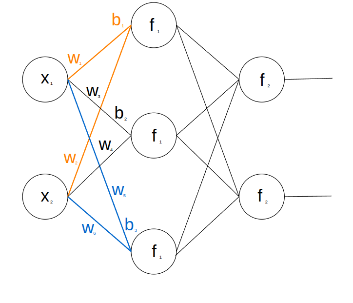

$$\mathbf{y} = \mathbf{W}^{(2)}(\mathbf{W}^{(1)} \mathbf{x} + \mathbf{b}^{(1)}) + \mathbf{b}^{(2)}$$

괄호를 전개하면 다음과 같이 정리됩니다.

$$\mathbf{y} = (\mathbf{W}^{(2)} \mathbf{W}^{(1)})\mathbf{x} + (\mathbf{W}^{(2)} \mathbf{b}^{(1)} + \mathbf{b}^{(2)}) = \mathbf{W}'\mathbf{x} + \mathbf{b}'$$

$\mathbf{W}^{(1)}$이 1단계 특징을 뽑고 $\mathbf{W}^{(2)}$가 2단계 특징을 조합해 주길 기대했지만, 행렬 곱 때문에 두 층은 하나의 가중치 $\mathbf{W}'$와 바이어스 $\mathbf{b}'$로 합쳐집니다.

100층을 쌓아도 결과는 같습니다. 2장에서 본 1층짜리 선형 식과 똑같습니다.
선형 식은 직선(고차원에서는 평면)으로 공간을 나누는 것이 한계라서, 입력 두 개 중 하나만 1일 때 1을 내는 XOR 같은 문제도 풀지 못합니다.

그래서 층 사이에 **비선형 활성화 함수**를 넣어 연산이 하나로 합쳐지지 않게 해야 합니다.

### 그렇다면 단위 계단 함수로 돌아가면 될까?

"그럼 선형 계산 뒤에 2장의 단위 계단 함수를 붙이면 비선형이 생기지 않을까?"

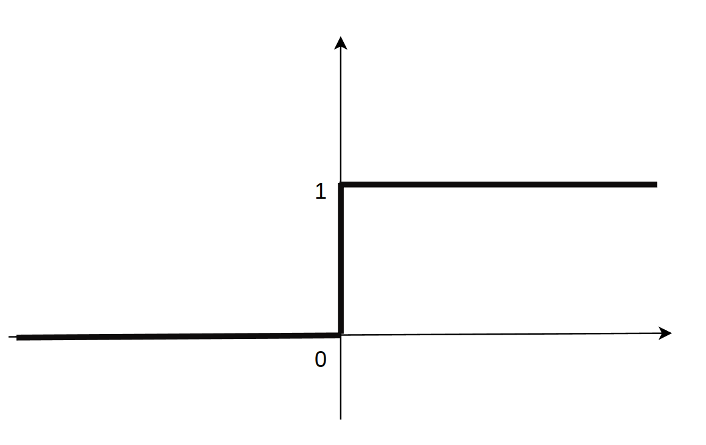

활성화 함수에 들어가는 값, 즉 입력의 가중합에 바이어스를 더한 값을 $z$
뉴런의 출력은 $\hat{y} = f(z)$입니다. 2장의 정의를 $z$로 다시 쓰면 다음과 같습니다.

$$f(z) = \begin{cases} 1 & (z > 0) \\ 0 & (z \le 0) \end{cases}$$

계단 함수는 직선이 아닌 비선형 함수가 맞습니다. 하지만 다층 신경망에서는 쓸 수 없습니다. 2장에서 배운 **경사하강법과 연쇄 법칙(미분)** 때문입니다.

2장 설명: [경사하강법](/notes/deep-learning/easy-deep-learning-ch02/#3-경사하강법gradient-descent) · [기울기 구하기와 연쇄 법칙](/notes/deep-learning/easy-deep-learning-ch02/#기울기그래디언트-구하기와-연쇄-법칙)

- **$z = 0$ 지점 (직각 절벽):**

    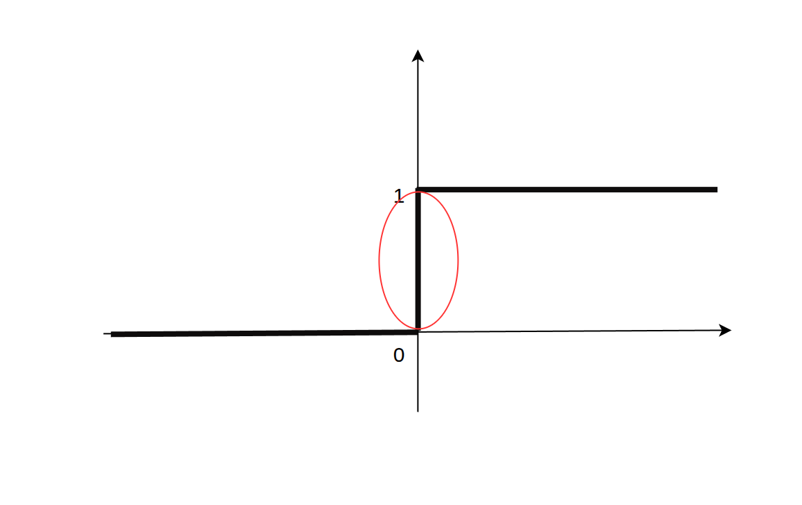

    값이 0에서 1로 순간 도약합니다. 세로로만 솟아오르는 절벽이므로 이 지점에서는 기울기를 정할 수 없습니다(미분 불가능).

- **$z \ne 0$인 모든 구간 (완전한 평지):**

    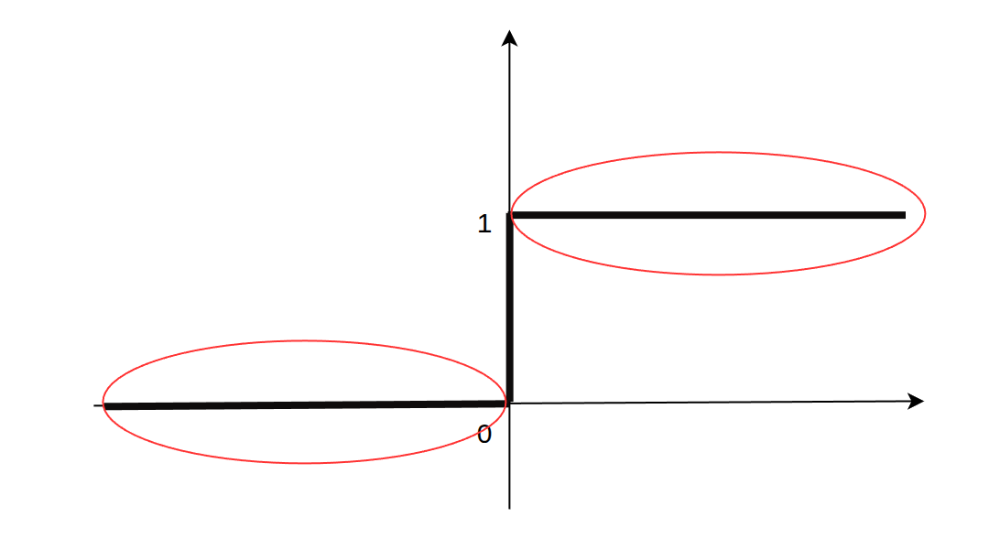

    그래프가 완전히 평평하므로 **도함수가 0**입니다.

2장에서 우리는 연쇄 법칙으로 오차 신호를 거꾸로 전달하며 가중치를 고쳤습니다.

$$\frac{\partial \text{Loss}}{\partial w} = \frac{\partial \text{Loss}}{\partial \hat{y}} \times \frac{\partial \hat{y}}{\partial z} \times \frac{\partial z}{\partial w}$$

계단 함수를 거치면 가운데 항 $\frac{\partial \hat{y}}{\partial z}$이 **0**이 되어 곱 전체가 0이 됩니다. 오차 신호가 뒤로 전달되지 않으니 가중치 갱신식($w_{\text{new}} \leftarrow w_{\text{old}} - \eta \cdot \text{기울기}$)에서 기울기가 0이 되어 가중치가 바뀌지 않습니다.

### 활성화 함수의 두 조건

결국 활성화 함수는 두 조건을 동시에 만족해야 합니다.

1. **비선형성**: 층이 1층으로 합쳐지지 않고 복잡한 특징을 배울 수 있어야 합니다.
2. **미분 가능성**: 2장의 연쇄 법칙으로 오차 기울기를 앞쪽 층까지 전달할 수 있어야 합니다.

### 선형 활성화 함수는 언제 사용할까요?

은닉층은 비선형 함수를 쓰는 것이 기본이지만, 특수한 목적으로 선형 출력을 유지하는 영역이 있습니다.

| **사용 위치**  | **사용 목적**                                 | **실제 사례**                                                       |
| ---------- | ----------------------------------------- | --------------------------------------------------------------- |
| **출력층**    | 출력 범위를 제한(0~1 등)하지 않고 임의의 실수를 그대로 예측      | **회귀(Regression)** 모델 (예: 주가·매출 예측)                             |
| **은닉층 일부** | 노드가 적은 층에서 ReLU가 음수를 0으로 만들며 정보를 잃는 것을 방지 | **MobileNetV2**(모바일 기기용 경량 이미지 모델)의 선형 병목(Linear Bottleneck) 구간 |

## 2. 시그모이드(Sigmoid)

그렇다면 계단 함수를 부드럽게 만들면 어떨까요? **시그모이드**는 급격한 도약 대신 부드러운 S자 곡선을 쓰는 활성화 함수입니다.

$$\sigma(z)=\frac{1}{1+e^{-z}}$$

<figure>
  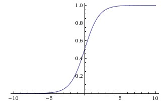
  <figcaption>출처: <a href="https://cs231n.github.io/neural-networks-1/">Stanford CS231n</a>.</figcaption>
</figure>

- 출력은 항상 0과 1 사이이고, $\sigma(0)=0.5$입니다.
- 모든 구간에서 미분할 수 있고 기울기가 0이 아니므로, 앞의 두 조건(비선형, 미분 가능)을 만족합니다.
- 출력을 확률처럼 읽을 수 있어 이진분류의 출력층에 쓰입니다. 자세한 내용은 [5장](/notes/deep-learning/easy-deep-learning-ch04/)에서 다룹니다.

다만 입력이 매우 크거나 작으면 곡선이 평평해져 기울기가 0에 가까워집니다(포화).
층이 깊어지면 이런 작은 기울기가 연쇄 법칙으로 계속 곱해져, 앞쪽 층으로 갈수록 기울기가 사라지는 **기울기 소실**(Vanishing Gradient)이 생깁니다. 
이 문제를 줄이려고 널리 쓰이게 된 함수가 ReLU입니다.

## 3. ReLU(Rectified Linear Unit)

널리 쓰이는 비선형 활성화 함수입니다. 양수 입력은 그대로 출력하고 음수 입력은 0으로 출력합니다.

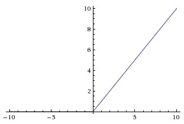

**장점**

- 양수 구간의 기울기가 1이라 기울기가 줄지 않고 전달됩니다. 앞에서 본 sigmoid의 기울기 소실을 줄이는 데 도움이 됩니다.
- 0에서는 꺾여 있어 미분값이 정해지지 않지만, 구현에서는 0에서의 기울기를 0 또는 1로 정해 둡니다. 나머지 구간에서는 기울기가 정해지므로 계단 함수와 달리 학습에 문제가 되지 않습니다.
- 계산식이 간단하고 효과가 좋아 현대에 많이 쓰입니다. 

**단점**

- 음수 입력은 모두 0이 되어 정보가 사라집니다.
- 한 뉴런의 입력이 계속 음수이면 기울기도 계속 0이 되어 그 뉴런은 학습하지 못합니다. 이를 **죽은 뉴런**(Dying ReLU) 문제라고 합니다. 계단 함수의 평평한 구간과 같은 문제가 음수 쪽에서만 생기는 셈입니다.

## 4. ReLU의 대안

죽은 뉴런을 줄이거나 음수 구간을 부드럽게 다루려는 대안들입니다.

### Leaky ReLU

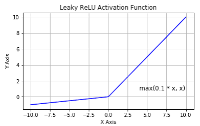

음수 구간에도 작은 양의 기울기를 두어 기울기가 0이 되지 않게 합니다. 기울기는 설정에 따라 달라지며, 위 그래프에서는 0.1을 사용합니다.

곱셈과 비교만으로 계산할 수 있습니다. 실제 실행 속도는 장치와 구현에 따라 달라집니다. 이미지를 생성하는 모델인 생성적 적대 신경망(Generative Adversarial Network, GAN) 등에 사용합니다.

### Swish와 GELU

ReLU는 입력 $x$에 음수면 0, 양수면 1을 곱한 것으로 볼 수 있습니다. Swish와 GELU는 이 곱하는 값을 0과 1 사이의 부드러운 값으로 바꾼 함수입니다.

#### Swish / SiLU (Sigmoid Linear Unit)

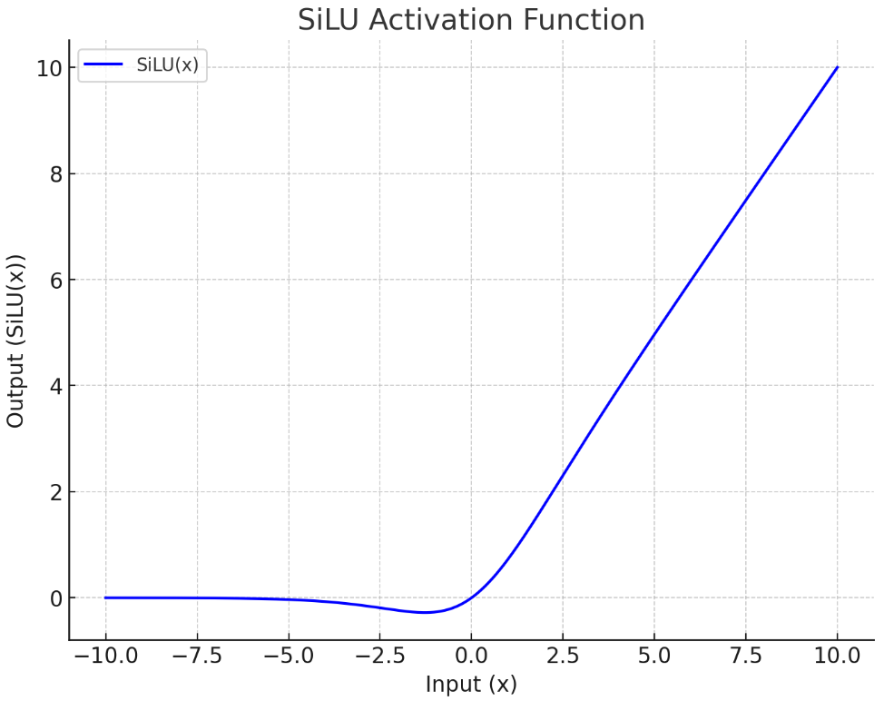

구글이 탐색 알고리즘으로 찾아낸 함수로, 입력 $x$에 시그모이드 $\sigma(\beta x)$를 곱합니다.

$$x \cdot \sigma(\beta x)$$

- **$x$**: 들어오는 원래 신호(입력값)
- **$\sigma(\cdot)$ (시그모이드)**: 앞에서 본 0과 1 사이로 압축하는 함수
- **$\beta$ (베타)**: 곡선의 가파른 정도를 조절하는 상수. 보통 1을 쓰며, $\beta=1$일 때를 **SiLU**라고 합니다.

Swish 원 논문에서는 여러 이미지 분류 실험에서 ReLU보다 좋은 결과를 보고했습니다. 성능 차이는 모델과 학습 조건에 따라 달라집니다. [Swish 원 논문](https://arxiv.org/abs/1710.05941)

#### GELU (Gaussian Error Linear Unit)

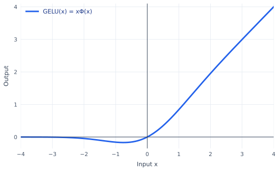

$$GELU(x) = x \cdot \Phi(x)$$

- **$x$**: 원래 들어온 입력값
- **$\Phi(x)$**: 평균이 0이고 표준편차가 1인 표준정규분포($\mathcal{N}(0, 1)$)에서, 왼쪽 끝부터 $x$까지 쌓인 확률입니다(누적분포함수, CDF). 즉 값이 $x$ 이하일 확률이며, 그래프에서는 곡선 아래의 면적입니다. 확률 $\Phi(x)$는 0과 1 사이의 값을 가집니다.

아래 종 모양 곡선은 표준정규분포의 확률밀도입니다. 왼쪽 끝부터 $x=1$까지 색칠한 면적이 $\Phi(1)\approx0.841$, 즉 약 84.1%입니다.

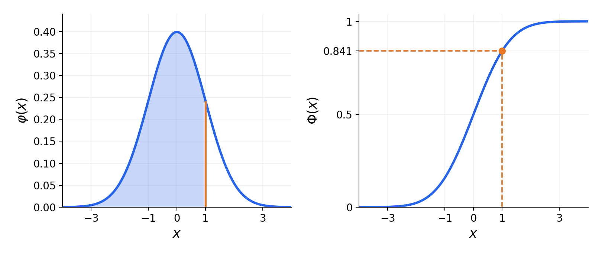

입력 크기에 따라 곱하는 값이 부드럽게 달라집니다.

- **$x$가 큰 양수일 때 (예: $x = +3$):** $\Phi(3) \approx 0.999$이므로 $x$를 거의 그대로 통과시킵니다.

점선은 입력을 그대로 출력하는 $y=x$입니다.

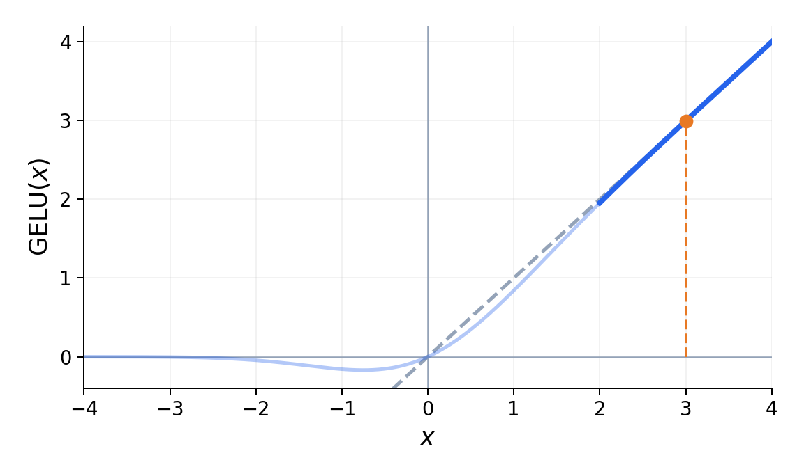
- **$x$가 큰 음수일 때 (예: $x = -3$):** $\Phi(-3) \approx 0.001$이므로 출력이 거의 0에 수렴합니다.

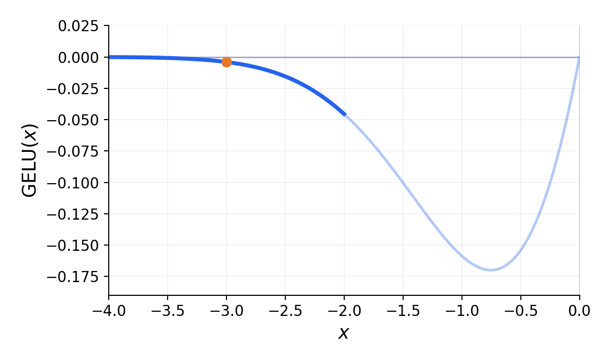
- **$x = 0$ 근처일 때:** $\Phi(x)$가 약 0.5이므로 출력은 약 $0.5x$입니다. $x=0$에서는 출력도 0입니다.

점선은 $y=0.5x$입니다.

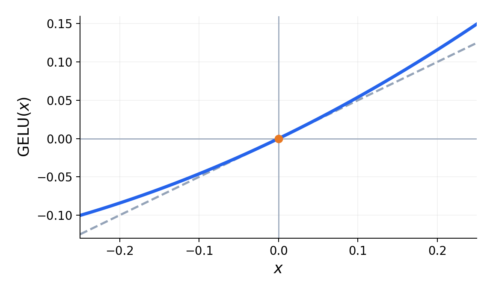

BERT나 Vision Transformer 같은 Transformer 모델에 사용합니다. [GELU 원 논문](https://arxiv.org/abs/1606.08415)

### 한눈에 비교

| 함수 | 음수 입력 | 사용 예 |
| --- | --- | --- |
| ReLU | 모두 0 | 널리 쓰이는 기본 선택 |
| Leaky ReLU | 작은 기울기로 통과 | GAN 등 |
| Swish / SiLU | 0 근처로 부드럽게 수렴 | 이미지 분류 실험(Swish 원 논문) |
| GELU | 0에 가깝게 수렴 | BERT, Vision Transformer 등 |

