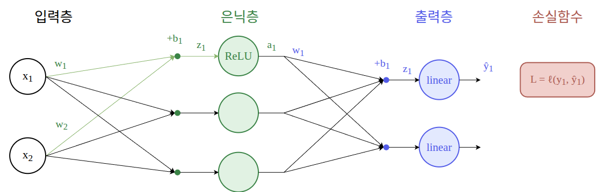
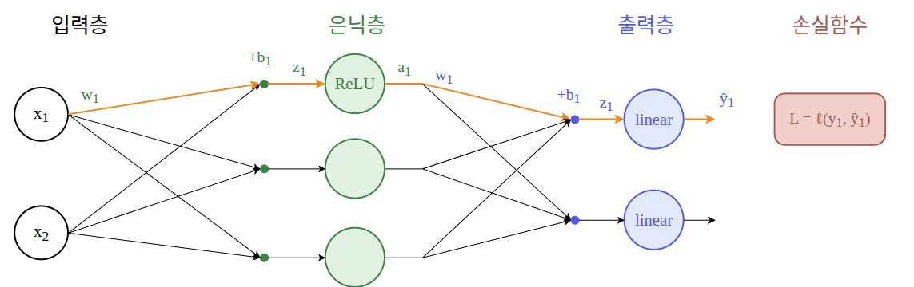
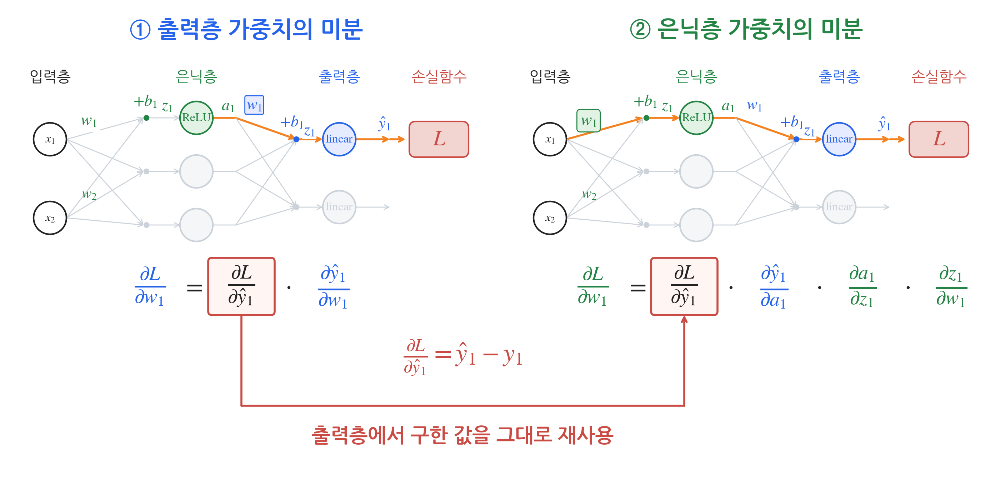

## 역전파 알고리즘

딥러닝 학습은 결국 **"오차를 줄이도록 모든 가중치를 알맞게 조절하는 일"** 입니다.

이를 위해 각 가중치가 오차에 얼마나 영향을 미쳤는지(그래디언트)를 효율적으로 구해내는 핵심 알고리즘이 바로 **역전파(Backpropagation)** 입니다.

마지막 출력층은 정답과 비교해 얼마나 틀렸는지 바로 알 수 있습니다.

하지만 중간에 낀 **은닉층은 정답 라벨이 없습니다.** 개별 은닉 노드가 몇을 내뱉어야 정답인지 중간 기준이 없는데, 최종 오차의 책임을 어떻게 물을 수 있을까요?

해답은 단순합니다. **"도미노를 거꾸로 짚어가는 것"** 입니다.

은닉 노드가 변하면 $\to$ 출력이 변하고 $\to$ 결국 최종 오차가 변합니다.

역전파는 이 인과관계를 미분의 **연쇄 법칙(Chain Rule)** 으로 엮어, 오차가 발생한 맨 뒤(손실)에서부터 거꾸로 계산해 각 가중치의 기여도를 찾아냅니다.

특히 뒤쪽에서 구해둔 계산 결과를 앞쪽 노드들이 **함께 나눠 쓰기 때문에**, 수천만 개의 가중치도 중복 없이 빠르게 계산할 수 있습니다.

아래 단순한 신경망을 통해 이 계산이 어떻게 흘러가는지 직접 눈으로 따라가 보겠습니다.

가중치 : $w$
편향 :  $b$
활성화 노드 입력값 : $z$
활성화 노드 출력값 : $a$

이 신경망의 계산 흐름은 다음과 같습니다. 분량상 각 층의 첫 번째 노드를 중심으로 설명합니다.

1. 입력층: 입력 x₁에 가중치 w₁을 곱하고, 다른 입력의 가중합과 편향 b₁을 더합니다.
2. 은닉층: 선형 변환 결과 z₁에 ReLU를 적용하여 a₁을 얻습니다.
3. 출력층: a₁에 출력층 가중치 w₁을 곱하고, 다른 은닉 노드의 가중합과 편향 b₁을 더합니다. 선형 활성화함수는 계산한 값을 그대로 예측값 ŷ₁로 내보냅니다.
4. 이과정을 순전파라고 합니다.

여기서 각 가중치들 w1, w1들의 loss에 얼마나 기여를 했는지 파악하는겁니다.
연쇄법칙을 이용해 편미분을 계산합니다.

손실함수는 MSE ( $L=\frac12(\textcolor{#2563EB}{\hat y_1}-y_1)^2$ ) 를 사용합니다.

설명을 단순하게 하려고 손실은 첫 번째 출력 $\textcolor{#2563EB}{\hat y_1}$만 사용합니다. 출력이 여러 개면 각 출력을 거치는 경로의 미분을 모두 더합니다.

### 출력층 가중치의 미분

$\textcolor{#2563EB}{w_1}$의 기울기를 먼저 계산합니다. 연쇄 법칙으로 두 개의 미분으로 나눕니다.

$$
\frac{\partial L}{\partial \textcolor{#2563EB}{w_1}}
= \underbrace{\frac{\partial L}{\partial \textcolor{#2563EB}{\hat y_1}}}_{(1)}
\cdot \underbrace{\frac{\partial \textcolor{#2563EB}{\hat y_1}}{\partial \textcolor{#2563EB}{w_1}}}_{(2)}
$$

#### (1) 손실을 예측값으로 미분

지수 2가 앞으로 내려와 $\frac12$과 상쇄됩니다.

$$
L=\frac12(\textcolor{#2563EB}{\hat y_1}-y_1)^2
\quad\Rightarrow\quad
\frac{\partial L}{\partial \textcolor{#2563EB}{\hat y_1}} = \textcolor{#2563EB}{\hat y_1} - y_1
$$

#### (2) 예측값을 가중치로 미분

$\textcolor{#2563EB}{w_1}$에 곱해진 $\textcolor{#238443}{a_1}$만 남고, 나머지 항은 $\textcolor{#2563EB}{w_1}$과 무관한 상수라서 0이 됩니다.

$$
\textcolor{#2563EB}{\hat y_1} = \textcolor{#2563EB}{w_1}\textcolor{#238443}{a_1} + (\text{다른 은닉 노드 항}) + \textcolor{#2563EB}{b_1}
\quad\Rightarrow\quad
\frac{\partial \textcolor{#2563EB}{\hat y_1}}{\partial \textcolor{#2563EB}{w_1}} = \textcolor{#238443}{a_1}
$$

#### (3) 결과

$$
\frac{\partial L}{\partial \textcolor{#2563EB}{w_1}}
= \underbrace{(\textcolor{#2563EB}{\hat y_1} - y_1)}_{(1)}
\, \underbrace{\textcolor{#238443}{a_1}}_{(2)}
$$

### 은닉층 가중치의 미분

$\textcolor{#238443}{w_1}$은 출력층을 지나 손실에 영향을 주므로, 연쇄 법칙으로 네 개의 미분으로 나눕니다.

$$
\frac{\partial L}{\partial \textcolor{#238443}{w_1}}
= \underbrace{\frac{\partial L}{\partial \textcolor{#2563EB}{\hat y_1}}}_{(1)}
\cdot \underbrace{\frac{\partial \textcolor{#2563EB}{\hat y_1}}{\partial \textcolor{#238443}{a_1}}}_{(2)}
\cdot \underbrace{\frac{\partial \textcolor{#238443}{a_1}}{\partial \textcolor{#238443}{z_1}}}_{(3)}
\cdot \underbrace{\frac{\partial \textcolor{#238443}{z_1}}{\partial \textcolor{#238443}{w_1}}}_{(4)}
$$

#### (1) 손실을 예측값으로 미분

출력층에서 구한 값과 같습니다: $\textcolor{#2563EB}{\hat y_1} - y_1$

#### (2) 예측값을 은닉 노드 출력으로 미분

같은 출력 노드 식을 이번에는 $\textcolor{#238443}{a_1}$로 미분합니다. $\textcolor{#238443}{a_1}$에 곱해진 $\textcolor{#2563EB}{w_1}$만 남습니다.

$$
\textcolor{#2563EB}{\hat y_1} = \textcolor{#2563EB}{w_1}\textcolor{#238443}{a_1} + (\text{다른 은닉 노드 항}) + \textcolor{#2563EB}{b_1}
\quad\Rightarrow\quad
\frac{\partial \textcolor{#2563EB}{\hat y_1}}{\partial \textcolor{#238443}{a_1}} = \textcolor{#2563EB}{w_1}
$$

#### (3) ReLU 미분

$\textcolor{#238443}{z_1}>0$이면 $\textcolor{#238443}{a_1}=\textcolor{#238443}{z_1}$라서 기울기가 1이고, 아니면 $\textcolor{#238443}{a_1}=0$으로 고정이라 기울기가 0입니다. $\textcolor{#238443}{z_1}=0$에서는 미분이 정의되지 않아 보통 0으로 둡니다.

$$
\textcolor{#238443}{a_1} = \max(0, \textcolor{#238443}{z_1})
\quad\Rightarrow\quad
\frac{\partial \textcolor{#238443}{a_1}}{\partial \textcolor{#238443}{z_1}} = \operatorname{ReLU}'(\textcolor{#238443}{z_1}) =
\begin{cases}
1 & (\textcolor{#238443}{z_1} > 0) \\
0 & (\textcolor{#238443}{z_1} \le 0)
\end{cases}
$$

#### (4) 은닉 노드 입력을 가중치로 미분

$\textcolor{#238443}{w_1}$에 곱해진 $x_1$만 남습니다.

$$
\textcolor{#238443}{z_1} = \textcolor{#238443}{w_1}x_1 + \textcolor{#238443}{w_2}x_2 + \textcolor{#238443}{b_1}
\quad\Rightarrow\quad
\frac{\partial \textcolor{#238443}{z_1}}{\partial \textcolor{#238443}{w_1}} = x_1
$$

#### (5) 결과

$$
\frac{\partial L}{\partial \textcolor{#238443}{w_1}}
= \underbrace{(\textcolor{#2563EB}{\hat y_1} - y_1)}_{(1)}
\, \underbrace{\textcolor{#2563EB}{w_1}}_{(2)}
\, \underbrace{\operatorname{ReLU}'(\textcolor{#238443}{z_1})}_{(3)}
\, \underbrace{x_1}_{(4)}
$$

### 계산한 값 재사용하기

초록색 $\textcolor{#238443}{w_1}$의 미분식을 다시 보면, 파란색 $\textcolor{#2563EB}{w_1}$을 미분할 때 구한 $\textcolor{#2563EB}{\hat y_1}-y_1$이 그대로 들어 있습니다.

$$
\frac{\partial L}{\partial \textcolor{#238443}{w_1}}
=
\underbrace{(\textcolor{#2563EB}{\hat y_1}-y_1)}_{\text{출력층에서 이미 구한 값}}
\textcolor{#2563EB}{w_1}
\operatorname{ReLU}'(\textcolor{#238443}{z_1})x_1
$$

따라서 손실함수부터 다시 미분할 필요 없이, 파란색 w1 계산시 저장한 $\textcolor{#2563EB}{\hat y_1}-y_1$에 나머지 미분값을 곱하면 됩니다.
역전파는 이처럼 뒤쪽 층에서 구한 미분값을 앞쪽 층으로 넘기고, 각 층에서는 그 층의 미분만 곱해 계산을 이어갑니다.
층이 더 많아도 같은 과정이 입력층 방향으로 반복됩니다.

미분식에 들어가는 값 중 일부는 순전파에서 이미 계산했습니다.

- $\textcolor{#2563EB}{\hat y_1}$: 순전파의 최종 출력입니다.
- $\textcolor{#238443}{a_1}$: 파란색 $\textcolor{#2563EB}{w_1}$의 기울기 $(\textcolor{#2563EB}{\hat y_1}-y_1)\textcolor{#238443}{a_1}$에 곱해지는 값으로, 순전파에서 구한 은닉 노드의 출력입니다.
- $\operatorname{ReLU}'(\textcolor{#238443}{z_1})$: 순전파에서 구한 $\textcolor{#238443}{z_1}$의 부호로 정해집니다.

그래서 순전파를 할 때 $\textcolor{#238443}{z_1}$, $\textcolor{#238443}{a_1}$, $\textcolor{#2563EB}{\hat y_1}$을 저장해 두고, 역전파에서는 꺼내 쓰기만 합니다.

## 참고 자료

- 혁펜하임, 『이지 딥러닝』, 챕터 3.
- [Stanford CS231n · 연쇄 법칙과 역전파](https://cs231n.github.io/optimization-2/).
