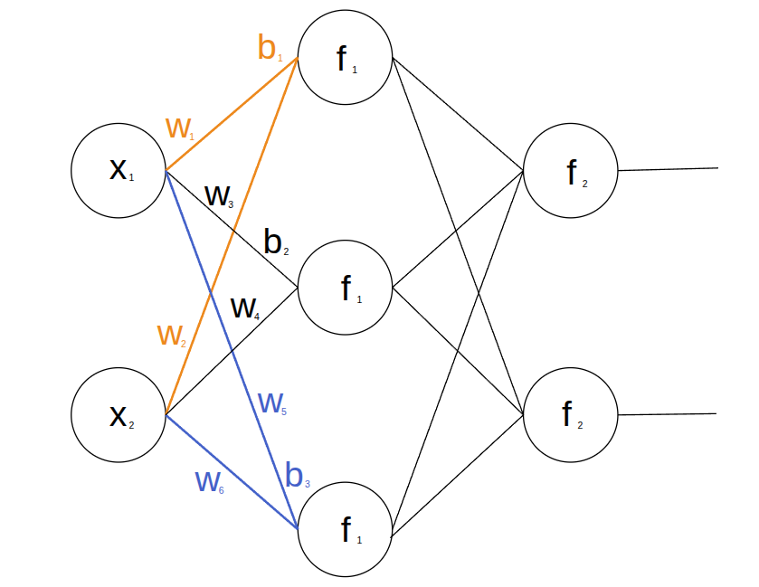

## 역전파 알고리즘

신경망은 손실이 줄어드는 방향으로 가중치를 조금씩 바꾸며 학습합니다([경사하강법](/notes/deep-learning/easy-deep-learning-ch02/)). 
그러려면 가중치마다 기울기, 즉 그 가중치를 살짝 바꿨을 때 손실이 변하는 비율이 필요합니다.

출력층 가중치의 기울기는 예측과 정답의 차이에서 바로 구할 수 있습니다. 은닉층은 다릅니다. 은닉 노드에는 정답이 없어서, 그 가중치가 손실에 준 영향은 뒤 층을 거쳐야만 알 수 있습니다. 층이 깊을수록 그 경로가 길어집니다.

경로가 길어도 [연쇄 법칙](/notes/deep-learning/easy-deep-learning-ch02/)으로 구할 수 있습니다. 연쇄 법칙은 합성함수의 미분을 각 단계의 미분을 곱해 구하는 방법입니다. 손실에서 출발해 이 곱을 거꾸로 이어 가면, 뒤쪽 층의 미분은 여러 가중치가 똑같이 쓰므로 한 번 구해 두고 재사용할 수 있습니다. 이 방법이 **역전파**(Backpropagation)입니다. 1986년 러멜하트, 힌턴, 윌리엄스의 논문으로 다층 신경망을 학습시킬 수 있음이 알려졌고, 지금도 대부분의 신경망이 이 방법으로 학습합니다.

그림은 출력 노드가 두 개인 신경망입니다. 아래 계산 예시에서는 출력 노드를 하나만 사용합니다.

조회수 $x_1$과 영상 길이 $x_2$로 영상의 수익을 예측하는 신경망을 예로 들겠습니다. 구조는 **입력 노드 2개 → 은닉층 1개(노드 3개) → 출력 노드 1개**입니다. 두 입력은 은닉 노드 $h_1,h_2,h_3$ 각각에 연결되고, 이 세 노드는 모두 출력 $\hat y$에 연결됩니다.

은닉층에는 ReLU를 쓰고, 출력층은 값을 그대로 내보냅니다. 은닉 노드 $j$에서는 다음 순서로 계산합니다.

$$
z_j=x_1w_{1j}+x_2w_{2j}+b_j,\qquad h_j=\operatorname{ReLU}(z_j)
$$

$w_{ij}$는 입력 $i$에서 은닉 노드 $j$로 이어지는 가중치이고, $b_j$는 그 노드의 바이어스입니다. ReLU는 음수를 0으로, 양수를 그대로 내보냅니다. 세 노드의 출력을 합쳐 예측값을 구합니다.

$$
\hat y=h_1v_1+h_2v_2+h_3v_3+b_{\mathrm{out}}
$$

$v_j$는 은닉 노드 $j$에서 출력으로 이어지는 가중치입니다. 입력에서 예측값까지 계산하는 과정을 **순전파**(Forward Propagation)라고 합니다. 이때 구한 $z_j$, $h_j$, $\hat y$는 역전파에서도 사용합니다.

## 1. 손실의 미분을 거꾸로 계산하기

예측이 실제 수익과 다르면 각 가중치를 어느 방향으로 바꿔야 할까요? 이번에는 손실을 제곱 오차의 절반으로 둡니다. $1/2$은 미분할 때 나오는 2를 없애기 위한 값입니다.

$$
L=\frac12(\hat y-y)^2
$$

역전파는 순전파와 반대로, 손실에서 출발해 출력 쪽에서 입력 쪽으로 거슬러 올라가며 편미분을 구합니다. 첫 번째 가중치 $w_{11}$이 손실에 영향을 주는 경로는 다음과 같습니다.

$$
w_{11}\;\longrightarrow\;z_1\;\longrightarrow\;h_1
\;\longrightarrow\;\hat y\;\longrightarrow\;L
$$

연쇄 법칙에 따라 각 단계의 변화율을 곱합니다.

$$
\frac{\partial L}{\partial w_{11}}
=\frac{\partial L}{\partial\hat y}
\frac{\partial\hat y}{\partial h_1}
\frac{\partial h_1}{\partial z_1}
\frac{\partial z_1}{\partial w_{11}}
$$

| 단계 | 변화율 |
| --- | --- |
| 예측 → 손실 | $\partial L/\partial\hat y=\hat y-y$ |
| 은닉 출력 → 예측 | $\partial\hat y/\partial h_1=v_1$ |
| 가중합 → 은닉 출력 | $\partial h_1/\partial z_1=\operatorname{ReLU}'(z_1)$ |
| 가중치 → 가중합 | $\partial z_1/\partial w_{11}=x_1$ |

따라서 첫 번째 가중치의 미분은 다음과 같습니다.

$$
\frac{\partial L}{\partial w_{11}}
=(\hat y-y)v_1\operatorname{ReLU}'(z_1)x_1
$$

ReLU의 기울기는 입력이 양수이면 1, 음수이면 0입니다. 0에서는 미분이 정의되지 않으며, 구현에서는 보통 0으로 처리합니다.

### 뒤에서 구한 미분값 재사용하기

은닉 노드 $j$까지 전달된 미분값을 $\delta_j$로 묶습니다.

$$
\delta_j=\frac{\partial L}{\partial z_j}
=(\hat y-y)v_j\operatorname{ReLU}'(z_j)
$$

같은 은닉 노드로 들어오는 가중치와 바이어스는 이 값을 함께 사용합니다.

$$
\frac{\partial L}{\partial w_{ij}}=x_i\delta_j,\qquad
\frac{\partial L}{\partial b_j}=\delta_j
$$

출력층의 미분에는 순전파에서 구한 $h_j$가 쓰입니다.

$$
\frac{\partial L}{\partial v_j}=h_j(\hat y-y),\qquad
\frac{\partial L}{\partial b_{\mathrm{out}}}=\hat y-y
$$

역전파는 이처럼 뒤에서 계산한 미분값을 앞에서도 재사용합니다. 그래서 먼저 순전파로 $z_j$, $h_j$, $\hat y$를 구해야 합니다. 학습은 **순전파 → 손실 계산 → 역전파 → 파라미터 갱신** 순서로 진행됩니다.

## 2. 숫자로 한 번 따라가기

입력은 단위를 조정한 설명용 값이며, 실제 영상 데이터는 아닙니다. $x_1=1$, $x_2=2$, 정답 $y=4$라고 하겠습니다. 처음 가중치와 바이어스는 다음과 같습니다.

| 은닉 노드 $j$ | $w_{1j}$ | $w_{2j}$ | $b_j$ | $v_j$ |
| --- | ---: | ---: | ---: | ---: |
| 1 | 1 | 0 | 0 | 1 |
| 2 | 0 | 1 | 0 | 1 |
| 3 | −1 | 0 | 0 | 1 |

출력 바이어스 $b_{\mathrm{out}}$은 0입니다. 순전파에서 $z_1=1$, $z_2=2$, $z_3=-1$이므로 $h_1=1$, $h_2=2$, $h_3=0$입니다. 예측은 $\hat y=3$, 손실은 $L=\frac12(3-4)^2=0.5$입니다.

예측과 정답의 차이는 $\hat y-y=-1$입니다. 세 은닉 노드의 ReLU 기울기는 차례로 $1,1,0$이므로 $\delta_1=-1$, $\delta_2=-1$, $\delta_3=0$입니다.

| 파라미터 | 노드 1 | 노드 2 | 노드 3 |
| --- | ---: | ---: | ---: |
| $\partial L/\partial w_{1j}$ | −1 | −1 | 0 |
| $\partial L/\partial w_{2j}$ | −2 | −2 | 0 |
| $\partial L/\partial b_j$ | −1 | −1 | 0 |
| $\partial L/\partial v_j$ | −1 | −2 | 0 |

출력 바이어스의 미분은 $\partial L/\partial b_{\mathrm{out}}=-1$입니다. 세 번째 은닉 노드는 이번 입력에서 ReLU의 음수 구간에 있으므로, 그 노드를 지나는 미분값은 모두 0입니다.

학습률 $\eta=0.01$로 모든 파라미터를 동시에 갱신합니다. 예를 들어 $w_{11}$은 $1-0.01(-1)=1.01$이 됩니다. 갱신한 값으로 다시 순전파하면 $h_1=1.06$, $h_2=2.06$, $h_3=0$이고, 출력층 가중치는 각각 $1.01$, $1.02$, $1$입니다. 출력 바이어스는 $0.01$이 됩니다.

$$
\hat y=1.06(1.01)+2.06(1.02)+0.01=3.1818
$$

손실은 약 $0.3347$로 줄었습니다. 한 번의 계산에서 미분값을 구하고 그 방향으로 갱신하자 예측이 정답 4에 가까워졌습니다.

활성화 함수가 필요한 이유는 [3. 활성화 함수](/notes/deep-learning/linear-nonlinear-activations/)에서 다룹니다.

## 참고 자료

- 혁펜하임, 『이지 딥러닝』, 챕터 3.
- [Stanford CS231n · 연쇄 법칙과 역전파](https://cs231n.github.io/optimization-2/).
