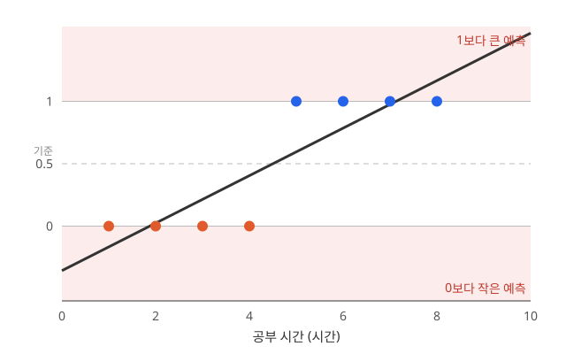
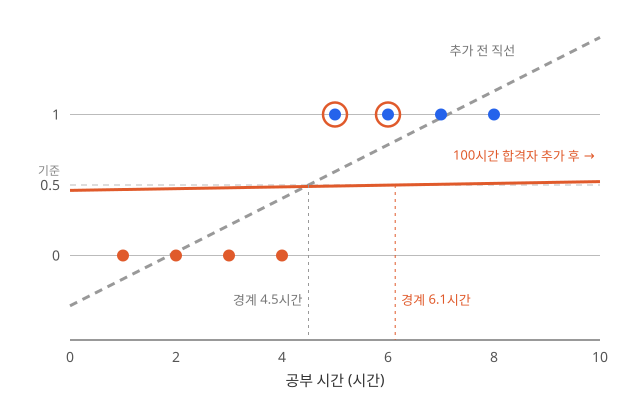

## 1. 이진분류

**이진분류**(Binary Classification)는 입력을 보고 두 클래스 중 하나를 고르는 문제입니다. 두 클래스를 숫자로 다루기 위해 한쪽을 1, 다른 쪽을 0으로 둡니다.

| 활용 예 | 입력 | $y=1$ | $y=0$ |
| --- | --- | --- | --- |
| 스팸 메일 필터 | 메일 내용 | 스팸 | 정상 메일 |
| 질병 진단 | 검사 수치, 의료 영상 | 질환 있음 | 질환 없음 |
| 불량품 검사 | 제품 사진 | 불량 | 정상 |
| 시험 합격 예측 | 공부 시간 | 합격 | 불합격 |

## 2. 직선으로 나누면 생기는 문제

### 직선 하나로 나눠 보기

공부 시간으로 합격 여부를 예측해 보겠습니다.
가장 먼저 떠오르는 방법은 2장의 선형 회귀처럼 데이터에 직선을 긋는 것입니다.

$$
\hat y = wx + b
$$

공부 시간 $x$를 넣어 나온 값이 0.5 이상이면 합격, 아니면 불합격으로 판단합니다. 1~4시간 공부한 학생은 불합격, 5~8시간 공부한 학생은 합격인 데이터에 MSE로 직선을 맞추면 $\hat y \approx 0.19x - 0.36$이 됩니다. 0.5를 넘는 지점은 4.5시간이라 8명 모두 맞게 분류합니다.

그런데 이 직선을 분류에 그대로 쓰면 두 가지 문제가 생깁니다.

### 예측값이 0과 1을 벗어납니다

직선은 끝없이 뻗어 나갑니다. 0시간 공부한 학생의 예측값은 $-0.36$, 15시간 공부한 학생은 $2.5$입니다. 이 값을 합격 확률로 읽으면 "합격 확률 −36%", "합격 확률 250%"가 되어 의미가 없습니다.

### 멀리 떨어진 데이터 하나가 경계를 옮깁니다

같은 데이터에 100시간 공부한 합격자 한 명을 추가해 보겠습니다. 이 학생은 누가 봐도 합격이라, 분류 경계를 바꿀 이유가 없습니다.

하지만 MSE는 100시간 지점의 예측값도 1에 가깝게 맞추려고 합니다. 직선이 거의 수평으로 누워 $\hat y \approx 0.006x + 0.46$이 되고, 0.5를 넘는 지점이 4.5시간에서 6.1시간으로 밀립니다. 그 결과 5시간, 6시간 공부한 합격자가 불합격으로 분류됩니다.

직선은 **이미 잘 맞힌 데이터까지 정확히 1이 되도록** 끌어당기기 때문입니다. 분류에서는 합격 쪽에 충분히 있으면 그만인데, 직선은 그 거리를 오차로 셉니다.

## 3. 출력을 0과 1 사이로: sigmoid

### 0과 1로 잘라 버리면?

가장 단순한 해결책은 값이 0 이상이면 1, 아니면 0으로 잘라 내는 것입니다. 이 함수를 **유닛 스텝 함수**(Unit Step Function)라고 합니다.

$$
u(z)=\begin{cases}
1,&z\geq0\\
0,&z<0
\end{cases}
$$

<figure>
  
  <figcaption>출처: <a href="https://commons.wikimedia.org/wiki/File:Mplwp_heaviside_theta.svg">Geek3 · Wikimedia Commons</a> · <a href="https://creativecommons.org/licenses/by/3.0/">CC BY 3.0</a>. 원본 그대로 사용.</figcaption>
</figure>

가중합 $z=wx+b$에 이 함수를 적용해 0 또는 1을 내는 단일 인공 신경을 **퍼셉트론**이라고 합니다. 출력 범위 문제는 해결되지만 두 가지 한계가 있습니다.

- **학습 신호가 없습니다.** $z=0$에서는 불연속이라 미분할 수 없고, 나머지 구간에서는 기울기가 0입니다. 가중치를 조금 바꿔도 출력이 그대로라서 역전파로 고칠 방향을 전달할 수 없습니다.
- **확신의 정도를 잃습니다.** $z$가 $0.01$이든 $10$이든 출력은 1입니다. 경계에 아슬아슬한 학생과 확실한 학생이 같은 값으로 압축됩니다.

### 부드러운 S자 곡선, sigmoid

그래서 계단 대신 부드러운 S자 곡선을 씁니다. 이것이 **시그모이드**(Sigmoid)입니다.

$$
z = wx + b
\quad\rightarrow\quad
p=\sigma(z)=\frac{1}{1+e^{-z}}
$$

<figure>
  
  <figcaption>출처: <a href="https://cs231n.github.io/neural-networks-1/">Stanford CS231n</a>.</figcaption>
</figure>

$z$가 아무리 커도 출력은 1에 가까워질 뿐 넘지 않고, 아무리 작아도 0 아래로 내려가지 않습니다. 그래서 $p$를 **합격일 확률**로 읽을 수 있고, 불합격일 확률은 $1-p$입니다.

| 특징 | 의미 |
| --- | --- |
| $0<\sigma(z)<1$ | 유한한 입력을 0과 1 사이로 변환 |
| $\sigma(0)=0.5$ | 점수 0이 확률 0.5에 대응 |
| 전 구간 미분 가능 | 역전파에 사용 가능 |
| $\sigma'(z)=\sigma(z)(1-\sigma(z))$ | 출력값으로 미분 계산 가능 |

두 번째 문제도 함께 줄어듭니다. 100시간 공부한 학생은 $z$가 매우 커서 $p$가 이미 1에 가깝습니다. 오차가 거의 0이므로 경계를 끌어당기지 않습니다.

최종 분류가 필요할 때는 0.5 같은 임계값을 적용합니다.

$$
\hat y=\begin{cases}
1,&p\geq0.5\\
0,&p<0.5
\end{cases}
$$

$p=0.5$는 $z=0$과 같으므로, 분류 경계는 여전히 $wx+b=0$입니다. 입력이 두 개면 이 경계는 직선, 더 많으면 초평면이며 이런 분류를 **선형분류**라고 합니다. 곡선 경계가 필요하면 3장의 비선형 은닉층을 앞에 둡니다.

## 4. 손실 함수도 바꿔야 합니다: MSE 대신 BCE

### MSE를 그대로 쓰면?

출력을 sigmoid로 바꿨으니, 2장에서 쓰던 제곱 오차를 그대로 써도 될까요? 점수 $z$에 대해 미분해 보면 문제가 보입니다.

$$
\frac{\partial (p-y)^2}{\partial z}
=2(p-y)\,p(1-p)
$$

sigmoid의 기울기 $p(1-p)$가 그대로 곱해집니다. 합격생인데 $p=0.01$로 크게 틀렸다면 $p(1-p)\approx0.0099$라서, 미분값이 약 $-0.02$에 그칩니다. **크게 틀렸는데 고칠 신호는 작은** 상황입니다. 또 sigmoid와 제곱 오차를 합친 손실은 가중치에 대해 볼록하지 않아, 경사하강법이 평평한 구간에서 잘 움직이지 않습니다.

### 정답에 준 확률을 평가하는 BCE

**이진 교차 엔트로피**(Binary Cross-Entropy, BCE)는 정답에 부여한 확률이 작을수록 큰 손실을 줍니다.

$$
L_{\mathrm{BCE}}=-\left[y\log p+(1-y)\log(1-p)\right]
$$

정답에 따라 둘 중 한 항만 남습니다. 여기서 $\log$는 자연로그입니다.

| 정답 | 남는 손실 | 손실을 줄이는 방향 |
| --- | --- | --- |
| 합격 $y=1$ | $-\log p$ | 합격 확률 $p$를 높임 |
| 불합격 $y=0$ | $-\log(1-p)$ | 불합격 확률 $1-p$를 높임 |

여러 학생을 학습할 때는 각 손실을 평균 냅니다.

$$
L=-\frac{1}{N}\sum_{i=1}^{N}
\left[y_i\log p_i+(1-y_i)\log(1-p_i)\right]
$$

### 확신하고 틀릴수록 손실이 커집니다

합격생 한 명에 대한 결과를 비교해 보겠습니다.

| 합격 확률 $p$ | 제곱 오차 $(p-1)^2$ | BCE $-\log p$ |
| --- | --- | --- |
| 0.9 | 0.01 | 약 0.105 |
| 0.5 | 0.25 | 약 0.693 |
| 0.1 | 0.81 | 약 2.303 |
| 0.01 | 0.9801 | 약 4.605 |

제곱 오차는 $p$가 0에 가까워져도 1을 넘지 않습니다. BCE는 정답에 준 확률이 0에 가까워질수록 제한 없이 커집니다. **틀린 쪽에 높은 확률을 준 예측**에 큰 손실을 부과합니다.

### sigmoid와 함께 미분하면

sigmoid와 BCE를 결합하면 $p(1-p)$가 약분되어 점수에 대한 미분이 간단해집니다.

$$
\frac{\partial L_{\mathrm{BCE}}}{\partial z}=p-y
$$

합격생인데 $p=0.01$이라면 미분값은 $-0.99$입니다. 제곱 오차의 $-0.02$와 달리, 크게 틀린 만큼 큰 신호가 점수를 높이는 방향으로 전달됩니다.

sigmoid 출력과 BCE 손실을 쓰는 이 모델을 **로지스틱 회귀**(Logistic Regression)라고 부릅니다.

## 5. BCE와 MSE를 MLE로 이해하기

### 관측한 정답을 잘 설명하는 모델 고르기

왜 BCE에는 로그가 들어갈까요? **최대우도추정**(Maximum Likelihood Estimation, MLE)에서 출발하면 이유를 볼 수 있습니다.

이미 정답을 아는 데이터를 고정해두고, 모델의 파라미터 $\theta$를 바꿔 봅니다. 각 모델이 실제 정답에 얼마나 높은 확률을 주는지 평가한 함수가 **우도**입니다.

합격생 한 명과 불합격생 한 명을 예로 들겠습니다.

| 모델 | 합격생에게 준 합격 확률 | 불합격생에게 준 불합격 확률 | 두 확률의 곱 |
| --- | --- | --- | --- |
| A | 0.9 | 0.8 | 0.72 |
| B | 0.6 | 0.6 | 0.36 |

두 관측을 독립적으로 취급하면, 두 정답을 함께 설명하는 우도는 각 확률의 곱입니다. MLE는 이 우도가 커지는 파라미터를 찾습니다.

$$
\mathcal{L}(\theta)=\prod_{i=1}^{N}P(y_i\mid\mathbf{x}_i;\theta)
$$

확률을 계속 곱하면 값이 매우 작아지고 계산도 불편합니다. 로그를 취하면 곱이 합으로 바뀌며, 로그가 증가함수이므로 가장 좋은 파라미터는 그대로입니다.

$$
\log\mathcal{L}(\theta)=\sum_{i=1}^{N}\log P(y_i\mid\mathbf{x}_i;\theta)
$$

최대화 문제를 손실 최소화로 바꾸려고 앞에 마이너스를 붙입니다. 이것이 **음의 로그 우도**(Negative Log-Likelihood, NLL)입니다. [MLE 참고](https://d2l.ai/chapter_appendix-mathematics-for-deep-learning/maximum-likelihood.html)

### 정답이 0 또는 1이면 BCE

이진 정답을 확률 $p$의 **베르누이 분포**로 나타내면 두 경우를 한 식으로 쓸 수 있습니다.

$$
P(y\mid\mathbf{x};\theta)=p^y(1-p)^{1-y}
$$

- $y=1$이면 $p$가 남습니다.
- $y=0$이면 $1-p$가 남습니다.

여기에 음의 로그를 적용하면 BCE가 나옵니다.

$$
-\log\left(p^y(1-p)^{1-y}\right)
=-y\log p-(1-y)\log(1-p)
$$

즉, **정답이 관측될 우도를 키우는 것과 BCE를 줄이는 것이 연결**됩니다.

### 연속적인 값에 정규분포를 가정하면 MSE

2장의 영상 수익처럼 연속적인 값을 예측할 때는 정답이 예측값 $\hat y$ 주변에 정규분포로 퍼져 있다고 가정할 수 있습니다. 모든 데이터의 분산 $\sigma^2$는 같은 고정값으로 둡니다.

$$
p(y\mid\mathbf{x};\theta)
=\frac{1}{\sqrt{2\pi\sigma^2}}
\exp\left(-\frac{(y-\hat y)^2}{2\sigma^2}\right)
$$

이 식은 연속값의 **확률밀도**입니다. 예측값에서 멀어진 정답에는 낮은 밀도를 부여합니다. 음의 로그를 취하면 제곱 오차가 남습니다.

$$
-\log p(y\mid\mathbf{x};\theta)
=\frac{(y-\hat y)^2}{2\sigma^2}
+\frac12\log(2\pi\sigma^2)
$$

분산이 고정되어 있으므로 오른쪽의 상수와 양의 배율을 제외해도 최소화하는 파라미터는 같습니다. 여러 데이터에 대해 평균 내면 **MSE 최소화**와 같아집니다. [선형 회귀와 최대우도](https://d2l.ai/chapter_linear-regression/linear-regression.html#normal-distribution-and-squared-loss)

| 예측 대상 | 사용하는 분포 가정 | 음의 로그 우도에서 연결되는 손실 |
| --- | --- | --- |
| 합격 / 불합격 | 베르누이 분포 | BCE |
| 영상 수익 | 고정 분산의 정규분포 | MSE |

MLE는 파라미터를 고르는 원리입니다. 어떤 분포로 정답을 모델링하느냐에 따라 손실 함수의 형태가 달라집니다.

## 예제로 확인해 보기

### 합격생 한 명의 이진분류

정답은 $y=1$, 모델 점수는 $z=-2$라고 하겠습니다.

| 순서 | 계산 결과 |
| --- | --- |
| sigmoid | $p=\sigma(-2)\approx0.1192$ |
| 임계값 0.5로 분류 | 불합격으로 잘못 분류 |
| BCE | $-\log(0.1192)\approx2.1269$ |
| 로짓에 대한 미분 | $p-y\approx-0.8808$ |

출력층 바이어스만 학습률 0.1로 한 번 갱신한다고 해 보겠습니다. $\partial z/\partial b=1$이므로 점수가 약 0.0881 커집니다.

$$
z_{\mathrm{new}}=-2-0.1(-0.8808)\approx-1.9119
$$

합격 확률은 약 0.1288로 높아지고, BCE는 약 2.0498로 줄어듭니다. 아직 분류 결과는 틀리지만, 확률과 손실을 보면 **정답 쪽으로 학습하고 있음**을 확인할 수 있습니다.

## 참고 자료

- 혁펜하임, 『이지 딥러닝』, 챕터 4.
- [Stanford CS231n · 활성화 함수](https://cs231n.github.io/neural-networks-1/).
- [Dive into Deep Learning · 최대우도추정](https://d2l.ai/chapter_appendix-mathematics-for-deep-learning/maximum-likelihood.html).
- [Dive into Deep Learning · 선형 회귀와 제곱 손실](https://d2l.ai/chapter_linear-regression/linear-regression.html).
