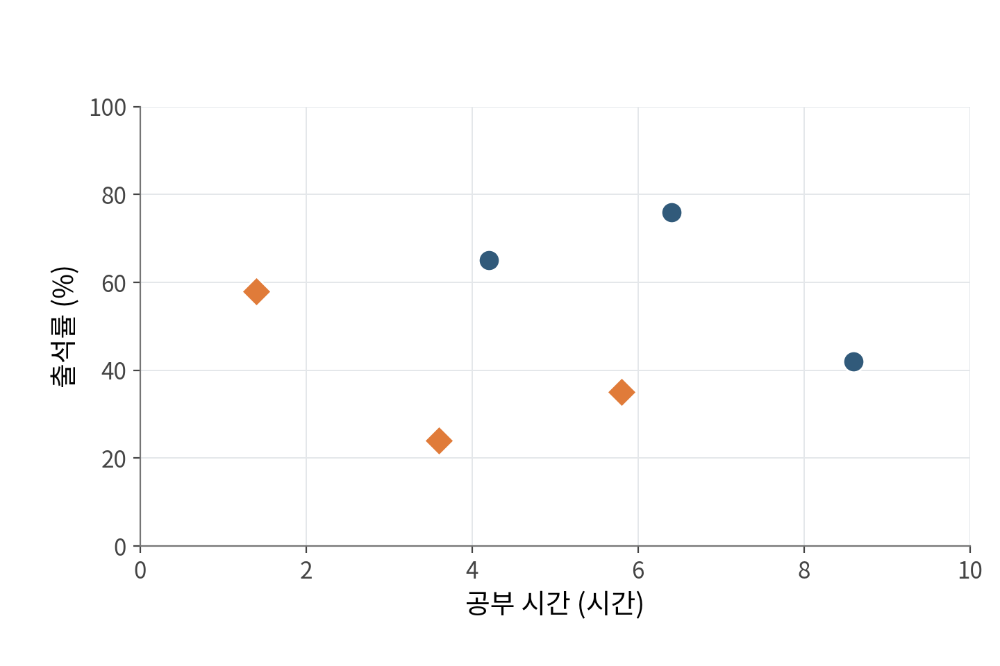
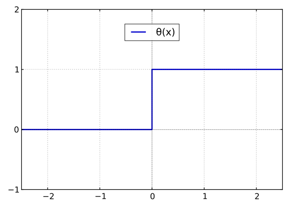
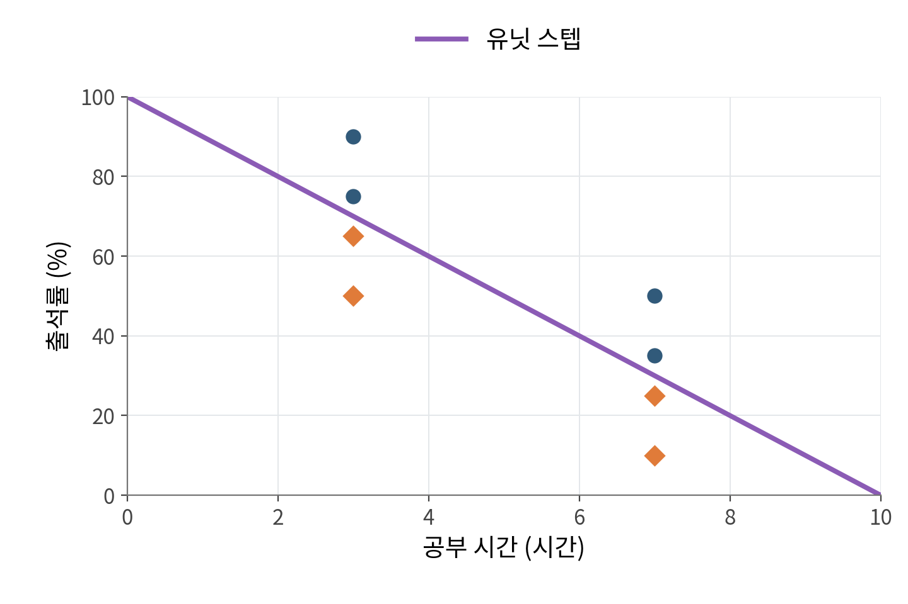
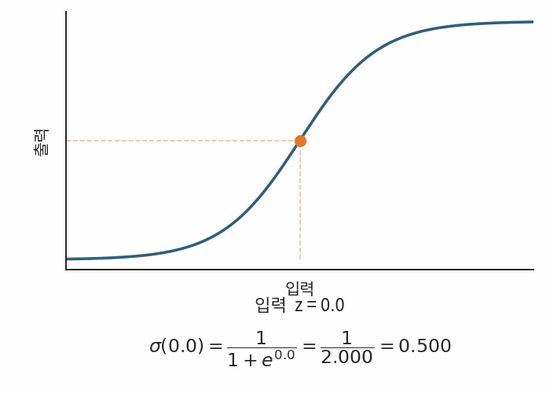
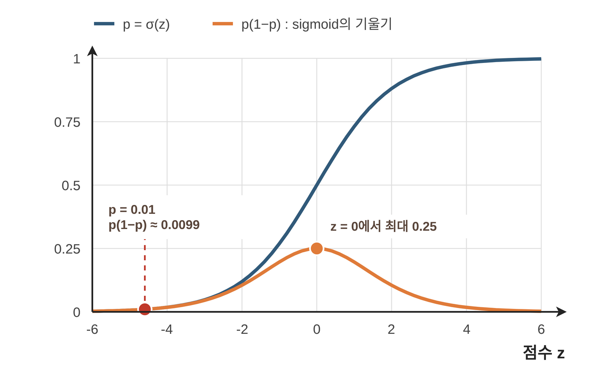
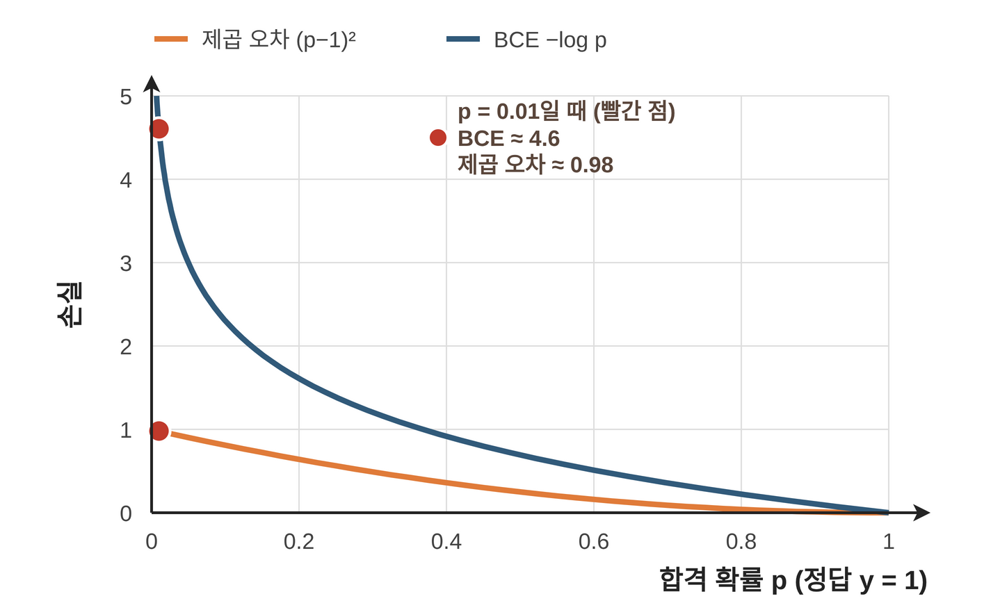
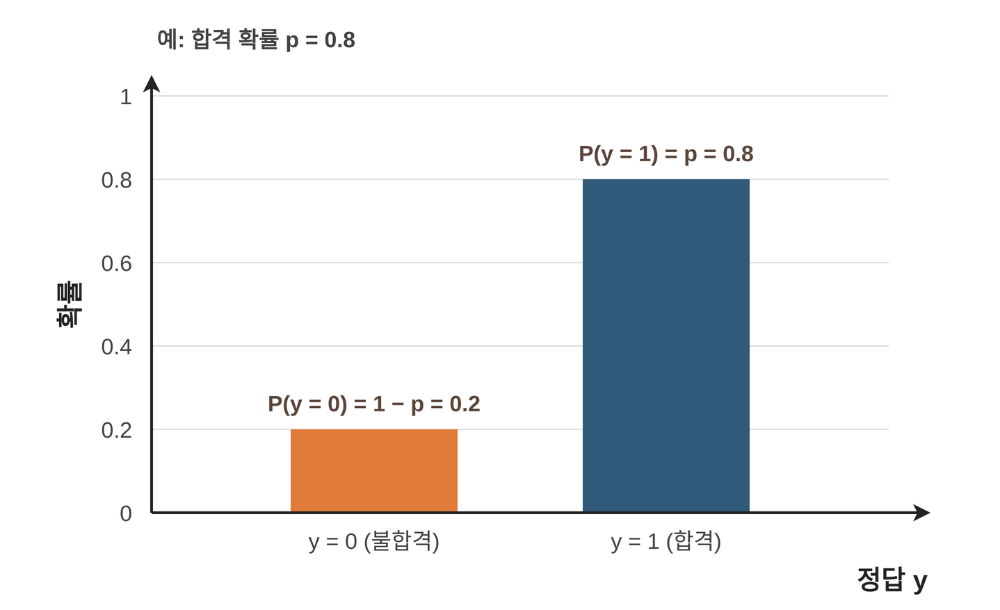
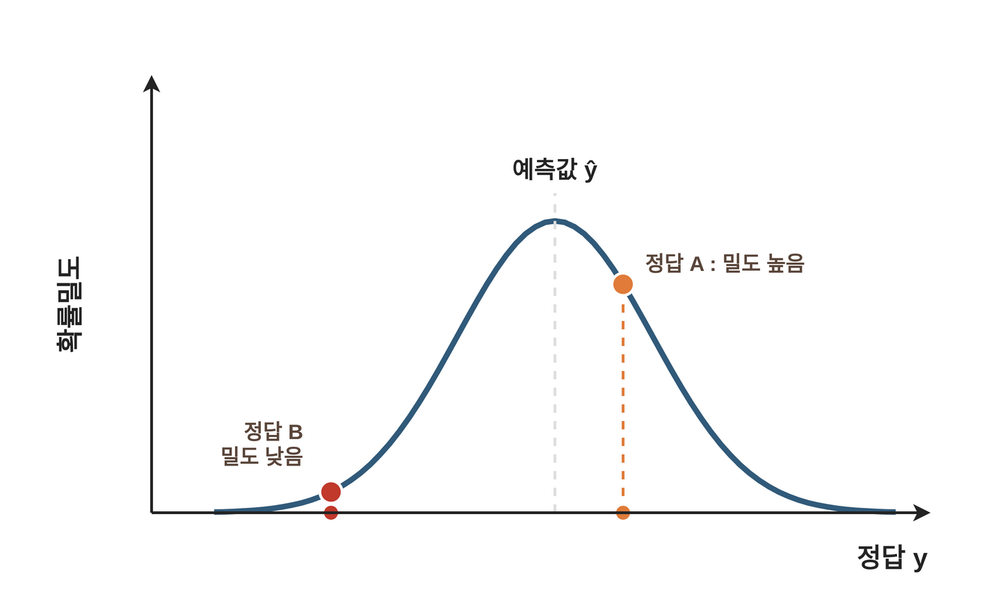

## 1. 이진분류

**이진분류**(Binary Classification)는 데이터를 클래스 두 개로 분류하는 작업입니다.

활용 예
- 스팸 메일 필터: 메일 내용을 보고 스팸인지 정상 메일인지 분류
- 질병 진단: 검사 수치나 의료 영상을 보고 질환이 있는지 없는지 분류
- 불량품 검사: 제품 사진을 보고 불량인지 정상인지 분류
- 시험 합격 예측: 공부 시간을 보고 합격인지 불합격인지 분류

## 2. 퍼셉트론으로 이진분류

퍼셉트론을 사용하여 공부 시간과 출석률로 시험 합격(1)과 불합격(0)을 예측해 보겠습니다.
입력노드 $x_1$에는 공부 시간과  $x_2$에는 출석률을 입력으로 하겠습니다. 학생 20명의 데이터를 넣으면 다음과 같습니다.

퍼셉트론은 입력값들을 종합한 점수가 기준선(0)을 넘으면 1, 넘지 못하면 0으로 판정하는 **유닛 스텝 함수(Unit Step Function)** 를 사용합니다.

### 학습 방식

유닛 스텝 함수는 z=0에서 미분할 수 없고, 그 밖의 구간에서는 기울기가 0입니다. 따라서 경사하강법에 사용할 수 없어 퍼셉트론 학습 규칙으로 가중치를 고칩니다.

학습률 $\eta$로, 샘플마다 예측 $\hat y$와 정답 $y$를 비교해 가중치를 고칩니다.

$$
w_j \leftarrow w_j + \eta(y-\hat y)x_j,
\qquad
b \leftarrow b + \eta(y-\hat y)
$$

##### 방식
- 맞혔다면 $y-\hat y=0$이라 아무것도 바뀌지 않습니다.
- 합격인데 불합격으로 예측했다면($y-\hat y=1$) $z$가 커지도록 가중치를 더합니다.
- 불합격인데 합격으로 예측했다면($y-\hat y=-1$) $z$가 작아지도록 가중치를 뺍니다.

즉, 틀린 샘플 쪽으로 경계선을 조금씩 밀어서 학습합니다.

퍼셉트론은 학습을 통해 합격과 불합격에 알맞은 0과 1이 출력되도록 $w_1,w_2,b$ 값을 찾습니다.

### 퍼셉트론의 한계

**데이터가 조금만 꼬여도 수렴하지 않습니다.** 
이 규칙은 직선 하나로 완벽하게 나눌 수 있는 데이터(선형 분리 가능, Linearly Separable)에서만 수렴이 보장됩니다. 
라벨이 잘못 붙은 샘플이 하나만 섞여도 직선으로 완벽하게 나눌 수 없고, 틀리는 샘플이 계속 남습니다. 
남은 샘플 때문에 가중치가 끝없이 움직여서, 틀린 샘플이 가장 적은 경계에 머물지 못합니다.
그리고 기울기가 미분이 불가능하여 경사하강법을 사용하지 못합니다. 

**얼마나 틀렸는지 알 수 없습니다.** 
$z$가 $0.01$이든 $10$이든 출력은 똑같이 1입니다. 
경계에 아슬아슬하게 걸친 학생과 확실한 학생이 같은 값으로 압축됩니다. 
틀렸을 때도 갱신량에 들어가는 $y-\hat y$는 $\pm1$뿐이라, 조금 틀린 샘플과 크게 틀린 샘플을 같은 크기로 밀어냅니다.

유닛스텝 활성화함수의 한계를 개선하기 위한 시그모이드 함수를 나왔습니다.

## 3. 시그모이드

부드러운 S자 곡선인 **시그모이드**(Sigmoid)는 입력값을 0과 1 사이의 값으로 바꿉니다.

<figure>
  
  <figcaption>출처: <a href="https://cs231n.github.io/neural-networks-1/">Stanford CS231n</a>.</figcaption>
</figure>

$$
\sigma(z)=\frac{1}{1+e^{-z}}
$$
- $z$: 시그모이드 함수의 입력값
- $e$: 자연상수(약 2.718)

$z$가 커지면 $e^{-z}$가 0에 가까워져 출력은 1에 다가가고, $z$가 작아지면 $e^{-z}$가 커져 출력은 0에 다가갑니다.

이진분류에서는 이 출력값을 $p$로 두고 **합격일 확률**로 읽습니다. 불합격일 확률은 $1-p$입니다.

거듭제곱 밑으로 자연상수를 사용하면 지수함수의 미분 형태가 그대로 유지되어 시그모이드의 미분을 간단히 정리할 수 있습니다. 다른 밑도 사용할 수 있지만 가중치의 척도만 달라집니다.

| 특징 | 의미 |
| --- | --- |
| $0<\sigma(z)<1$ | 유한한 입력을 0과 1 사이로 변환 |
| $\sigma(0)=0.5$ | 점수 0이 확률 0.5에 대응 |
| 전 구간 미분 가능 | 역전파에 사용 가능 |
| $\sigma'(z)=\sigma(z)(1-\sigma(z))$ | 출력값으로 미분 계산 가능 |

 $z=0.01$이면 $p\approx0.5025$, $z=10$이면 $p\approx0.99995$라서 아슬아슬한 학생과 확실한 학생이 구분됩니다. 
 또 미분이 가능하므로 학습 규칙 대신 손실 함수를 정의해 경사하강법으로 학습할 수 있습니다. 
 라벨이 섞인 데이터에서도 손실이 가장 작은 경계를 찾아갑니다.

모델이 계산한 합격 확률 p를 실제 분류 결과로 바꾸려면 기준값이 필요합니다. 
여기서는 0.5 이상이면 합격, 0.5 미만이면 불합격으로 분류합니다.

$$
\hat y=\begin{cases}
1,&p\geq0.5\\
0,&p<0.5
\end{cases}
$$

$p=0.5$는 $z=0$과 같으므로, 분류 경계는 여전히 $w_1x_1+w_2x_2+b=0$입니다. 입력이 두 개면 이 경계는 직선, 더 많으면 초평면이며 이런 분류를 **선형분류**라고 합니다.

## 4. 손실 함수: MSE 대신 BCE

이진분류에서 손실함수는 MSE말고 BCE(Binary Cross-Entropy)를 많이 사용합니다.
왜 MSE말고 BCE를 많이 쓰는걸까요?

MSE는 점수 $z$에 대해 미분하면 연쇄법칙에 따라 $p$를 $z$로 미분한 값, 곧 시그모이드의 기울기 $p(1-p)$가 곱해집니다.
      손실함수
      / 입력값 = 손실함 수 /예측값   x 예측값 / 활성화 함수 x 활성화 함수/ 입력값 
$$
\frac{\partial (p-y)^2}{\partial z}
=2(p-y)\,p(1-p)
$$

합격생인데 $p=0.01$로 크게 틀렸다면 $p(1-p)\approx0.0099$라서 미분값이 약 $-0.02$에 그칩니다. **크게 틀렸는데 고칠 신호는 작은** 상황입니다. 

시그모이드는 양 끝에서 평평해서, 크게 틀린 예측일수록 기울기가 0에 가까워지기 때문입니다.
또 시그모이드와 제곱 오차를 합친 손실은 가중치에 대해 볼록하지 않아, 경사하강법이 평평한 구간에서 잘 움직이지 않습니다.

### 정답에 준 확률로 벌점을 매기는 BCE

필요한 것은 **정답에 준 확률이 클수록 손실이 작고, 0에 가까울수록 손실이 크게 늘어나는** 함수입니다.
모델이 관측된 정답 전체에 높은 확률을 주게 하려면 각 정답에 준 확률을 곱해 최대화할 수 있습니다. 로그를 취하면 이 곱을 합으로 계산할 수 있습니다. 최대화 문제를 손실 최소화로 바꾸기 위해 부호를 뒤집으면 -log가 나옵니다
확률이 1이면 0이고, 0에 가까워질수록 한없이 커집니다. 이를 합격($y=1$)과 불합격($y=0$)에 모두 쓰는 식이 **이진 교차 엔트로피**(Binary Cross-Entropy, BCE)입니다.

$$
L_{\mathrm{BCE}}=-\left[y\log p+(1-y)\log(1-p)\right]
$$

정답에 따라 둘 중 한 항만 남습니다. 여기서 $\log$는 자연로그입니다.

| 정답        | 남는 손실        | 손실을 줄이는 방향       |
| --------- | ------------ | ---------------- |
| 합격 $y=1$  | $-\log p$    | 합격 확률 $p$를 높임    |
| 불합격 $y=0$ | $-\log(1-p)$ | 불합격 확률 $1-p$를 높임 |

정답이 합격인 학생에게 합격 확률 $p$를 여러 값으로 주었을 때 두 손실을 비교해 보겠습니다.

| 합격 확률 $p$ | 제곱 오차 $(p-1)^2$ | BCE $-\log p$ |
| --- | --- | --- |
| 0.9 | 0.01 | 약 0.105 |
| 0.5 | 0.25 | 약 0.693 |
| 0.1 | 0.81 | 약 2.303 |
| 0.01 | 0.9801 | 약 4.605 |

제곱 오차는 $p$가 0에 가까워져도 1을 넘지 않습니다. 
BCE는 정답에 준 확률이 0에 가까워질수록 제한 없이 커집니다. **틀린 쪽에 높은 확률을 준 예측**에 큰 손실을 부과합니다.

### 여러 학생의 손실을 합치기

학생이 $N$명이면 모든 학생에게서 정답이 나와야 하므로, 학생 $i$가 정답을 맞힐 확률 $q_i$를 모두 곱합니다. 학생들의 결과는 서로 영향을 주지 않는다고 봅니다. $q_i$는 $y_i=1$이면 $p_i$, $y_i=0$이면 $1-p_i$입니다.

$$
q_1\times q_2\times\cdots\times q_N
$$

그런데 확률은 1보다 작으므로 곱할수록 0에 가까워집니다. 예를 들어 0.1을 400번 곱하면 $10^{-400}$이라 컴퓨터가 표현하는 범위를 벗어나 0이 됩니다(언더플로, underflow). 로그를 씌우면 곱이 합이 되어 이 문제가 사라집니다.

$$
\log(q_1q_2\cdots q_N)=\log q_1+\log q_2+\cdots+\log q_N
$$

로그는 증가함수라 곱이 가장 클 때 합도 가장 큽니다. 최대화를 손실 최소화로 바꾸려고 부호를 뒤집고, 데이터 수에 따라 크기가 달라지지 않도록 평균을 내면 다음 식이 됩니다. 한 학생의 BCE를 평균 낸 것과 같습니다.

$$
L=-\frac{1}{N}\sum_{i=1}^{N}\log q_i
=-\frac{1}{N}\sum_{i=1}^{N}
\left[y_i\log p_i+(1-y_i)\log(1-p_i)\right]
$$

### 시그모이드와 함께 미분하면

시그모이드와 BCE를 결합하면 $p(1-p)$가 약분되어 점수에 대한 미분이 간단해집니다. $y=1$이면 $\partial L/\partial p=-1/p$이므로 다음과 같습니다.

$$
-\frac{1}{p}\cdot p(1-p)=p-1
$$

$y=0$일 때도 같은 방식으로 $p$가 남아, 정리하면 $y$에 상관없이 아래 식이 됩니다.

$$
\frac{\partial L_{\mathrm{BCE}}}{\partial z}=p-y
$$

합격생인데 $p=0.01$이라면 미분값은 $-0.99$입니다. 제곱 오차의 $-0.02$와 달리, 크게 틀린 만큼 큰 신호가 점수를 높이는 방향으로 전달됩니다.

시그모이드는 0과 1 사이의 값 p를 출력합니다. 합격과 불합격 중 하나를 결정하려면 사람이 임계값을 정해야 합니다. 보통 0.5를 사용하지만, 어떤 실수를 더 줄여야 하는지에 따라 임계값을 바꿀 수 있습니다.

시그모이드 출력과 BCE 손실을 쓰는 이 모델을 **로지스틱 회귀**(Logistic Regression)라고 부릅니다.

## 5. BCE와 MSE를 MLE로 이해하기

### 관측한 결과를 잘 설명하는 모델 고르기

앞에서 BCE는 "정답 확률의 곱에 로그를 취하고 부호를 뒤집은 값"으로 나왔습니다. 이 과정은 **최대우도추정**(Maximum Likelihood Estimation, MLE)이라는 일반 원리와 같습니다. 관측한 데이터를 가장 높은 확률로 만들어 내는 파라미터를 고르는 방법입니다.

동전 예로 보겠습니다. 동전을 10번 던져 앞면 7번, 뒷면 3번이 나왔습니다. 결과는 고정해 두고, 앞면이 나올 확률이라는 파라미터를 바꿔 가며 각 모델이 이 결과에 얼마나 높은 확률을 주는지 비교합니다. 이 값이 **우도**(Likelihood)입니다. 던질 때마다 독립이라 하면, 우도는 각 결과의 확률을 곱한 값입니다.

| 모델 | 앞면 확률 | 우도 |
| --- | --- | --- |
| A | 0.3 | $0.3^7\times0.7^3\approx0.000075$ |
| B | 0.5 | $0.5^{10}\approx0.00098$ |
| C | 0.7 | $0.7^7\times0.3^3\approx0.00222$ |

관측 결과를 가장 잘 설명하는 모델은 우도가 가장 큰 C입니다. MLE는 이처럼 우도가 커지는 파라미터를 찾습니다.

분류 모델에서는 학생마다 입력 $\mathbf{x}_i$가 다르고, 파라미터 $\theta$(가중치와 바이어스)가 학생별 확률을 정합니다. 우도는 같은 방식으로 정답 확률의 곱입니다.

$$
\mathcal{L}(\theta)=\prod_{i=1}^{N}P(y_i\mid\mathbf{x}_i;\theta)
$$

앞에서처럼 로그를 취해 곱을 합으로 바꾸고, 최대화 문제를 손실 최소화로 바꾸려고 마이너스를 붙입니다. 이것이 **음의 로그 우도**(Negative Log-Likelihood, NLL)입니다. [MLE 참고](https://d2l.ai/chapter_appendix-mathematics-for-deep-learning/maximum-likelihood.html)

$$
-\log\mathcal{L}(\theta)=-\sum_{i=1}^{N}\log P(y_i\mid\mathbf{x}_i;\theta)
$$

### 정답이 0 또는 1이면 BCE

이진 정답을 확률 $p$의 **베르누이 분포**로 나타내면 두 경우를 한 식으로 쓸 수 있습니다.

$$
P(y\mid\mathbf{x};\theta)=p^y(1-p)^{1-y}
$$

- $y=1$이면 $p$가 남습니다.
- $y=0$이면 $1-p$가 남습니다.

여기에 음의 로그를 적용하면 BCE가 나옵니다.

$$
-\log\left(p^y(1-p)^{1-y}\right)
=-y\log p-(1-y)\log(1-p)
$$

즉, **정답이 관측될 우도를 키우는 것과 BCE를 줄이는 것이 연결**됩니다.

### 연속적인 값에 정규분포를 가정하면 MSE

2장의 영상 수익처럼 연속적인 값을 예측할 때는 정답이 예측값 $\hat y$ 주변에 가장 많이 모이고, 멀어질수록 드물다고 가정할 수 있습니다. 이런 모양이 **정규분포**입니다.

모든 데이터의 분산 $\sigma^2$는 같은 고정값으로 둡니다.

$$
p(y\mid\mathbf{x};\theta)
=\frac{1}{\sqrt{2\pi\sigma^2}}
\exp\left(-\frac{(y-\hat y)^2}{2\sigma^2}\right)
$$

이 식은 연속값의 **확률밀도**입니다. 예측값에서 멀어진 정답에는 낮은 밀도를 부여합니다. 음의 로그를 취하면 제곱 오차가 남습니다.

$$
-\log p(y\mid\mathbf{x};\theta)
=\frac{(y-\hat y)^2}{2\sigma^2}
+\frac12\log(2\pi\sigma^2)
$$

분산이 고정되어 있으므로 오른쪽의 상수와 양의 배율을 제외해도 최소화하는 파라미터는 같습니다. 여러 데이터에 대해 평균 내면 **MSE 최소화**와 같아집니다. [선형 회귀와 최대우도](https://d2l.ai/chapter_linear-regression/linear-regression.html#normal-distribution-and-squared-loss)

| 예측 대상 | 사용하는 분포 가정 | 음의 로그 우도에서 연결되는 손실 |
| --- | --- | --- |
| 합격 / 불합격 | 베르누이 분포 | BCE |
| 영상 수익 | 고정 분산의 정규분포 | MSE |

MLE는 정답이 나올 확률을 기준으로 파라미터를 고르는 원리입니다. 정답을 어떤 분포로 모델링하느냐에 따라 음의 로그 우도, 곧 손실 함수의 형태가 달라집니다.

## 참고 자료

- 혁펜하임, 『이지 딥러닝』, 챕터 4.
- [Stanford CS231n · 활성화 함수](https://cs231n.github.io/neural-networks-1/).
- [Dive into Deep Learning · 최대우도추정](https://d2l.ai/chapter_appendix-mathematics-for-deep-learning/maximum-likelihood.html).
- [Dive into Deep Learning · 선형 회귀와 제곱 손실](https://d2l.ai/chapter_linear-regression/linear-regression.html).
