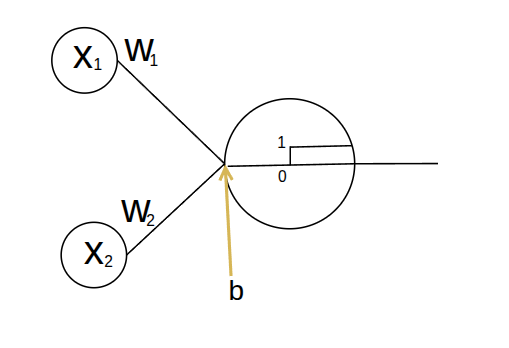
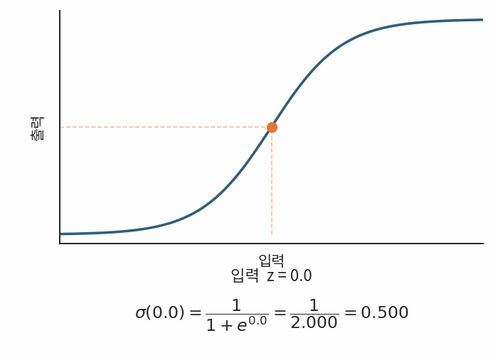
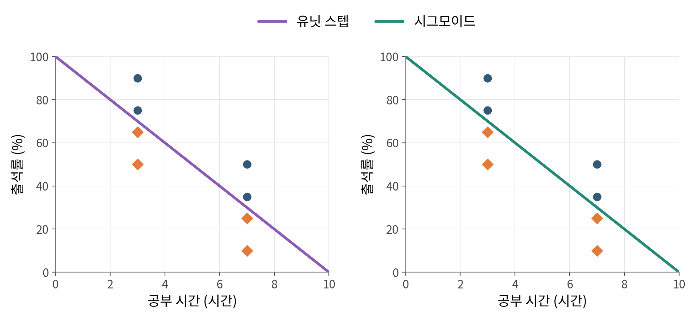
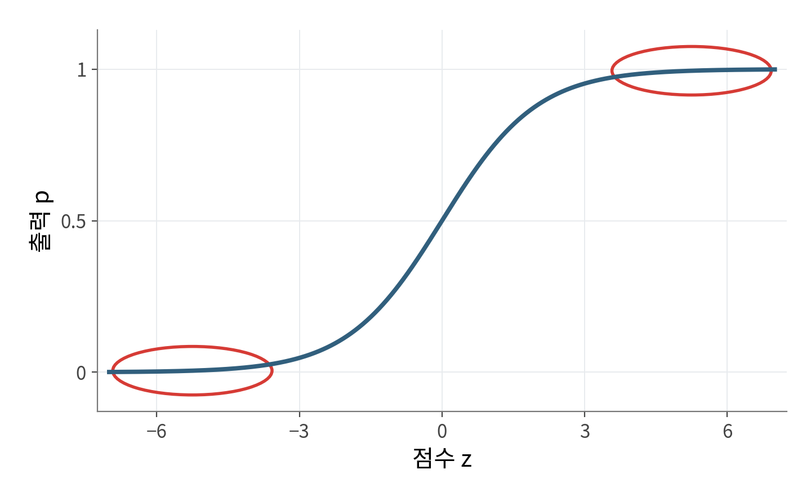
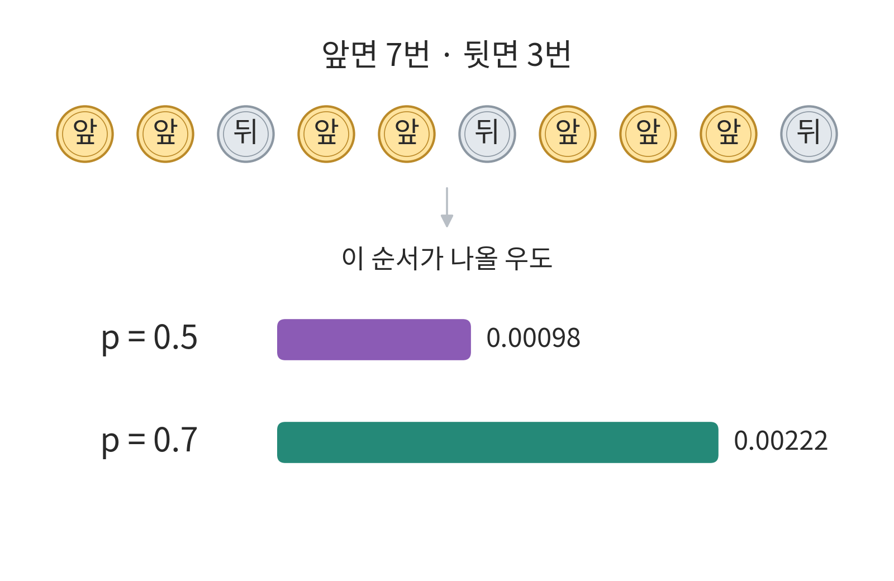

## 1. 이진분류

**이진분류**(Binary Classification)는 데이터를 두 클래스로 나누는 작업입니다.

- 스팸 메일 필터: 스팸 / 정상 메일
- 질병 진단: 질환 있음 / 없음
- 불량품 검사: 불량품 / 정상 제품
- 시험 합격 예측: 합격 / 불합격

## 2. 퍼셉트론으로 이진분류

공부 시간 $x_1$과 출석률 $x_2$로 학생 6명의 합격(1)과 불합격(0)을 예측해 보겠습니다. 파란 원은 합격, 주황 마름모는 불합격입니다.

퍼셉트론은 두 입력에 가중치를 곱하고 편향을 더해 점수 $z$를 계산합니다.

$$
z=w_1x_1+w_2x_2+b
$$

$w_1,w_2$는 가중치, $b$는 편향입니다. **유닛 스텝 함수**(Unit Step Function)는 $z\geq0$이면 1, $z<0$이면 0을 출력합니다.

### 학습

틀리게 분류한 학생의 점수가 정답 쪽으로 움직이도록 가중치와 편향을 고칩니다. 이를 반복해 두 부류를 나누는 경계를 찾습니다.

### 유닛 스텝 함수의 한계

- **기울기를 이용한 학습이 어렵습니다.** $z=0$에서는 미분할 수 없고, 나머지 구간의 미분값은 0입니다. 따라서 이 출력을 미분해 경사하강법으로 학습할 수 없습니다.
- **확신도를 구분하지 못합니다.** $z=0.01$과 $z=10$을 모두 1로 출력해, 경계에 가까운 예측과 멀리 떨어진 예측을 구분할 수 없습니다.

점수 차이를 출력에 반영하고 미분으로 학습하기 위해, 계단 함수를 시그모이드로 바꿔 보겠습니다.

## 3. 시그모이드(Sigmoid)

**시그모이드**(Sigmoid)는 점수 $z$를 0과 1 사이의 확률 $p$로 바꿉니다.

<figure>
  
  <figcaption>출처: <a href="https://cs231n.github.io/neural-networks-1/">Stanford CS231n</a>.</figcaption>
</figure>

$$
p=\sigma(z)=\frac{1}{1+e^{-z}}
$$

$e$는 자연상수로, 약 2.718입니다. $z$가 커지면 $e^{-z}$가 작아져 출력은 1에 가까워집니다.

반대로 $z$가 작아지면 $e^{-z}$가 커져 출력은 0에 가까워집니다.

##### 밑이 자연상수 $e$인 이유

$e^z$는 미분해도 그대로 남습니다. $e^{-z}$는 지수의 미분값 $-1$만 곱해집니다.

$$
\frac{d}{dz}e^{-z}=-e^{-z}
$$

$\frac{d}{dz}$는 $z$에 대해 미분한다는 뜻입니다. 이 성질로 시그모이드의 미분도 $p(1-p)$로 정리됩니다. 밑이 2나 10이면 각각 $\ln2$, $\ln10$이 추가로 곱해집니다.

##### 시그모이드는 왜 이런 식일까요?

점수 $z$는 실수 전체 범위지만, 확률 $p$는 $0<p<1$입니다. 확률 쪽의 범위를 늘려 두 값을 연결해 보겠습니다.

먼저 사건이 일어날 확률과 일어나지 않을 확률의 비인 **오즈**(Odds, 승산)를 구합니다.

$$
\text{Odds}=\frac{p}{1-p}
$$

오즈에 자연로그($\ln$)를 취한 값이 **로짓**(Logit, 로그 오즈)입니다. $p$가 0에 가까워지면 $-\infty$, 1에 가까워지면 $\infty$로 가므로 점수 $z$와 연결할 수 있습니다.

$$
z=\ln\left(\frac{p}{1-p}\right)
$$

이를 $p$에 대해 정리하면 시그모이드가 됩니다.

$$
p=\frac{1}{1+e^{-z}}
$$

##### 시그모이드 특징

1. **예측의 확신도를 구분합니다.** $z=0.01$이면 $p\approx0.5025$, $z=10$이면 $p\approx0.99995$입니다. 둘 다 합격이지만 확신도는 다릅니다.
2. **임계값을 조정할 수 있습니다.** 보통 $p\geq0.5$이면 합격으로 분류합니다. 임계값을 높이면 합격 판정이 더 엄격해집니다.
3. **모든 입력값에서 미분할 수 있습니다.** 손실 함수를 정의하면 경사하강법으로 가중치와 편향을 조정할 수 있습니다.

같은 학생 6명으로 학습한 두 모델 모두 올바르게 분류합니다. 이 예시에서는 시그모이드의 경계가 두 부류 사이에 더 여유 있게 놓입니다. 시그모이드 모델은 BCE 손실에 가중치 크기를 제한하는 L2 규제를 더해 학습했고, 임계값은 0.5입니다.

입력의 선형식으로 분류 경계를 정하는 방식을 **선형분류**라고 합니다.

## 4. 손실 함수

학습은 예측과 정답 사이의 손실을 줄이는 과정입니다. 정답 $y$가 1이면 합격 확률 $p$를, 0이면 불합격 확률 $1-p$를 높여야 합니다. 두 경우를 한 식으로 쓰면 다음 값을 최대화합니다.

$$
p^y(1-p)^{1-y}
$$

미니배치(mini-batch)의 각 결과가 독립적이라고 가정하면, 정답에 준 확률을 모두 곱합니다. 데이터가 16개라면 다음과 같습니다.

$p_i$와 $y_i$는 $i$번째 데이터의 예측 합격 확률과 정답입니다.

$$
\left[p_1^{y_1}(1-p_1)^{1-y_1}\right]
\times\cdots\times
\left[p_{16}^{y_{16}}(1-p_{16})^{1-y_{16}}\right]
$$

확률을 계속 곱하면 값이 너무 작아져 컴퓨터가 0으로 처리하는 **언더플로**(underflow)가 생길 수 있습니다. 이를 피하려면 곱을 직접 계산하지 않고 각 확률의 자연로그를 더합니다. 로그는 증가함수이므로 최대가 되는 파라미터는 같습니다.

$$
\ln\left(\prod_{i=1}^{16}p_i^{y_i}(1-p_i)^{1-y_i}\right)
=\sum_{i=1}^{16}\left[y_i\ln p_i+(1-y_i)\ln(1-p_i)\right]
$$

$\prod$는 모든 항의 곱, $\sum$은 모든 항의 합

##### 곱이 합으로 바뀌는 이유

자연로그와 $e$의 거듭제곱은 서로 반대 연산입니다.
확률을 $e$의 거듭제곱으로 쓰면, 곱셈에서 지수끼리 더해지는 성질을 이용할 수 있습니다.

$$
\begin{aligned}
\ln(p_1p_2)
&=\ln\left(e^{\ln p_1}e^{\ln p_2}\right)\\
&=\ln\left(e^{\ln p_1+\ln p_2}\right)\\
&=\ln p_1+\ln p_2
\end{aligned}
$$

$e^{\ln p}=p$이므로 첫 줄처럼 다시 쓸 수 있고, 마지막에는 자연로그가 지수 부분을 꺼냅니다.

최대화를 최소화로 바꾸려면 부호를 뒤집습니다. 데이터 $N$개의 평균을 내면 **이진 교차 엔트로피**(Binary Cross-Entropy, BCE) 손실이 됩니다.

$$
L_{\mathrm{BCE}}=-\frac{1}{N}\sum_{i=1}^{N}
\left[y_i\ln p_i+(1-y_i)\ln(1-p_i)\right]
$$

### MSE vs BCE

정답이 합격($y=1$)인 학생에 대해 모델의 예측 확률 $p$에 따른 손실을 비교합니다.

- **MSE**: $(p-1)^2$
- **BCE**: $-\ln p$

| **예측 확률 (p)** | **MSE: (p−1)2** | **BCE: −lnp** |
| ------------- | --------------- | ------------- |
| **0.9**       | 0.01            | 약 0.105       |
| **0.5**       | 0.25            | 약 0.693       |
| **0.1**       | 0.81            | 약 2.303       |
| **0.01**      | 0.9801          | 약 4.605       |

MSE는 완전히 틀린 예측($p \to 0$)을 하더라도 손실이 최대 1을 넘지 않습니다.
반면 BCE는 잘못된 확신에 대해 무한대의 페널티를 부여하여 잘못된 예측을 강력하게 응징합니다.

##### 시그모이드와 결합 시 역전파 차이 (기울기 소실)

모델의 최종 출력 점수(로짓) $z$에 대해 각 손실 함수를 편미분하면 시그모이드의 도함수 $p(1-p)$의 거동이 달라집니다.

$$\begin{aligned} \frac{\partial L_{\mathrm{MSE}}}{\partial z} &= 2(p-y) \cdot p(1-p) \\ \frac{\partial L_{\mathrm{BCE}}}{\partial z} &= \frac{p-y}{p(1-p)} \cdot p(1-p) = p - y \end{aligned}$$

합격생($y=1$)에게 $p=0.01$을 예측한 극단적인 오답 상황을 보겠습니다.

- **MSE 기울기**: $2(0.01 - 1) \times 0.01 \times 0.99 \approx -0.0196$

- **BCE 기울기**: $0.01 - 1 = -0.99$

MSE는 시그모이드 기울기가 평평해지는 구간에서 기울기가 0에 수렴하는 기울기 소실(Gradient Vanishing)이 발생합니다.

반면 BCE는 분모와 분자가 약분되어 오차 $(p - y)$에 비례하는 명확한 그래디언트를 전달하므로 빠르게 파라미터를 수정합니다.

### 확률론적 관점: 왜 BCE가 최적인가?

BCE는 단순히 임의로 만든 식이 아니라, 관측 데이터를 가장 잘 설명하는 모델을 찾는 최대우도추정(MLE)의 직접적인 결과입니다.

#### (1) 동전 던지기로 이해하는 우도(Likelihood)

앞면 확률이 $p$인 동전을 10번 던져 **앞면 7번, 뒷면 3번**이 나왔다고 가정해 봅니다.

- 결과가 관측되었을 때, 이 사건이 일어날 확률은 $p^7(1-p)^3$입니다.

- 이를 $p$의 함수로 본 것을 우도(Likelihood)라고 합니다.

- $p=0.5$일 때보다 $p=0.7$일 때 우도가 훨씬 높습니다. 즉, $p=0.7$이 실제 관측된 결과를 더 그럴듯하게 설명합니다.

#### (2) 분류 모델로의 확장 (베르누이 분포)

이진 분류 역시 매 데이터마다 앞/뒷면 확률이 바뀌는 동전 던지기와 같습니다.

입력 $\mathbf{x}$에 대해 정답 $y \in {0, 1}$가 나올 확률은 베르누이 확률질량함수로 한 번에 표현됩니다.

$$P(y \mid \mathbf{x}; \theta) = p^y (1-p)^{1-y}$$

- $y=1$이면 $p^1(1-p)^0 = p$

- $y=0$이면 $p^0(1-p)^1 = 1-p$

### MSE의 MLE 관점

MSE도 MLE 관점에서보자면 가우시안(정규)분포를 NLL한것이 MSE입니다.

모든 데이터의 분산 $\sigma^2$를 같은 고정값으로 두면 다음과 같습니다.

$$
p(y\mid\mathbf{x};\theta)
=\frac{1}{\sqrt{2\pi\sigma^2}}
 e^{-\frac{(y-\hat y)^2}{2\sigma^2}}
$$

이 식은 연속값의 **확률밀도**입니다. 음의 로그를 취하면 제곱 오차가 남습니다.

$$
-\ln p(y\mid\mathbf{x};\theta)
=\frac{(y-\hat y)^2}{2\sigma^2}
+\frac12\ln(2\pi\sigma^2)
$$

분산이 고정되어 있으므로 상수와 양의 배율을 제외해도 최소화하는 파라미터는 같습니다. 따라서 평균 음의 로그 우도를 줄이는 것은 **MSE를 줄이는 것**과 같습니다.

## 참고 자료

- 혁펜하임, 『이지 딥러닝』, 챕터 4.
- [Stanford CS231n · 활성화 함수](https://cs231n.github.io/neural-networks-1/).
- [Dive into Deep Learning · 최대우도추정](https://d2l.ai/chapter_appendix-mathematics-for-deep-learning/maximum-likelihood.html).
- [Dive into Deep Learning · 선형 회귀와 제곱 손실](https://d2l.ai/chapter_linear-regression/linear-regression.html).
