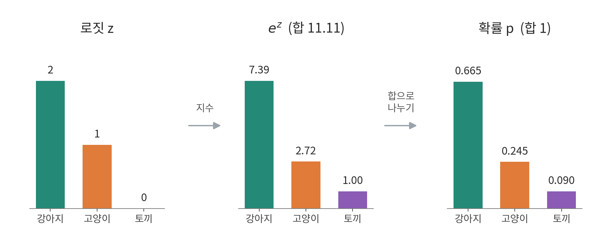
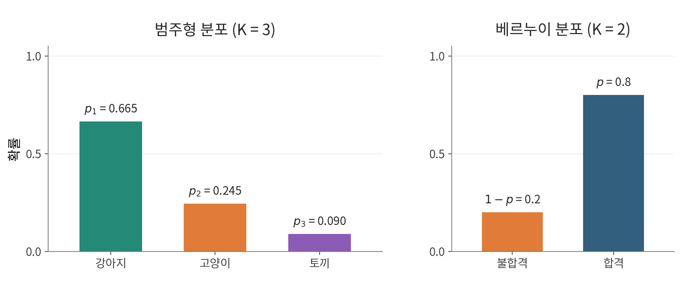
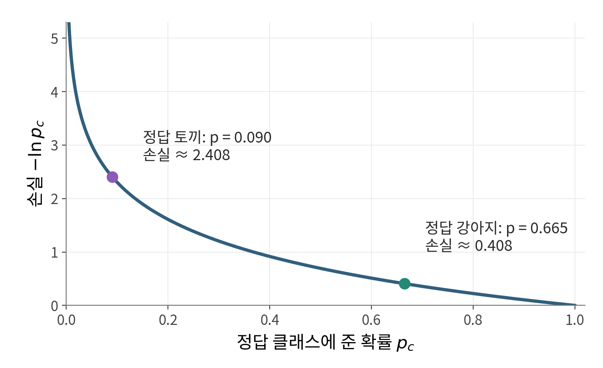
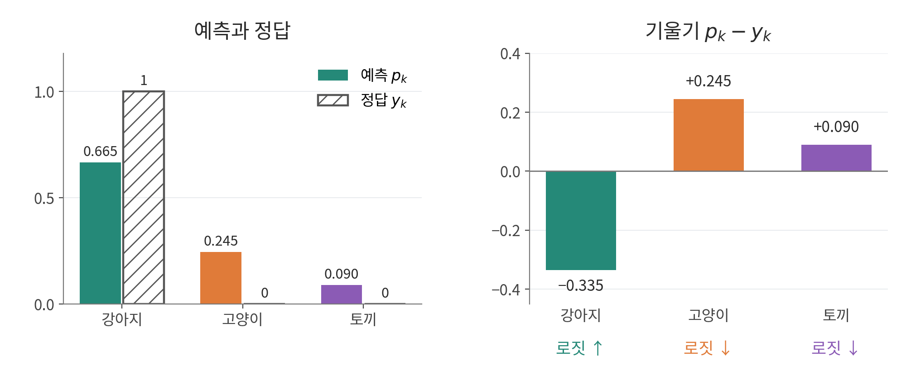

## 1. 다중분류

데이터를 세 개 이상의 클래스 중 하나로 분류하는 것을 다중분류라고 합니다.

예를 들어, 사진을 보고 **[강아지, 고양이, 토끼]** 중 어떤 동물인지 맞히는 작업이 있다고 해봅시다.

컴퓨터는 "이 사진은 고양이야"라는 글자를 그대로 이해하지 못하므로, 정답을 **숫자 목록(벡터)** 형태로 알려주어야 합니다.

이때 가장 널리 쓰이는 방법이 **원-핫 인코딩(One-Hot Encoding)** 입니다. 객관식 답안지에 정답 번호 하나만 칠하듯, 정답 자리만 1로 표시하고 나머지는 전부 0으로 둡니다.

- **강아지 사진일 때:** `[1, 0, 0]`
- **고양이 사진일 때:** `[0, 1, 0]`
- **토끼 사진일 때:** `[0, 0, 1]`

모델은 사진을 보고 클래스마다 점수를 하나씩, 총 3개 계산합니다.

$$\mathbf{z} = [z_1,\ z_2,\ z_3]$$

이 점수를 **로짓(Logit)** 이라고 부릅니다. $z_1, z_2, z_3$은 각각 강아지, 고양이, 토끼의 로짓입니다.

정답은 0과 1로만 이루어져 있지만, 로짓은 `-3.1`, `5.2`처럼 음수도 나오고 크기에도 제한이 없습니다. 범위가 다른 두 값을 바로 비교하면 손실(Loss)을 일관된 기준으로 계산할 수 없습니다.

그래서 로짓을 합이 1인 **각 클래스의 확률**로 바꿔 정답과 같은 기준으로 맞춥니다. 이 변환을 하는 대표적인 함수가 **소프트맥스(Softmax)** 입니다.

## 2. 소프트맥스(Softmax)

softmax는 여러 개의 실수를 받아, 모든 출력이 양수이고 합이 1이 되도록 바꾸는 함수입니다.

각 클래스의 확률 $p_k$는 다음과 같습니다.

$$
p_k=\frac{e^{z_k}}{e^{z_1}+e^{z_2}+e^{z_3}}
$$

$k$는 클래스 번호(1: 강아지, 2: 고양이, 3: 토끼)이고, $e$는 자연상수(약 2.718)입니다.

$e^{z_k}$는 항상 양수이고, 모든 항을 같은 합으로 나누므로 확률의 합은 1입니다. 로짓이 클수록 확률도 큽니다.

로짓이 $[2,\ 1,\ 0]$이면 다음처럼 계산됩니다.

##### 지수를 쓰는 이유

로짓을 그대로 합으로 나누면 음수 로짓은 음수 확률이 됩니다. 로짓이 $[2,\ 1,\ -3]$이면 합이 0이라 나눌 수도 없습니다. $e^{z}$는 $z$가 음수여도 0보다 크므로 이런 문제가 없고, 증가함수라 로짓의 순서도 유지됩니다.

밑이 $e$인 이유는 [시그모이드](/notes/deep-learning/easy-deep-learning-ch04/)와 같습니다. 학습할 때는 손실을 로짓까지 미분하는데, $e^z$는 미분해도 자기 자신이라 계산이 간단합니다.

## 3. 교차 엔트로피(Cross-Entropy)

모델이 잘 맞혔는지는 정답 클래스에 준 확률로 판단합니다. 이 확률이 1에 가까울수록 잘 맞힌 것이므로, 학습에서는 이 확률이 커지도록 가중치와 편향을 고칩니다.

앞의 예에서 모델은 강아지에 0.665, 고양이에 0.245, 토끼에 0.090을 주었습니다. 이 확률을 $p_1, p_2, p_3$로 쓰고, 원-핫 정답은 $\mathbf{y}=[y_1,\ y_2,\ y_3]$로 씁니다.

정답이 강아지면 높일 값은 $p_1$, 고양이면 $p_2$입니다. 원-핫 정답을 지수로 쓰면 정답의 확률만 한 식으로 고를 수 있습니다. $a^1=a$, $a^0=1$이기 때문입니다.

$$
p_1^{y_1}\,p_2^{y_2}\,p_3^{y_3}
$$

정답이 강아지($\mathbf{y}=[1,0,0]$)이면 강아지의 확률만 남습니다.

$$
0.665^1\times0.245^0\times0.090^0=0.665
$$

앞 글의 $p^y(1-p)^{1-y}$도 같은 방법으로, 정답 $y$에 따라 $p$와 $1-p$ 중 하나를 골랐습니다.

클래스가 $K$개이면 곱 기호로 줄여 씁니다.

$$
P(\mathbf{y}\mid\mathbf{x};\theta)=\prod_{k=1}^{K}p_k^{y_k}
$$

- $K$: 클래스 수(이 예에서는 3)
- $\prod_{k=1}^{K}$: $k=1$부터 $K$까지 모두 곱함
- $\mathbf{y}$: 원-핫 정답 벡터 $[y_1,\dots,y_K]$
- $P(\mathbf{y}\mid\mathbf{x};\theta)$: 입력 사진 $\mathbf{x}$를 넣었을 때 정답 $\mathbf{y}$가 나올 확률. $\theta$는 모델의 가중치와 편향입니다.

$K$개 중 하나가 나오는 이 분포를 **범주형 분포**(Categorical Distribution, 멀티누이 분포)라고 합니다. 앞 글의 동전 던지기가 베르누이 분포라면, 주사위 던지기는 범주형 분포입니다. 클래스가 2개이면 범주형 분포는 베르누이 분포가 됩니다.

BCE 때처럼 자연로그를 취하면 곱이 합으로 바뀌고, 부호를 뒤집으면 **교차 엔트로피** 손실이 됩니다.

$$
L_{\mathrm{CE}}=-\sum_{k=1}^{K}y_k\ln p_k
$$

$\sum_{k=1}^{K}$는 $k=1$부터 $K$까지 모두 더한다는 뜻입니다. 데이터가 여러 개면 BCE처럼 평균을 냅니다.

원-핫 벡터는 정답 자리만 1이므로 정답 클래스의 항만 남습니다.

$$
L_{\mathrm{CE}}=-(1\cdot\ln p_1+0\cdot\ln p_2+0\cdot\ln p_3)=-\ln p_1
$$

정답 클래스의 번호를 $c$라 하면 $L_{\mathrm{CE}}=-\ln p_c$입니다. 앞의 softmax 출력 $[0.665,\ 0.245,\ 0.090]$으로 계산하면 다음과 같습니다.

- 정답이 강아지: $-\ln 0.665\approx0.408$
- 정답이 토끼: $-\ln 0.090\approx2.408$

정답에 준 확률이 0에 가까울수록 손실은 한없이 커집니다.

### softmax와 함께 미분하기

앞 글에서 시그모이드와 BCE를 함께 미분하면 $p-y$가 남았습니다. softmax와 교차 엔트로피도 마찬가지로, 각 로짓에 대한 기울기가 **예측 확률과 정답의 차이**가 됩니다.

$$
\frac{\partial L_{\mathrm{CE}}}{\partial z_k}=p_k-y_k
$$

이 기울기를 역전파로 앞선 층에 전달해 가중치와 편향을 학습합니다.

## 참고 자료

- 혁펜하임, 『이지 딥러닝』, 챕터 4.
- [Dive into Deep Learning · softmax와 교차 엔트로피](https://d2l.ai/chapter_linear-classification/softmax-regression.html).
