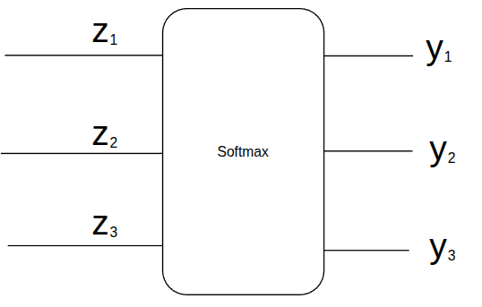

## 1. 다중분류

데이터를 클래스 세개 이상으로 분류하는것을 다중분류라고 합니다 

예를 들어, 사진을 보고 **[강아지, 고양이, 토끼]** 중 어떤 동물인지 맞히는 작업이 있다고 해봅시다.

컴퓨터는 "이 사진은 고양이야"라는 글자를 그대로 이해하지 못하므로, 정답을 **숫자 목록(벡터)** 형태로 알려주어야 합니다. 이때 가장 널리 쓰이는 방법이 바로 **원-핫 인코딩(One-Hot Encoding)** 입니다.

시험지의 객관식 답안지에 컴퓨터용 사인펜으로 정답 번호 하나만 칠하듯, 정답에 해당하는 자리만 1(켜짐)로 표시하고 나머지는 전부 0(꺼짐)으로 둡니다.

- **강아지 사진일 때:** `[1, 0, 0]`
    
- **고양이 사진일 때:** `[0, 1, 0]` 
    
- **토끼 사진일 때:** `[0, 0, 1]` 

모델 역시 입력된 사진을 분석해 각 동물의 특징이 얼마나 일치하는지 **'확신도 점수(자신감)'** 를 클래스마다 하나씩, 총 3개 계산합니다.

$$\mathbf{z} = [z_{\text{dog}}, z_{\text{cat}}, z_{\text{rabbit}}]$$

이 점수를 **로짓(Logit)** 이라고 부릅니다.

앞서 만든 정답은 맞으면 1, 틀리면 0으로 딱 떨어지게 정해져 있습니다. 
반면 로짓은 모델이 계산한 날것의 점수라 `-3.1`, `5.2`처럼 음수가 나오기도 하고 숫자의 크기에도 제한이 없습니다.

이렇게 기준과 단위가 전혀 다른 날것의 점수를 정답(`1`과 `0`)과 바로 비교하면, **오차(Loss)를 일관된 기준으로 계산할 수 없어 모델이 제대로 학습하지 못합니다.**

그래서 이 점수들을 **"각 동물일 확률이 몇 %인가? (합쳐서 100%)"** 라는 하나의 공통 기준으로 변환해 주는 작업이 필요합니다.

이 변환을 해주는 대표적인 방법이 바로 **소프트맥스(Softmax)** 함수입니다.

## 2. Softmax

 Softmax는 여러개의 실수값을 받아 각 출력의 값이 양수이면서 그 합이 1인되도록 변환해주는 함수입니다.
 

$y_1 = \frac{e^z_1}{ e^z_1 + e^z_2 + e^z_3 }$ 

$y_2 = \frac{e^{z_2}}{ e^{z_1} + e^{z_2} + e^{z_3} }$ 

$y_3 = \frac{e^z_3}{ e^z_1 + e^z_2 + e^z_3 }$ 

- **강아지 사진일 때:** `[15, 3, -2]`
    
- **고양이 사진일 때:** `[0, 1, 0]` 
    
- **토끼 사진일 때:** `[0, 0, 1]` 

거듭제곱을 쓰는 이유 

	입력값을 자연상수의 거듭제곱지수로 넣는 이유는 0으로 내려가게 하지않게 하기위함
	 자연상수는 미분시 깔끔함 
	 

### sigmoid와 무엇이 다른가

각 출력에 sigmoid를 따로 적용하면, 세 클래스의 확률이 동시에 높아질 수 있고 합도 1로 맞춰지지 않습니다. 어떤 답을 허용하는지에 따라 함수를 선택합니다.

| 문제 | 출력 방식 | 의미 |
| --- | --- | --- |
| 강아지인가, 고양이인가 | sigmoid 하나 | 강아지 $p$, 고양이 $1-p$ |
| 강아지·고양이·토끼 중 하나인가 | softmax | 한 정답을 두고 확률을 나눔 |
| 사진에 어떤 동물들이 함께 있는가 | 클래스별 sigmoid | 강아지와 고양이가 동시에 정답 가능 |

마지막 경우는 **다중 레이블 분류**입니다. 예를 들어 강아지와 고양이가 함께 있는 사진의 정답은 $[1\;1\;0]$이 될 수 있습니다.

이진분류를 두 출력의 softmax로 만들 수도 있습니다. 두 점수의 차이에 sigmoid를 적용한 것과 같습니다.

$$
\frac{e^{z_1}}{e^{z_0}+e^{z_1}}=\sigma(z_1-z_0)
$$

이진분류에서는 sigmoid 출력 하나로 두 확률을 표현할 수 있어 구성이 간단합니다.

## 3. 다중분류의 교차 엔트로피

### 정답 클래스의 확률 높이기

강아지 사진이라면 세 확률 중 강아지 확률이 높아져야 합니다. **교차 엔트로피**(Cross-Entropy, CE)는 정답 벡터 $\mathbf{y}$와 예측 확률 $\mathbf{p}$를 다음처럼 비교합니다.

$$
L_{\mathrm{CE}}=-\sum_{k=1}^{K}y_k\log p_k
$$

원-핫 정답은 한 위치만 1이므로, 정답 클래스 $c$의 항만 남습니다.

$$
L_{\mathrm{CE}}=-\log p_c
$$

앞의 $[0.665\;0.245\;0.090]$에 대해 정답이 강아지라면 손실은 약 $-\log(0.665)=0.408$입니다. 같은 예측에서 정답이 토끼라면 손실은 약 2.408로 더 큽니다.

### 최대우도추정과 연결하기

앞 글의 [최대우도추정](/notes/deep-learning/easy-deep-learning-ch04/)처럼 정답에 준 확률의 곱을 크게 만드는 관점에서 보겠습니다. 세 종류 중 하나가 정답인 **범주형 분포**에서는, 관측된 정답에 대한 우도를 다음처럼 쓸 수 있습니다.

$$
P(\mathbf{y}\mid\mathbf{x};\theta)=\prod_{k=1}^{K}p_k^{y_k}
$$

음의 로그를 취하면 교차 엔트로피가 됩니다. BCE는 두 클래스의 정답 분포 $[y\;1-y]$와 예측 분포 $[p\;1-p]$에 대한 교차 엔트로피입니다. [softmax와 교차 엔트로피 참고](https://d2l.ai/chapter_linear-classification/softmax-regression.html)

softmax와 CE를 결합했을 때도 로짓에 대한 미분은 간단합니다.

$$
\frac{\partial L_{\mathrm{CE}}}{\partial z_k}=p_k-y_k
$$

이 미분을 역전파로 앞선 층에 전달해 가중치와 바이어스를 학습합니다.

## 참고 자료

- 혁펜하임, 『이지 딥러닝』, 챕터 4.
- [Dive into Deep Learning · softmax와 교차 엔트로피](https://d2l.ai/chapter_linear-classification/softmax-regression.html).
