신경망이 학습한다는 말은 결국 예측의 오차가 줄어들도록 가중치와 바이어스를 바꾸는 뜻이다. 그런데 파라미터가 수만 개라면 어느 값을 어느 방향으로 바꿔야 할까? 조회수로 영상 수익을 예측하는 작은 문제에서 출발해, 손실을 계산하고 기울기를 따라 한 번 갱신하는 과정을 확인한다. 그런 다음 데이터를 어떻게 묶고 이동 방향을 어떻게 보정하는지에 따라 최적화 방법을 비교한다.

## 가중치와 바이어스가 바꾸는 것

인공 신경망은 생물학적 신경 구조에서 영감을 받은 수학적 모델입니다.
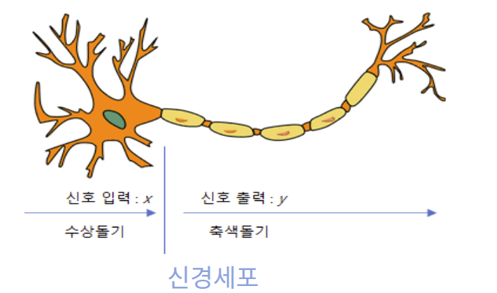

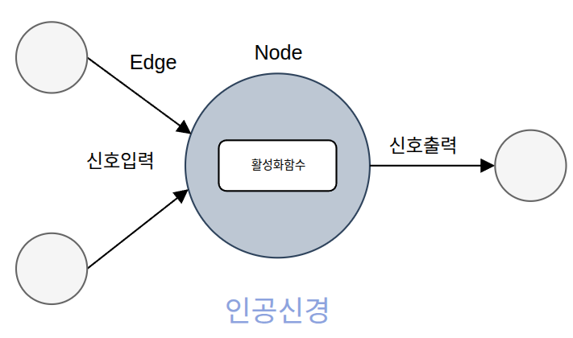

| 생물학적 구조 | 역할             | 인공 신경                    |
| ------- | -------------- | ------------------------ |
| 수상돌기    | 다른 신경의 신호를 받음  | 연결을 통해 입력을 받음            |
| 세포체     | 받은 신호를 통합      | 총합을 계산하고 활성화 함수통과시킴      |
| 축삭      | 신호를 다음 신경으로 전달 | 활성화 함수의 출력값을 다음층의 신경에 전달 |
활성화 함수는 들어온 신호의 총합을 그대로 내보내지 않고  이 신호를 다음 뉴런으로 얼마나 강하게 전달할지 결정하는 스위치이자 필터입니다.

우리 뇌의 뉴런도 자극이 일정 기준(역치)을 넘어야만 다음 뉴런으로 신호를 쏘듯이 인공신경망에서도 노드에 들어온 입력값에 더하고 활성화 함수에 통과시켜 다음 층으로 보냅니다.

여러 활성화 함수중에 기본적인 함수이면서 초기에 사용한 함수는  unit step function입니다.  총합이 0보다 작거나 같으면 0을, 0보다 크면 1을 출력합니다. 계단모양을 띄어 unit step function이라고 불린다.
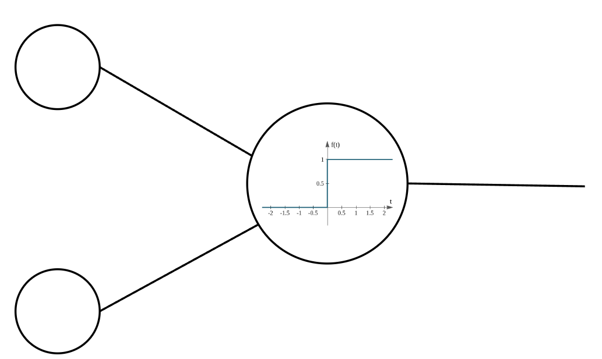

### Weight와 Bias란?

예를 들어, 온도 100도 이상이거나 연기가 나면 경보를 울리는걸 만든다고 하자. 

두개의 입력노드가 있다. 
- 위쪽 입력노드 : 온도 
- 아래쪽 입력노드 : 연기가 나는 양

1. 온도계가 99도이면서 연기가 안나는 상황

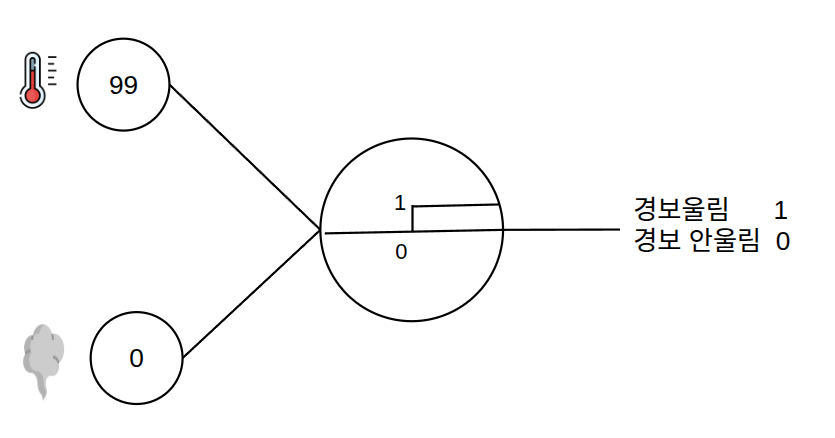

온도 99 + 연기 0 = 99이므로 연기가 없는데 경보가 울린다. 인공신경이 필요이상으로 민감함으로 이 문제를 해결하기 위해 합 **바이어스(Bias)** 를 사용한다.

**바이어스** 는 입력노드에 엣지로부터 오는 값들의 총합에 더해지는 값으로 값의 기준치를 조절해준다. 신경의 민감도를 조절하는 파라미터이다.

바이어스를 -99로 설정하면 

(99, 0) 일때  99+ 0 - 99 = 0
(99, 1) 일때 99 + 1 - 99 = 1 , 경보 울림
(100, 0)일때 100 + 0 - 99 = 1, 경보 울림

하지만 바이어스를 사용해도 (0, 1)일때 0 + 1 - 99 = -98이므로 경보가 울려야되는 상황이지만 안울리는 현상이 발생한다. 

각 입력값이 동일한 중요도로 취급되기 때문에 이런 현상이 발생한다.

이 문제를 해결하기 위해 각 입력노드에 중요도를 곱해주는 웨이트를 사용한다.
웨이트는 입력노드의 출력에 위치하며 입력값에 곱해져 총합에 반영된다.

예를 들어 입력노드1에 1.0웨이트, 입력노드2에 100웨이트로 설정하면 

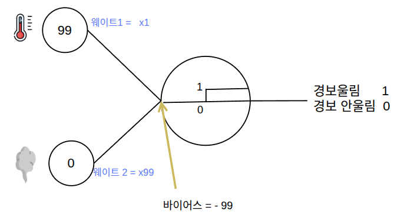

(99, 1) = 99 * 1 + 1 * 100 - 99 = 1, 경보울림
(0, 1) = 0 * 1 + 1 *  100 - 99 = 1, 경보울림

딥러닝 모델에는 사람이 하나씩 조정하기 어려울 만큼 많은 가중치와 바이어스가 있다. 

데이터를 입력하고 예측 결과의 오차를 계산한 뒤, 그 오차를 줄이는 방향으로 가중치와 바이어스를 자동으로 조정하는 과정이 **학습**이다.

### 신경망의 핵심 요소

| 구성                | 역할                  |
| ----------------- | ------------------- |
| 입력층(Input Layer)  | 조회수·영상 길이 같은 입력을 받음 |
| 은닉층(Hidden Layer) | 입력을 조합하고 변환         |
| 출력층(Output Layer) | 예측 수익 같은 최종 결과를 출력  |

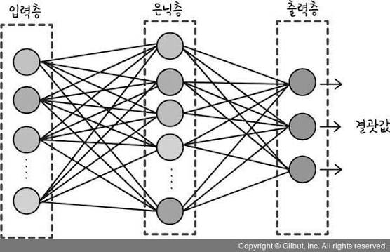

- **완전연결층**(Fully Connected Layer, FC): 이전 층의 모든 노드와 연결된 층.
- **다층 퍼셉트론**(Multi-Layer Perceptron, MLP): 하나 이상의 은닉층을 가지며, 완전연결층과 비선형 활성화 함수로 구성한 신경망.
- 심층 신경망 : 최소 두개 이상의 은닉층을 가진 신경망 

신경망은 작은 계산들을 연결한 **하나의 함수**다. 입력에 가중치를 곱하고, 바이어스를 더하고, 활성화 함수를 통과시키는 계산이 층마다 이어진다.

## 예측을 평가할 기준 만들기

### 조회수로 수익 예측하기

조회수만으로 영상 수익을 예측한다고 해보자. 먼저 기존 영상 네 편의 조회수와 실제 수익을 살펴보자. 

| 영상  | 조회수(만 회) | 실제 수익(만 원) |
| --- | -------: | ---------: |
| A   |        1 |          2 |
| B   |        2 |          4 |
| C   |        3 |          5 |
| D   |        4 |          7 |

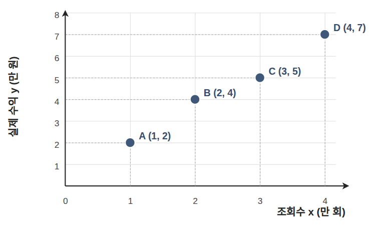

처음 보는 영상의 수익을 예측하려면, 조회수와 수익이 어떤 관계인지 알아야 합니다. 
이처럼 연속된 숫자를 예측하는 문제를 **회귀**라고 합니다.

**선형 회귀**는 두 값의 관계를 직선으로 나타내는 방법입니다. 
딥러닝 자체는 아니지만, 앞에서 배운 가중치와 바이어스가 예측을 어떻게 바꾸는지 살펴보기 좋은 간단한 예입니다.

### 가중치와 바이어스로 예측선 조절하기

그래프에 점들을 찍고 그 사이를 지나는 직선을 그으면, 그 직선으로 새로운 영상의 수익을 예측할 수 있습니다. 조회수가 들어오면 선형회귀함수가 예상 수익을 내놓습니다.

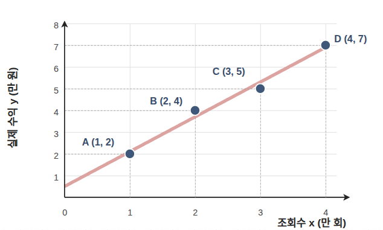

직선의 함수 y =  1.5x +0.5
여기서 1.5가 가중치(기울기), 0.5가 바이어스(편차)이다.

직선을 정하는 값은 두 가지입니다.
**가중치**는 조회수가 늘 때 예측 수익이 얼마나 늘어날지 정합니다.
**바이어스**는 직선을 위아래로 옮깁니다.
이 둘을 바꾸면 예측선의 모양과 위치가 달라집니다.

그러면 어떤 직선이 데이터를 가장 잘 예측하는지 어떻게 판단할까요? 

기존 영상마다 직선이 예측한 수익과 실제 수익을 비교하면 됩니다.
두 값의 차이를 **오차**라고 합니다.
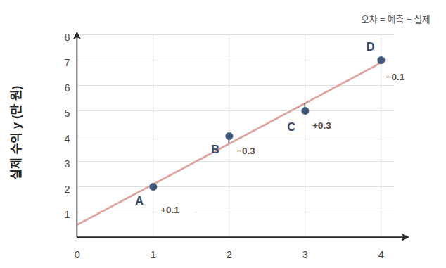
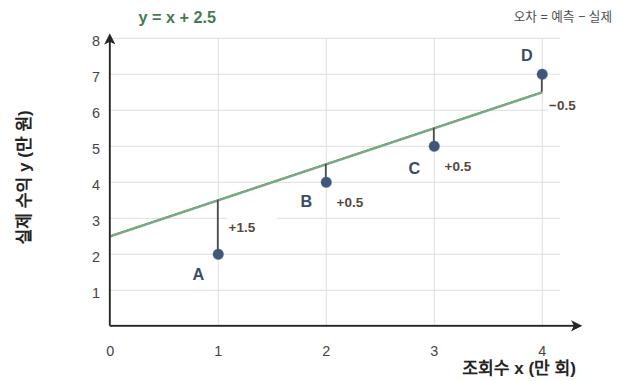

오차 하나만 보면 직선이 전체 데이터를 잘 설명하는지 알기 어렵습니다. 
그래서 모든 영상의 오차를 하나의 점수로 모읍니다.
예측이 얼마나 빗나갔는지 나타내는 이 점수를 **손실**이라고 하고, 손실을 계산하는 규칙을 **손실 함수**라고 합니다.
데이터 개수가 달라도 비교하려면 합계보다 평균이 낫습니다. 그런데 오차를 그대로 평균 내면 문제가 생깁니다.

### 오차가 서로 지워지지 않게 계산하기
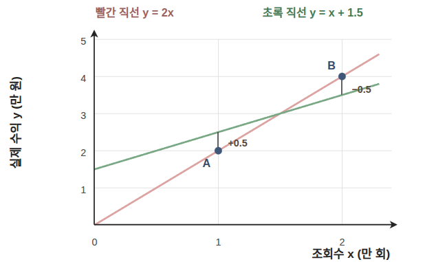

앞의 A와 B 두 영상만 놓고 두 직선을 비교해 보겠습니다. 빨간 직선은 두 데이터를 모두 지나가지만, 초록 직선은 두 데이터의 중간을 지나갑니다. 두 데이터의 오차를 더하면 다음과 같습니다.
  
  - 초록 직선 :`0.5 + (−0.5) = 0`
  - 빨간 직선 :`0 + 0 = 0`

둘 다 0이 됩니다.
  
이 문제를 막으려면 오차의 크기를 양수로 바꿔 평균을 내면 됩니다.
대표적인 방법이 절댓값을 쓰는 방법과 제곱을 쓰는 방법입니다.

| 손실 함수                              | 계산 방법        | 특징                     |
| ---------------------------------- | ------------ | ---------------------- |
| 평균 절대 오차(Mean Absolute Error, MAE) | 오차의 절댓값을 평균  | 큰 오차도 크기에 비례해 반영 |
| 평균 제곱 오차(Mean Squared Error, MSE)  | 오차를 제곱한 뒤 평균 | 큰 오차에 더 큰 벌점을 부여 |

MSE는 오차가 커질수록 손실이 빠르게 커지므로 이상치의 영향을 크게 받을 수 있습니다. 어떤 손실 함수가 적합한지는 문제와 데이터에 따라 달라집니다.

파라미터가 몇 개라면 직접 바꿔 보며 손실을 비교할 수 있지만, 신경망의 파라미터는 수만 개에서 수억 개에 이를 수 있습니다. 경사하강법은 각 파라미터를 어느 방향으로 바꿔야 손실이 줄어드는지 계산합니다.

## 손실이 낮아지는 방향으로 이동하기

손실이 각 가중치와 바이어스에 따라 어떻게 변하는지 계산한 결과를 그래디언트(Gradient)라고 합니다.
경사하강법은 이 그래디언트가 가리키는 방향의 반대(내리막길)로 파라미터를 조금씩 이동시킵니다.

선형 회귀와 MSE의 조합은 수식으로 최소점을 구할 수 있지만, 비선형 함수를 여러 층 연결한 신경망은 그렇게 풀기 어렵습니다. 대신 현재 위치의 기울기를 구해 손실이 줄어드는 방향으로 반복해 이동합니다.

### 작동방식

1. 파라미터 $a$와 $b$를 임의의 값으로 초기화합니다.
2. 예측값과 실제값의 차이로 손실을 계산합니다.
3. 손실이 가파르게 내려가는 방향을 찾습니다.
4. 그 방향으로 파라미터를 조정합니다.
5. 손실이 더 이상 유의미하게 줄지 않을 때까지 2~4를 반복합니다.

$$\text{새로운 가중치} \leftarrow \text{현재 가중치} - \left( \text{학습률} \times \text{손실의 기울기} \right)$$

수학 기호로 쓰면 다음과 같습니다.
$$w \leftarrow w - \eta \cdot \frac{\partial \text{Loss}}{\partial w}$$
### 기울기를 구하는 연쇄 법칙

기울기란 결국 **파라미터 $a, b$를 살짝 건드렸을 때 최종 손실값이 얼마나 변하는가**를 의미합니다.

$$\text{입력 데이터 } x \xrightarrow{\text{파라미터 } a, b \text{와 계산}} \text{예측값 } \hat{y} \xrightarrow{\text{실제 정답 } y \text{와 비교}} \text{손실값(Loss)}$$

파라미터가 최종 손실값에 어떤 영향을 미쳤는지 알아내려면, **이 계산 단계를 거꾸로** 따라가며 변화량을 계산해야 합니다.
 손실값과 파라미터 사이에 수십 층이 쌓이면 이 식은 인간의 손으로는 도저히 한 번에 미분할 수 없을 만큼 복잡하고 거대한 수학 덩어리가 됩니다.

그래서 징검다리를 건너듯 각 단계의 변화량을 쪼개서 곱해나가는 **연쇄 법칙( Chain Rule)** 을 사용합니다.

$$\frac{\text{손실값의 변화량}}{\text{파라미터 } a_1 \text{의 변화량}} = \frac{\text{손실값의 변화량}}{\text{예측값의 변화량}} \times \frac{\text{예측값의 변화량}}{\text{파라미터 } a_1 \text{의 변화량}}$$

연쇄 법칙을 이용해 **예측값이 손실에 미치는 영향** 부터 시작해 거꾸로 추적해 나가면 각 파라미터를 어느 방향으로 얼만큼 수정해야 할지 명확한 값을 얻을 수 있습니다.

### 한 번에 얼마나 움직일까
한번에 이동하는 크기를 학습률이라고 합니다.
학습률이 지나치게 크면 낮은 지점을 건너뛰어 손실이 오히려 커지거나 학습이 **발산**(Divergence)할 수 있습니다. 너무 작으면 안정적이지만 학습에 많은 반복이 필요합니다. 따라서 학습 곡선을 확인하며 적절한 학습률을 찾아야 합니다.

### 경사하강법의 한계

지금 예시에서는 영상이 네 편뿐이라 손실을 금방 계산할 수 있습니다.
하지만 영상이 수백만 편이라면, 한 번 움직일 때마다 모든 영상의 예측과 오차를 계산해야 합니다.
모든 데이터의 오차를 사용하는 경사하강법은 한 번 갱신하는 데 계산량이 큽니다.

또한 신경망의 손실 함수에는 주변보다 낮지만 전체에서 가장 낮지는 않은 **지역 최솟값**(Local Minimum)이나 기울기가 작은 구간이 있을 수 있습니다. 이후에는 초기 가중치, 데이터를 묶는 방식, 이전 그래디언트를 활용하는 방법이 학습 경로에 어떤 차이를 만드는지 살펴본다.

## 가중치를 어떤 값에서 시작할까

### 입력과 출력의 개수를 고려하는 이유

신경망을 깊게 쌓으면 각 층에서 신호가 반복해서 더해지고 곱해진다. 초기 가중치의 크기가 맞지 않으면 신호나 그래디언트가 지나치게 커지거나 작아질 수 있다.

그래서 **연결 개수에 맞춰 가중치의 분산을 조절**한다.

- $n_{\mathrm{in}}$: 한 노드로 들어오는 입력 수. 많아질수록 합산되는 신호도 많아지므로 가중치의 분산을 줄인다.
- $n_{\mathrm{out}}$: 다음 층의 출력 수. 역전파에서 합쳐지는 그래디언트의 크기와 관련된다.

대표적인 초기화는 평균이 0인 무작위 가중치를 사용한다. 아래는 자주 사용하는 기본 분산이다.

| 초기화 | 가중치 분산 | 주로 연결되는 활성화 함수 |
| --- | --- | --- |
| LeCun | $1/n_{\mathrm{in}}$ | SELU 등 |
| Xavier · Glorot | $2/(n_{\mathrm{in}}+n_{\mathrm{out}})$ | tanh 등 |
| He · Kaiming | $2/n_{\mathrm{in}}$ | ReLU |

가중치를 무작위로 두면 같은 층의 노드들이 서로 다른 특징을 배울 수 있다. 바이어스는 보통 0으로 초기화하며, 구성에 따라 작은 양수를 쓰기도 한다. [초기화 참고](https://docs.pytorch.org/docs/stable/nn.init.html)

## 데이터 하나씩 보는 확률적 경사하강법

**확률적 경사하강법**(Stochastic Gradient Descent, SGD)은 데이터 하나로 손실과 그래디언트를 계산한다. 전체 영상을 기다리지 않고 영상 하나를 확인할 때마다 파라미터를 갱신한다.

선택한 영상 한 편의 예측 수익과 실제 수익을 비교해 손실을 계산한다. 그 손실이 줄어드는 방향으로 가중치와 바이어스를 갱신한다. 이때 전체 영상의 손실을 먼저 계산할 필요는 없다.

데이터를 섞어서 순서대로 사용하는 경우의 흐름은 다음과 같다.

1. 영상 데이터의 순서를 무작위로 섞는다.
2. 영상 하나의 오차로 파라미터를 갱신한다.
3. 다음 영상으로 넘어가며 전체 데이터를 한 번 사용한다.
4. 다시 섞고 반복한다.

전체 데이터를 한 번 순회한 단위를 **에포크**(Epoch)라고 한다.

- **계산 비용**: 한 번 갱신할 때 데이터 하나만 계산한다.
- **이동 방향**: 선택된 영상에 따라 흔들린다. 비볼록 문제에서는 이런 변동이 일부 정체 구간을 벗어나는 데 도움을 줄 수 있다.

## 여러 데이터를 묶어 보는 미니배치

### 영상 하나의 오차에 덜 흔들리려면

SGD는 선택한 영상에 따라 갱신 방향이 크게 달라질 수 있다. **미니배치**(Mini-batch)는 여러 영상의 손실을 평균 내어 한 번 갱신한다.

$$
L_{B_t}(\theta)=\frac{1}{|B_t|}\sum_{i\in B_t}\ell_i(\theta)
$$

$$
\theta_{t+1}=\theta_t-\eta\nabla_\theta L_{B_t}(\theta_t)
$$

$B_t$는 이번 갱신에 사용할 데이터 묶음, $|B_t|$는 배치 크기다.

| 방식 | 갱신 한 번에 사용하는 영상 수 | 특징 |
| --- | --- | --- |
| SGD | 1개 | 자주 갱신하지만 방향의 변동이 큼 |
| 미니배치 | 일부 | 변동을 줄이고 GPU 병렬 계산을 활용 |
| 전체 배치 GD | 전체 | 한 번의 갱신에 전체 데이터 계산 |

배치를 크게 하면 그래디언트의 변동은 대체로 줄지만, 메모리가 더 필요하고 한 에포크의 갱신 횟수는 줄어든다. 배치 크기는 처리 속도와 검증 성능을 함께 보고 정한다.

### 배치를 키울 때 학습률도 조정하기

배치를 $k$배 키우면 같은 데이터를 보는 동안 갱신 횟수는 약 $1/k$로 줄어든다. 이를 보완하려고 학습률도 $k$배로 키우는 경험적 규칙이 **선형 스케일링 규칙**(Linear Scaling Rule)이다.

$$
\eta_{\mathrm{new}}=k\eta_{\mathrm{old}}
$$

다만 학습 시작부터 큰 학습률을 쓰면 불안정할 수 있다. **학습률 워밍업**(Learning Rate Warmup)은 0이나 작은 값에서 시작해 목표 학습률까지 점진적으로 올린다. 큰 배치의 SGD에서 활용된 방법이며, 적용 후에는 검증 성능을 확인한다. [관련 논문](https://arxiv.org/abs/1706.02677)

## 지난 이동 방향을 이어가는 모멘텀

이번 배치에서 계산한 방향만 따르면 이동 방향이 계속 흔들릴 수 있다. **모멘텀**(Momentum)은 과거 그래디언트를 누적해 이동 방향을 정한다.

이후 수식에서 $g_t$는 현재 배치의 그래디언트, $\theta_t$는 현재 파라미터다.

$$
v_t=\beta v_{t-1}+g_t
$$

$$
\theta_{t+1}=\theta_t-\eta v_t
$$

- $v_0=0$: 처음에는 누적한 방향이 없음.
- $\beta$: 이전 방향을 얼마나 유지할지 정하는 값, $0\leq\beta<1$.

여러 배치에서 같은 방향이 반복되면 그 방향이 누적된다. 반대 방향으로 번갈아 움직이는 성분은 서로 상쇄된다.

## 파라미터별 보폭을 나누는 RMSprop

### 파라미터마다 이동 폭 조절하기

조회수에 곱하는 가중치 방향으로는 손실이 급하게 변하고, 바이어스 방향으로는 완만하게 변할 수 있다. 하나의 학습률만 쓰면 한쪽에서는 크게 흔들리고 다른 쪽에서는 너무 천천히 움직인다.

**RMSprop**(Root Mean Square Propagation)은 파라미터별로 그래디언트 제곱의 이동평균을 구하고, 그 크기에 따라 이동 폭을 조절한다.

$$
s_t=\rho s_{t-1}+(1-\rho)g_t^2
$$

$$
\theta_{t+1}=\theta_t-\eta\frac{g_t}{\sqrt{s_t}+\epsilon}
$$

- $s_0=0$, $\rho$: 과거 제곱 그래디언트를 유지하는 비율.
- $\epsilon$: 분모가 0이 되는 것을 막는 작은 양수.
- 제곱·제곱근·나눗셈은 파라미터별로 계산.

그래디언트가 계속 큰 축은 분모가 커져 이동 폭이 줄어든다. 상대적으로 작은 축은 덜 줄어든다. [RMSprop 강의 자료](https://www.cs.toronto.edu/~tijmen/csc321/slides/lecture_slides_lec6.pdf)

<figure>
  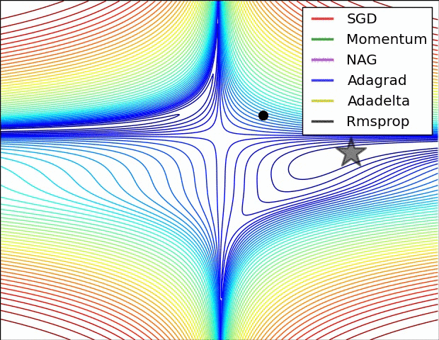
  <figcaption>출처: <a href="https://cs231n.github.io/neural-networks-3/">Stanford CS231n · Alec Radford</a>.</figcaption>
</figure>

이 예시에서는 빨간색 SGD, 초록색 모멘텀, 검은색 RMSprop의 경로를 비교하면 된다. 같은 표면에서도 방향을 누적하거나 축별 이동 폭을 조절하면 경로가 달라진다.

## 방향과 보폭을 같이 다루는 Adam

과거의 이동 방향도 활용하고, 파라미터별 이동 폭도 조절하고 싶다. **Adam**(Adaptive Moment Estimation)은 그래디언트의 이동평균과 제곱의 이동평균을 함께 사용한다.

$$
m_t=\beta_1m_{t-1}+(1-\beta_1)g_t
$$

$$
v_t=\beta_2v_{t-1}+(1-\beta_2)g_t^2
$$

$m_t$는 방향, $v_t$는 크기를 조절하는 데 쓰인다. 둘 다 0에서 시작하므로 초기 이동평균이 0 쪽으로 치우친다. 이를 보정한다.

$$
\hat m_t=\frac{m_t}{1-\beta_1^t},\qquad
\hat v_t=\frac{v_t}{1-\beta_2^t}
$$

$$
\theta_{t+1}=\theta_t-\eta\frac{\hat m_t}{\sqrt{\hat v_t}+\epsilon}
$$

$\beta_1,\beta_2$는 각각 과거 정보를 유지하는 비율이다. 모멘텀의 방향 누적과 RMSprop의 크기 조절을 함께 활용하는 방식으로 이해할 수 있다. [Adam 원 논문](https://arxiv.org/abs/1412.6980)

## 학습을 언제 멈출지 확인하기

### 언제 학습을 멈출까

기존 영상의 수익을 잘 맞춰도 새 영상에서는 틀릴 수 있다. 학습 데이터에 지나치게 맞춰져 새 데이터의 성능이 떨어지는 현상이 **과적합**(Overfitting)이다.

일부 영상을 학습에서 제외하고 **검증 데이터**(Validation Data)로 둔다. 이 영상들의 오차를 보면 새로운 데이터에서도 예측이 나아지는지 확인할 수 있다.

| 데이터 | 사용하는 목적 |
| --- | --- |
| 훈련 데이터 | 가중치와 바이어스 학습 |
| 검증 데이터 | 학습률·배치 크기 등 선택, 학습 종료 판단 |
| 테스트 데이터 | 선택을 마친 모델의 최종 성능 평가 |

**조기 종료**(Early Stopping)는 검증 손실의 개선이 일정 기간 멈추면 학습을 종료하는 방법이다. 학습 중 검증 손실이 가장 낮았던 모델을 저장해 사용한다.

## 데이터가 적을 때의 K-fold 교차 검증

영상이 적으면 어떤 영상을 검증용으로 빼두느냐에 따라 평가가 크게 달라질 수 있다. **K-fold 교차 검증**은 검증 그룹을 바꿔가며 여러 번 평가한다.

예를 들어 데이터를 5개 그룹으로 나누면 다음과 같다.

| 학습 회차 | 훈련 그룹 | 검증 그룹 |
| --- | --- | --- |
| 1 | B·C·D·E | A |
| 2 | A·C·D·E | B |
| 3 | A·B·D·E | C |
| 4 | A·B·C·E | D |
| 5 | A·B·C·D | E |

매 회차 모델을 새로 초기화해 학습한다. 각 그룹은 검증용으로 한 번씩 쓰이며, 다섯 번의 검증 결과를 평균 내고 편차도 확인한다. 데이터 분할에 따른 영향을 살펴볼 수 있지만, 학습도 K번 필요하다. [교차 검증 참고](https://scikit-learn.org/stable/modules/cross_validation.html)

## 참고 자료

- 혁펜하임, 『이지 딥러닝』. 신경망 학습과 최적화의 전체 흐름을 이해하는 데 참고했다.
- [Stanford CS231n · 신경망 구조](https://cs231n.github.io/neural-networks-1/), [학습과 최적화](https://cs231n.github.io/neural-networks-3/).
- [Glorot & Bengio, 가중치 초기화, 2010](https://proceedings.mlr.press/v9/glorot10a.html).
- [PyTorch · 초기화](https://docs.pytorch.org/docs/stable/nn.init.html).
- [Hinton · RMSprop 강의 자료](https://www.cs.toronto.edu/~tijmen/csc321/slides/lecture_slides_lec6.pdf).
- [Kingma & Ba, Adam, 2014](https://arxiv.org/abs/1412.6980).
- [Goyal et al., 큰 배치의 SGD·워밍업, 2017](https://arxiv.org/abs/1706.02677).
- [scikit-learn · 교차 검증](https://scikit-learn.org/stable/modules/cross_validation.html).
