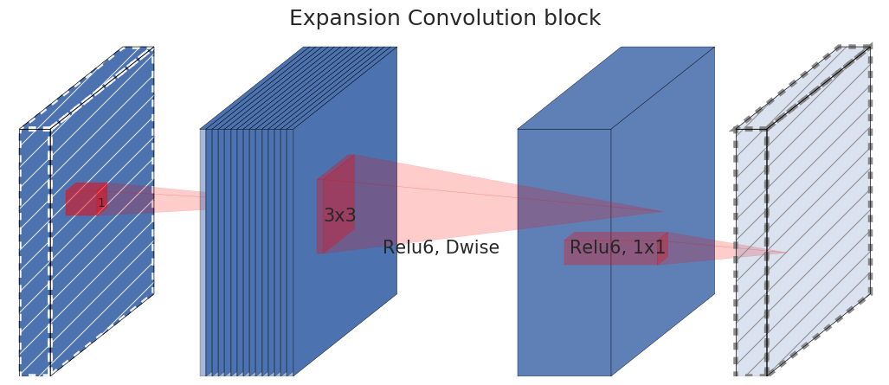

**다층 퍼셉트론**(Multi-Layer Perceptron, MLP)은 입력층과 출력층 사이에 은닉층을 둔 신경망입니다. 예를 들어 조회수 $x_1$과 영상 길이 $x_2$로 수익을 예측한다면 **입력 2개 → 은닉층 1개(노드 3개) → 출력 1개**로 구성할 수 있습니다. 각 입력은 세 은닉 노드 모두에 연결되고, 세 은닉 노드는 출력에 연결됩니다.

각 노드는 이전 층에서 받은 값에 가중치를 곱해 더하고 바이어스를 더합니다. 은닉 노드는 그 결과에 활성화 함수를 적용한 값을 다음 층으로 보냅니다.

## 은닉층에 비선형 함수가 필요한 이유

활성화 함수가 입력을 그대로 내보내는 $f(z)=z$라면, 노드 하나씩 이어 붙인 두 층은 다음처럼 합쳐집니다.

$$
\begin{aligned}
\hat y
&=w_2(w_1x+b_1)+b_2\\
&=(w_2w_1)x+(w_2b_1+b_2)
\end{aligned}
$$

가중치와 바이어스를 새 값으로 묶으면 한 층의 식과 같습니다. 노드가 여러 개여도 같은 원리로 묶이므로, 이런 층만 늘려서는 표현할 수 있는 함수의 종류가 늘지 않습니다.

은닉층에 비선형 활성화 함수를 넣으면 이처럼 층을 하나로 합칠 수 없게 됩니다. 입력에 따라 결과가 달라지는 더 복잡한 관계를 표현할 수 있습니다.

## ReLU는 음수를 0으로 만든다

**ReLU**(Rectified Linear Unit)는 음수 입력을 0으로 만들고 양수 입력은 그대로 출력하는 비선형 활성화 함수입니다.

$$
\operatorname{ReLU}(z)=\max(0,z)
$$

<figure>
  
  <figcaption>출처: <a href="https://cs231n.github.io/neural-networks-1/">Stanford CS231n</a>.</figcaption>
</figure>

| 입력 | −3 | −1 | 0 | 2 |
| --- | --- | --- | --- | --- |
| ReLU 출력 | 0 | 0 | 0 | 2 |

−3과 −1은 다른 값이지만 출력은 모두 0입니다. 이 출력만으로 원래 음수 값을 구분할 수는 없습니다.

## 선형 출력을 쓰는 곳

은닉층에서는 비선형 관계를 만들고, 출력층에서는 예측할 값에 맞춰 활성화 함수를 선택합니다. 연속적인 수치를 예측하는 회귀의 출력층에서는 $f(z)=z$를 쓸 수 있습니다. 그러면 출력값이 0~1 같은 특정 구간에 묶이지 않습니다. [역전파 예제](/notes/deep-learning/easy-deep-learning-ch03/)의 수익 예측도 이 방식을 사용합니다.

모델 중간에서 선형 출력을 쓰는 경우도 있습니다. MobileNetV2는 특징을 좁은 병목층으로 압축한 뒤 비선형 함수를 적용하면 정보가 사라질 수 있어, 마지막 압축 결과를 선형으로 내보냅니다. 넓은 내부에서는 ReLU6를 사용합니다. ReLU6는 ReLU의 양수 출력을 6에서 한 번 더 제한한 함수입니다.

<figure>
  
  <figcaption>출처: <a href="https://arxiv.org/html/1801.04381v4">Sandler et al., MobileNetV2, 2018</a>.</figcaption>
</figure>

이것은 MobileNetV2의 병목 구조에 맞춘 설계입니다. 노드나 채널 수가 줄어든다는 이유만으로 항상 활성화 함수를 제거하는 것은 아닙니다.

노드별 계산을 행렬로 묶는 방법은 [MLP를 행렬로 표현하기](/notes/deep-learning/mlp-matrix-representation/)에서 이어집니다.

## 참고 자료

- [Stanford CS231n · 신경망과 활성화 함수](https://cs231n.github.io/neural-networks-1/).
- [Sandler et al., MobileNetV2: Inverted Residuals and Linear Bottlenecks, 2018](https://arxiv.org/abs/1801.04381).
